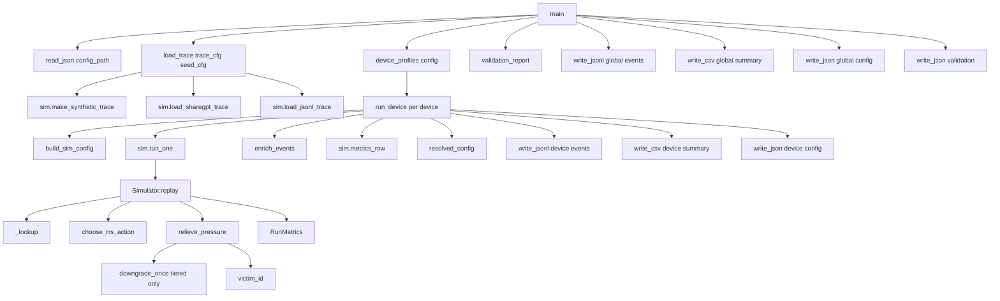
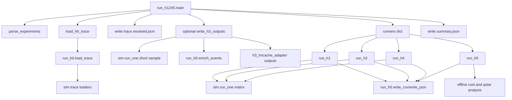

# H0 代码说明书

## 1. `sim.py` 的代码逻辑

文件：[pre实验/sim.py](/D:/EdgeKVTiers/pre实验/sim.py:1)

`sim.py` 是 `H0` 与 `H1245` 共用的解析仿真内核，负责定义对象模型、请求模型、代价函数、缓存状态机和运行指标。`H0` 与 `H1245` 都不重写这些逻辑，而是将其作为统一仿真底座复用。

### 1.1 核心数据结构

`KVObject`

用于描述一个可缓存对象的静态画像。

关键字段：

1. `object_id`：对象唯一标识。
2. `n_tokens`：对象 token 数，用于计算显存、质量损失与重算代价。
3. `reuse_key`：复用语义键，用于表达对象所属的复用簇。
4. `object_type`：对象类别，例如 `sharegpt_session_prefix`、`rag_topic_chunk`。
5. `p_reuse`：对象的复用概率估计，是生命周期决策的重要输入。

`Request`

用于描述一次访问请求及其准入语义。

关键字段：

1. `request_id`：请求唯一标识。
2. `object_id`：本次访问的对象标识。
3. `n_uncached`：本次请求未被缓存覆盖的 token 数。
4. `arrival_ts`：请求到达时间戳。
5. `reuse_key`：请求所属复用语义键。
6. `session_id`：会话标识。
7. `turn_index`：多轮会话中的轮次。
8. `admit_object_id`：请求结束后应被准入的新对象标识。

`admit_object_id` 使一次请求可以同时表达：

1. 访问旧对象。
2. 生成并准入新对象。

该设计主要服务于 ShareGPT 多轮 prefix 复用场景。

`ResidentEntry`

用于描述对象在模拟器中的运行时状态。

关键字段：

1. `obj`：关联的 `KVObject`。
2. `q`：当前 tier，例如 `full/int8/int4/sparse_k`。
3. `last_access`：最近访问时间。
4. `access_count`：累计访问次数。

`SimConfig`

用于描述一次仿真的设备画像和代价模型。

关键字段：

1. `mu_kv_mb_per_token`：单位 token 的 KV 显存占用，单位 MB/token。
2. `c_re_ms_per_token`：单位 token 的重算代价，单位 ms/token。
3. `d_deser_ms`：恢复后的反序列化固定开销，单位 ms。
4. `m_budget_mb`：显存预算，单位 MB。
5. `bw_gbps`：恢复链路带宽，单位 GB/s。
6. `epsilon`：内部执行使用的绝对质量预算。
7. `offload_keep_threshold`：对象是否进入 offload 的复用概率阈值。
8. `warmup_requests`：统计指标前忽略的预热请求数。

### 1.2 基础代价函数

`sim.py` 中的代价函数决定了对象在不同 tier 和不同动作下的资源消耗与收益估计。

1. `size_mb(obj, q, cfg)`：计算对象在 tier `q` 下的显存占用。
2. `qloss(obj, q)`：计算对象在 tier `q` 下的质量损失。
3. `c_recomp_ms(obj, q, cfg)`：计算对象重算代价。
4. `c_restore_ms(obj, q, cfg)`：计算对象恢复代价。
5. `keep_score(obj, q, cfg)`：计算对象保留价值，公式为 `p_reuse * c_recomp / size`。
6. `rrs_action(obj, q, cfg)`：比较恢复与重算代价，返回 `restore` 或 `recompute`。
7. `normalize_qloss(value, token_ref)`：将绝对质量损失转换为归一化口径。
8. `denormalize_epsilon(epsilon_norm, token_ref)`：将归一化预算转换为绝对预算。

这些函数共同构成 `H0`、`H1`、`H2`、`H4`、`H5` 的统一代价模型。

### 1.3 trace 构造逻辑

`sim.py` 支持三类 trace 输入路径。

`load_sharegpt_trace(...)`

作用：

1. 将 ShareGPT 多轮对话转换为 prefix-cache 工作负载。
2. 为每个 human turn 构造 `rag_topic_chunk` 请求和 `session_prefix` 请求。
3. 通过 `admit_object_id` 表达“访问旧 prefix，同时准入扩展后新 prefix”的语义。

`load_jsonl_trace(path)`

作用：

1. 从统一 JSONL 格式装载外部 trace。
2. 将外部对象和请求转换为内部 `KVObject` 与 `Request` 表示。

`make_synthetic_trace(...)`

作用：

1. 生成可控的 synthetic 工作负载。
2. 用于 smoke、回归测试以及无真实 trace 时的快速实验。

### 1.4 `Simulator` 的状态机逻辑

`Simulator` 是整个仿真内核的核心。其内部维护：

1. `resident`：当前驻留在显存中的对象集合。
2. `offloaded`：已从显存迁出但保留复用机会的对象集合。
3. `events`：逐请求事件日志。
4. `migrations`：迁移次数。
5. `evictions`：驱逐次数。
6. `offloads`：进入 offload 的次数。
7. `drops`：直接丢弃的次数。
8. `qloss_peak`：质量损失峰值。
9. `memory_peak`：显存峰值。

关键方法如下。

`choose_initial_tier(obj)`

作用：

1. 确定对象准入时的初始 tier。
2. `static-int4` 和 `static-sparse-k` 会直接以固定低精度进入。
3. 其他策略默认以 `full` 进入。

`choose_rrs_action(obj, q)`

作用：

1. 在对象从 `offloaded` 状态再次复用时选择 `restore` 或 `recompute`。
2. 支持 `always-restore`、`always-recompute` 和基于代价比较的 `rrs` 三种模式。

`next_tier(q)`

作用：

1. 给定当前 tier，返回下一个更低精度的 tier。

`downgrade_once()`

作用：

1. 在显存超预算时执行一次降级尝试。
2. 找出还能继续降级的对象。
3. 按 `keep_score` 从低到高排序。
4. 只有在降级后总质量损失不超过 `epsilon` 时才允许执行降级。

该逻辑对应 `TMS` 的主要实现落点。

`victim_id()`

作用：

1. 在无法继续降级时选择驱逐受害者。

不同策略的行为：

1. `lru`：按最近最少使用驱逐。
2. `lfu`：按访问频次最少驱逐。
3. `pgdsf`：按带频率的代价密度驱逐。
4. `score/tiered`：按 `keep_score` 最低驱逐。

`relieve_pressure()`

作用：

1. 在显存超出 `m_budget_mb` 时持续释放压力。
2. 若策略为 `tiered`，优先尝试降级。
3. 若降级不足，再执行驱逐。
4. 对被驱逐对象，若其 `p_reuse` 高于 `offload_keep_threshold`，则进入 `offloaded`；否则直接 `drop`。

该函数将 `TMS + LPE + offload/drop` 串成了一个完整的资源回收闭环。

`_miss_entry(obj, req)`

作用：

1. 为 miss 对象创建新的 `ResidentEntry`。
2. 计算本次 miss 对应的 TTFT。

`_lookup(req)`

作用：

1. 判断请求是否命中 `resident`。
2. 若未命中，再判断是否命中 `offloaded`。
3. 若命中 `offloaded`，则基于 `RRS` 决定 `restore` 或 `recompute`。
4. 若未命中任何状态，则按 miss 处理。

该方法是 `RRS` 真正生效的入口。

`replay()`

作用：

1. 按顺序回放完整请求序列。
2. 对每个请求完成查找、命中判定、准入、压力释放、事件记录和指标累计。

标准执行流程如下：

1. 调用 `_lookup(req)` 得到对象状态与本次访问代价。
2. 更新对象访问计数与最近访问时间。
3. 将访问对象或 `admit_object_id` 对应对象加入 `resident`。
4. 调用 `relieve_pressure()` 处理显存压力。
5. 记录 `q_before`、`q_after`、`rrs_action`、`ttft_ms`、`qloss_current_abs`、`memory_current_mb` 等事件。
6. 在预热阶段后累计 TTFT、命中率、恢复/重算比例等统计量。
7. 运行结束后输出 `RunMetrics`。

### 1.5 `sim.py` 的执行入口

`run_one(...)`

作用：

1. 构造一个 `Simulator`。
2. 执行 `replay()`。
3. 返回：
   1. `RunMetrics`
   2. `events`

`metrics_row(...)`

作用：

1. 将 `RunMetrics` 转换为适合 CSV 输出的 `dict`。

## 2. 调用 `sim` 的 `H0` 模拟器代码逻辑

文件：[h0/run_h0.py](/D:/EdgeKVTiers/h0/run_h0.py:1)

`run_h0.py` 的职责不是实现策略状态机，而是将 `sim.py` 包装成一个可配置、可复现、可校验的多设备实验入口。其核心功能是：

1. 读取配置。
2. 统一装载 trace。
3. 逐设备构造仿真配置。
4. 调用 `sim.run_one(...)` 执行回放。
5. 将原始事件标准化为 H0 事件格式。
6. 输出设备级和全局级实验产物。
7. 对关键约束执行自动校验。

### 2.1 模块装载与 I/O 逻辑

`load_pre_sim()`

作用：

1. 从磁盘动态装载 [pre实验/sim.py](/D:/EdgeKVTiers/pre实验/sim.py:1)。
2. 避免要求 `pre实验` 必须作为正式 Python 包安装。

`read_json()`、`write_json()`、`write_jsonl()`、`write_csv()`

作用：

1. 负责配置读取和标准实验产物落盘。

### 2.2 trace 装载逻辑

`limit_trace(objects, requests, max_requests)`

作用：

1. 截断请求序列。
2. 删除未在截断后请求集中被访问的对象。

这样可以保证：

1. 快速 smoke 时仅处理有限请求。
2. `token_ref` 和预算换算基于实际运行工作集。

`load_trace(trace_cfg, sim_cfg)`

作用：

1. 读取 trace 来源配置。
2. 将 `synthetic/sharegpt/jsonl` 三类外部来源统一转换为：
   1. `objects`
   2. `requests`
   3. `trace_source`

这是 `H0` 的基础能力之一，因为多设备对照实验要求所有设备使用同一内部 trace 表示。

### 2.3 多设备画像与预算解析

`device_profiles(config)`

作用：

1. 兼容单设备 `device_profile` 和多设备 `devices` 两种配置形式。
2. 最终统一为设备列表。

`build_sim_config(config, device, token_ref)`

作用：

1. 将通用配置和设备画像组合成 `sim.SimConfig`。
2. 统一处理：
   1. `mu_kv_mb_per_token`
   2. `c_re_ms_per_token`
   3. `d_deser_ms`
   4. `m_budget_mb`
   5. `bw_gbps`
   6. `epsilon_abs`
   7. `epsilon_norm`

其中质量预算采用双口径：

1. 内部执行使用 `epsilon_abs`。
2. 若配置只给出 `epsilon_norm`，则按 `token_ref` 反推 `epsilon_abs`。

### 2.4 事件语义标准化逻辑

`run_h0.py` 需要将 `sim.py` 的底层事件提升为适合实验文档和后处理脚本消费的标准 H0 事件。

`lpe_action_for(event)`

作用：

1. 根据 `q_after` 判断对象最终是：
   1. `resident`
   2. `offload`
   3. `drop`

`tms_action_for(event)`

作用：

1. 根据 `q_before` 与 `q_after` 判断本次是否发生了 `downgrade`。

`cache_event_for(event)`

作用：

1. 将底层事件翻译为标准缓存事件：
   1. `miss`
   2. `resident_hit`
   3. `offload_restore`
   4. `offload_recompute`

`enrich_events(raw_events, objects, cfg, device_name)`

作用：

1. 将 `sim.py` 的原始事件补齐为 H0 标准字段。
2. 增加设备画像、预算、对象类型、峰值和策略动作信息。

关键补充字段：

1. `event_index`：事件顺序编号。
2. `device_profile`：设备画像名称。
3. `event`：标准化事件类型。
4. `object_type`：对象类别。
5. `n_tokens`：对象 token 数。
6. `M_budget`：设备显存预算。
7. `BW`：设备带宽。
8. `epsilon_abs`：绝对质量预算。
9. `epsilon_norm`：归一化质量预算。
10. `mu_kv`：单位 token 显存开销。
11. `c_re`：单位 token 重算代价。
12. `d_deser`：反序列化固定开销。
13. `lpe_action`：生命周期策略动作。
14. `tms_action`：多级精度策略动作。
15. `qloss_total_abs`：累计绝对质量损失。
16. `qloss_total_norm`：累计归一化质量损失。
17. `t_policy_ms`：策略耗时字段，当前版本为占位值。
18. `M_peak`：当前运行到该事件时的显存峰值。

### 2.5 配置快照与单设备执行逻辑

`resolved_config(...)`

作用：

1. 输出本次运行实际生效的配置快照。
2. 记录 trace 来源、设备画像、策略、预算、对象数、请求数和输出文件名。

`run_device(...)`

作用：

1. 执行单个设备画像的一次完整回放。

内部流程如下：

1. 调用 `build_sim_config(...)` 构造 `SimConfig`。
2. 解析 `policy` 和 `rrs_mode`。
3. 调用 `sim.run_one(...)` 获得 `metrics` 与 `raw_events`。
4. 调用 `enrich_events(...)` 生成标准 H0 事件。
5. 调用 `sim.metrics_row(...)` 生成汇总行。
6. 写设备级：
   1. `events.jsonl`
   2. `summary.csv`
   3. `config.resolved.json`

### 2.6 全局聚合与校验逻辑

`validation_report(summaries, token_ref)`

作用：

1. 将 H0 的通过条件转化为自动化检查项。

当前检查内容包括：

1. `complete_replay`：所有设备都完成了非空回放。
2. `same_trace_across_devices`：所有设备使用相同 trace 来源。
3. `same_token_ref_across_devices`：所有设备具有相同 `token_ref`。
4. `memory_peak_within_budget`：显存峰值未超过预算。
5. `epsilon_budget_respected`：质量损失峰值未超过预算。
6. `required_summary_fields_present`：关键汇总字段存在。

`main()`

作用：

1. 作为 H0 顶层入口，组织多设备实验。

标准执行流程如下：

## 3. `H1245` 的代码逻辑以及如何调用 `sim/H0`

文件：[h0/run_h1245.py](/D:/EdgeKVTiers/h0/run_h1245.py:1)

`run_h1245.py` 的职责是在 `H0` 已经统一好的 trace 装载逻辑和 `sim.py` 的解析仿真逻辑之上，批量运行 `H1/H2/H4/H5`。它本身不实现新的状态机，而是复用：

1. `sim.py`：作为所有实验的底层代价模型和仿真执行器。
2. `run_h0.py`：作为 trace 装载、标准输出和部分事件标准化工具。
3. `h3_lmcache_adapter.py`：在需要时输出 H3 插件契约和 H0/H3 语义对齐样例。

### 3.1 调用层级关系

`run_h1245.py` 的复用关系如下：

1. 通过 `import run_h0` 直接复用：
   1. `run_h0.REPO_ROOT`
   2. `run_h0.sim`
   3. `run_h0.load_trace(...)`
   4. `run_h0.write_json(...)`
   5. `run_h0.write_csv(...)`
   6. `run_h0.enrich_events(...)`
2. 通过 `sim = run_h0.sim` 共享同一个 `sim.py` 模块实例。
3. 通过 `h3_lmcache_adapter` 复用 H3 hook 契约导出逻辑。

因此 `H1245` 不是独立环境，而是构建在 `H0 + sim` 之上的实验批处理层。

### 3.2 顶层配置与实验选择逻辑

`parse_experiments(value)`

作用：

1. 解析命令行中的 `--experiments` 参数。
2. 支持：
   1. `all`
   2. `h1`
   3. `h2`
   4. `h4`
   5. `h5`
3. 返回要执行的实验列表。

`trace_config_from_args(args, seed)`

作用：

1. 根据命令行参数构造 trace 配置字典。
2. 统一生成：
   1. `source`：trace 来源。
   2. `seed`：随机种子。
   3. `requests`：请求数。
   4. `max_requests`：最大请求数。
   5. `max_sessions`：最大会话数。
   6. `path`：外部 trace 路径。

`load_h0_trace(args, seed)`

作用：

1. 构造一个简化版 `sim.SimConfig`。
2. 调用 `run_h0.load_trace(...)`。
3. 得到统一的：
   1. `objects`
   2. `requests`
   3. `trace_source`

### 3.3 公共输出逻辑

`write_config(out_dir, data)`

作用：

1. 将实验配置快照输出为 `config.json`。
2. 统一所有 `H1/H2/H4/H5` 的配置输出格式。

`write_h3_outputs(...)`

作用：

1. 当命令行启用 `--h3-contract` 或 `--emit-h3-events` 时，导出 H3 相关辅助产物。

具体流程：

1. 计算 `token_ref`。
2. 调用 `h3_lmcache_adapter.write_h3_contract(...)` 输出 H3 hook 契约。
3. 若启用样例事件导出，则：
   1. 构造一组专门用于 H3 样例的 `SimConfig`。
   2. 调用 `sim.run_one(...)` 跑一段短 trace。
   3. 调用 `run_h0.enrich_events(...)` 将原始事件提升为 H0 标准事件。
   4. 调用 `h3_lmcache_adapter.write_h3_event_sample(...)` 输出 H0/H3 语义对齐样例。

### 3.4 `H1` 的代码逻辑

`run_h1(objects, requests, trace_source, out_dir)`

作用：

1. 在多档显存预算下，对比 `lru/lfu/score/tiered` 的生命周期策略效果。

执行流程：

1. 构造基础 `SimConfig`。
2. 遍历 `H1_M_BUDGETS`。
3. 遍历 `H1_POLICIES`。
4. 每个组合调用 `sim.run_one(...)`。
5. 用 `sim.metrics_row(...)` 生成结果行。
6. 构造 `h1_results.csv`。
7. 按显存预算聚合生成 `h1_summary.csv`。
8. 输出 `config.json`。

关键对比字段：

1. `m_budget_mb`：显存预算。
2. `policy`：策略名称。
3. `ttft_p95_ms`：p95 TTFT。
4. `improvement_vs_lru_pct`：相对 LRU 的提升比例。
5. `improvement_vs_best_lru_lfu_pct`：相对最佳 `LRU/LFU` 基线的提升比例。
6. `passes_20pct_lru_gate`：是否通过相对 LRU 降低 20% 的门槛。

### 3.5 `H2` 的代码逻辑

`run_h2(objects, requests, trace_source, out_dir)`

作用：

1. 在多档带宽下，对比 `always-restore`、`always-recompute` 和 `rrs`。

执行流程：

1. 构造基础 `SimConfig`。
2. 遍历 `H2_BW_GRID`。
3. 通过 `sim.config_with(...)` 为每档带宽生成新配置。
4. 调用 `cost_snapshot(...)` 记录代表性对象的平均恢复/重算代价。
5. 遍历 `H2_RRS_MODES`。
6. 每个组合调用 `sim.run_one(...)`。
7. 生成 `h2_results.csv` 和 `h2_summary.csv`。
8. 输出 `config.json`。

关键对比字段：

1. `bw_gbps`：恢复链路带宽。
2. `rrs_mode`：恢复/重算策略模式。
3. `ttft_p95_ms`：p95 TTFT。
4. `critical_bw_gbps`：临界带宽近似值。
5. `rrs_not_worse_than_best_fixed`：`rrs` 是否不劣于固定策略最佳者。
6. `rrs_recompute_ratio`：`rrs` 下的重算比例。
7. `rrs_restore_ratio`：`rrs` 下的恢复比例。

### 3.6 `H4` 的代码逻辑

`run_h4(objects, requests, trace_source, out_dir)`

作用：

1. 在不同显存预算和不同质量预算下，对比多个 quality-aware 或近似 baseline。

执行流程：

1. 构造基础 `SimConfig`。
2. 计算 `token_ref`。
3. 遍历重复随机种子 `H4_REPEATS`。
4. 遍历显存预算 `H4_M_BUDGETS`。
5. 遍历归一化质量预算 `H4_EPSILON_NORMS`。
6. 将 `epsilon_norm` 转回 `epsilon_abs`。
7. 遍历 `H4_BASELINES`。
8. 每个组合调用 `sim.run_one(...)`。
9. 记录 `qloss_within_budget`。
10. 输出 `h4_results.csv` 和 `h4_summary.csv`。

关键对比字段：

1. `method`：基线方法名。
2. `m_budget_mb`：显存预算。
3. `epsilon_norm_cfg`：配置使用的归一化质量预算。
4. `qloss_within_budget`：是否满足质量预算约束。
5. `tms_improvement_vs_score_pct`：`tms-tiered` 相对 `lpe-only` 的提升。
6. `tms_improvement_vs_best_pct`：`tms-tiered` 相对最佳有效基线的提升。
7. `passes_25pct_gate`：是否通过 25% 提升门槛。

### 3.7 `H5` 的代码逻辑

`run_h5(objects, requests, trace_source, out_dir)`

作用：

1. 在不同带宽和不同质量预算下，验证最优 tier `q*` 的相变结构。

执行流程：

1. 构造基础 `SimConfig`。
2. 通过 `representative_objects(objects)` 选出代表性对象样本。
3. 对样本对象计算新的 `token_ref`。
4. 遍历 `H5_BW_GRID`。
5. 遍历 `H5_EPSILON_NORM_GRID`。
6. 将 `epsilon_norm` 转换为 `epsilon_abs`。
7. 对每个对象分别计算：
   1. `qstar_offline(...)`
   2. `qstar_pred(...)`
8. 输出：
   1. `h5_grid.csv`
   2. `h5_objects.csv`
   3. `h5_tau.csv`
   4. `config.json`

关键函数：

1. `feasible_tiers(obj, epsilon)`：给定预算下对象允许的 tier 集合。
2. `offline_cost(obj, q, cfg, epsilon)`：离线成本模型。
3. `predicted_cost(obj, q, cfg, epsilon)`：预测成本模型。
4. `kendall_tau(xs, ys)`：离线最优排序与预测排序的一致性度量。
5. `dominant_tier(tiers)`：统计给定网格单元中的主导 tier。

### 3.8 `H1245` 如何调用 `sim`

`H1245` 对 `sim.py` 的调用方式具有统一模式：

1. 先通过 `load_h0_trace(...)` 取得统一的 `objects/requests`。
2. 再为每个实验构造基础 `SimConfig`。
3. 再通过 `sim.config_with(...)` 生成不同参数组合下的派生配置。
4. 对每个参数组合调用 `sim.run_one(...)`。
5. 对 `RunMetrics` 调用 `sim.metrics_row(...)`。
6. 将结果写入 CSV/JSON 配置快照。

### 3.9 `H1245` 如何调用 `H0`

`H1245` 并不调用 `run_h0.main()`，而是选择性复用 `H0` 中已经沉淀好的公共能力。

主要复用点包括：

1. `run_h0.load_trace(...)`
2. `run_h0.write_json(...)`
3. `run_h0.write_csv(...)`
4. `run_h0.enrich_events(...)`

因此关系可以概括为：

1. `sim.py` 提供底层仿真内核。
2. `H0` 提供 trace 统一、事件标准化和输出工具。
3. `H1245` 在其上构建实验批处理与指标矩阵。

### 3.10 `H1245` 的顶层执行逻辑

`main()`

作用：

1. 作为 `H1245` 的统一入口，组织 `H1/H2/H4/H5` 的批量运行。

标准流程如下：

1. 解析命令行参数。
2. 调用 `parse_experiments(...)` 确定实验子集。
3. 调用 `load_h0_trace(...)` 加载统一 trace。
4. 计算 `token_ref`。
5. 输出 `trace.resolved.json`。
6. 若启用 H3 相关选项，则调用 `write_h3_outputs(...)`。
7. 根据实验名从 `runners` 字典中选取：
   1. `run_h1`
   2. `run_h2`
   3. `run_h4`
   4. `run_h5`
8. 逐个实验执行并将结果写入对应子目录。
9. 汇总所有实验结果为 `summary.json`。

调用关系如下：

## 4. `H01245` 相对 `pre` 的升级

`pre` 与 `H01245` 共用同一仿真内核，但 `H01245` 相对 `pre` 的升级不在于更换结论来源，而在于将 `pre` 的趋势结果升级为可复现、可比较、可归档、可衔接后续实验的标准化实验产物。

### 4.1 从趋势结果升级为标准结果文件

`pre` 的职责是先判断趋势是否存在，主要服务“是否值得继续”。

`H01245` 则将结果固化为结构化文件：

1. `H1`
   1. `h1_results.csv`
   2. `h1_summary.csv`
   3. `config.json`
2. `H2`
   1. `h2_results.csv`
   2. `h2_summary.csv`
   3. `config.json`
3. `H4`
   1. `h4_results.csv`
   2. `h4_summary.csv`
   3. `config.json`
4. `H5`
   1. `h5_grid.csv`
   2. `h5_objects.csv`
   3. `h5_tau.csv`
   4. `config.json`

因此，`H01245` 相对 `pre` 的第一层升级是：

1. 从草图式趋势输出升级为标准实验结果文件。

### 4.2 从单次趋势升级为参数矩阵结果

`pre` 强调先扫参数看方向。

`H01245` 将这些趋势正式矩阵化为：

1. `H1`：显存预算 × 策略
2. `H2`：带宽 × 恢复/重算模式
3. `H4`：显存预算 × 质量预算 × baseline × repeat
4. `H5`：带宽 × 质量预算 × 对象样本

因此第二层升级是：

1. 从“看得到趋势”升级为“完整参数网格上的 cell 结果”。

### 4.3 从原始指标升级为带判定语义的 summary

`H01245` 额外生成面向实验判据的汇总结论字段，例如：

1. `H1`
   1. `improvement_vs_lru_pct`
   2. `improvement_vs_best_lru_lfu_pct`
   3. `passes_20pct_lru_gate`
2. `H2`
   1. `rrs_not_worse_than_best_fixed`
   2. `rrs_gap_vs_best_fixed_pct`
3. `H4`
   1. `tms_improvement_vs_score_pct`
   2. `tms_improvement_vs_best_pct`
   3. `passes_25pct_gate`
4. `H5`
   1. `kendall_tau`
   2. `agreement_ratio`
   3. `passes_08_tau_gate`

因此第三层升级是：

1. 从原始趋势指标升级为可直接用于通过/不通过判定的 summary 结果。

### 4.4 从独立数值升级为带配置快照的可复现实验结果

`H01245` 输出中显式固化：

1. `config.json`
2. `trace.resolved.json`
3. `summary.json`

这些文件将结果与以下上下文绑定：

1. trace 来源
2. 对象数
3. 请求数
4. `token_ref`
5. 参数网格
6. baseline 集合
7. 基础配置

因此第四层升级是：

1. 从单纯数值结果升级为带完整上下文的可复现实验产物。

### 4.5 从局部趋势升级为后续实验链条的输入

`H01245` 的输出不仅服务当前实验，还服务后续实验链条，例如：

1. 可供 H3 导出 H0/H3 语义对齐样例。
2. 可供可视化脚本读取。
3. 可供 Go/No-Go 决策报告引用。
4. 可作为后续主实验和消融实验的格式基线。

因此第五层升级是：

1. 从“当前是否有趋势”升级为“后续实验是否有统一输入与结果基线”。

### 4.6 `pre` 与 `H01245` 的关系总结

如果只从输出结果看，两者关系可以概括为：

1. `pre` 解决“有没有趋势”。
2. `H01245` 解决“把趋势整理成正式实验结果，并使其可复现、可比较、可归档、可进入后续实验链条”。

## 5. 将当前 `H0` 升级到 `H3`，即升级为可挂到 `LMCache/vLLM` 上的插件所需调整

当前 `H0` 是无 `LMCache` 的离线模拟器，核心逻辑建立在 `Simulator.replay()` 的顺序回放之上。要升级为可直接挂到 `LMCache/vLLM` 上的插件，不能继续沿用“模拟器持有完整 cache reality、插件只做演示回调”的结构，而必须将其重构为“在线策略层中间件”。

### 5.1 架构边界调整

当前问题：

1. `Simulator` 同时负责请求推进、状态维护、策略执行和指标统计。
2. 真实系统接入后，`LMCache/vLLM` 已掌握对象生命周期，插件不应再维护一套平行缓存状态。

所需调整：

1. 将当前逻辑拆为：
   1. `policy core`：纯决策逻辑。
   2. `sim runtime`：离线 replay 运行时。
   3. `online adapter`：真实 hook 接入层。
2. 保留 `sim.py` 作为离线验证底座。
3. 将插件使用的策略逻辑从 `Simulator` 中解耦出来。

### 5.2 四模块显式对象化

当前问题：

1. 文档中已有 `COP/TMS/LPE/RRS` 四模块定义。
2. 代码中大部分逻辑仍内联在 `Simulator` 中。

所需调整：

1. 新增显式模块类：
   1. `COPPolicy`
   2. `TMSPolicy`
   3. `LPEPolicy`
   4. `RRSDecision`
2. 将以下逻辑从 `Simulator` 中迁出：
   1. `keep_score` 相关逻辑 -> `COP/LPE`
   2. `downgrade_once()` -> `TMS`
   3. `victim_id()` 与 offload/drop 判决 -> `LPE`
   4. `rrs_action()` -> `RRS`

这样可以保证：

1. 离线模拟器和在线插件共享同一套策略实现。
2. 插件 hook 不必依赖 `Simulator` 内部状态机。

### 5.3 在线对象画像与 profile store

当前问题：

1. `H0` 中对象画像主要来自 trace 构造阶段生成的静态 `p_reuse`。
2. 真实系统中，对象画像必须随请求动态更新。

所需调整：

1. 引入 `ProfileStore` 或 `ObjectRegistry`。
2. 在线维护至少以下字段：
   1. `object_id`：对象标识。
   2. `n_tokens`：对象 token 数。
   3. `object_type`：对象类别。
   4. `last_access_ts`：最近访问时间。
   5. `access_count`：访问频次。
   6. `p_reuse_est`：在线复用概率估计。
   7. `current_tier`：当前精度层。
   8. `location`：`resident/offloaded/dropped`。
   9. `last_offload_ts`：最近 offload 时间。
   10. `last_restore_ts`：最近 restore 时间。
   11. `quality_loss_abs`：累计绝对质量损失。
3. 由 hook 事件驱动更新该 store，而不是由 trace 预置后基本不变。

### 5.4 配置对象拆分

当前问题：

1. `SimConfig` 同时承载离线 replay 参数、设备画像和在线策略阈值。

所需调整：

1. 将配置拆分为：
   1. `PolicyConfig`：策略阈值、tier 表、质量预算规则。
   2. `RuntimeEstimationConfig`：带宽估计、恢复估计、重算估计。
   3. `ReplayConfig`：仅离线使用的 seed、warmup、trace 请求数等。

这样可以避免在线插件带入无关 replay 参数。

### 5.5 hook 契约升级

当前问题：

1. [h0/h3_lmcache_adapter.py](/D:/EdgeKVTiers/h0/h3_lmcache_adapter.py:1) 已有 `on_admit/on_reuse/on_pressure/on_evict` 适配层。
2. 当前 `HookResult` 更接近日志对象，而不是正式执行契约。

所需调整：

1. 为每类 hook 定义稳定输入输出。

建议契约：

1. `on_admit(obj, resident_snapshot, context) -> AdmitDecision`
   1. `admit`：是否准入。
   2. `tier`：初始精度层。
   3. `pin/ttl`：是否固定保留以及存活期。
2. `on_reuse(obj, context) -> ReuseDecision`
   1. `action`：`restore/recompute/skip`。
   2. `target_tier`：恢复后目标 tier。
   3. `estimated_cost`：动作代价估计。
3. `on_pressure(resident_snapshot, budget_state, context) -> PressurePlan`
   1. `downgrades`：降级动作列表。
   2. `evictions`：驱逐候选列表。
   3. `continue_relief`：是否继续释放压力。
4. `on_evict(resident_snapshot, context) -> EvictDecision`
   1. `victim_object_id`：受害者对象。
   2. `action`：`offload/drop`。
   3. `reason`：决策原因。

### 5.6 `TMS` 从单对象操作升级为动作计划

当前问题：

1. 现有 `tms_then_lpe()` 一次只返回单对象动作。
2. 真实内存压力通常需要批量动作，且需避免抖动。

所需调整：

1. `TMS` 返回批量 `PressurePlan`。
2. 支持：
   1. 多对象降级。
   2. 降级后再次评估是否仍需驱逐。
   3. 最小迁移间隔 `Δ_min`。
   4. `c_mig` 明细记录。

### 5.7 `RRS` 接入真实运行时估计

当前问题：

1. `H0` 的 `RRS` 决策直接使用静态 `bw_gbps`。

所需调整：

1. 引入运行时估计器：
   1. `BandwidthEstimator`
   2. `RestoreLatencyEstimator`
   3. `RecomputeCostEstimator`
2. 在 `on_reuse` hook 中基于真实估计值决定 `restore/recompute`。

这样才能避免插件仍按静态实验参数决策。

### 5.8 tier 迁移接入真实 backend

当前问题：

1. 在 `H0` 中，tier 变化只是状态字段变化。
2. 真实插件中，`full -> int8/int4/sparse_k` 必须触发真实数据变换。

所需调整：

1. 引入 `TierBackend` 抽象。

建议接口：

1. `can_migrate(obj, q_from, q_to)`：判断是否可迁移。
2. `migrate(obj, q_from, q_to)`：执行真实迁移。
3. `estimate_migration_cost(obj, q_from, q_to)`：估计迁移开销。
4. `estimate_quality_loss(obj, q_to)`：估计迁移后的质量损失。

该层应对接文档中规划的：

1. `KIVI/KVQuant`：`int8/int4`
2. `H2O/SnapKV`：`sparse_k`

### 5.9 日志与指标采集从 `run_h0.py` 迁出

当前问题：

1. 标准事件字段主要由 `run_h0.py` 的 `enrich_events()` 在离线回放后补齐。
2. 在线插件运行时不存在 `run_h0.py` 这一离线后处理环节。

所需调整：

1. 抽出公共日志构建层：
   1. `EventBuilder`
   2. `MetricsCollector`
   3. `JsonlHookLogger`
2. 让真实 hook 直接输出与 H0 兼容的标准事件字段。

这样才能进行 H0/H3 语义一致性比较。

### 5.10 底层对象适配层

当前问题：

1. 现有适配器仅通过 `_object_id()`、`_q()` 等函数猜测对象字段。
2. 真实 `LMCache/vLLM` 对象结构可能与当前假设不同。

所需调整：

1. 增加正式的对象适配层，如 `CacheObjectView`。
2. 统一暴露至少以下字段：
   1. `object_id`：对象标识。
   2. `n_tokens`：对象 token 数。
   3. `tier`：当前 tier。
   4. `resident_bytes`：当前显存占用。
   5. `offload_handle`：offload 引用。
   6. `session/prefix metadata`：会话和 prefix 语义信息。

### 5.11 admission 逻辑升级

当前问题：

1. 当前 `Simulator` 基本采用“先准入，再在压力处理中修正”的逻辑。
2. 在线插件场景下，admission 应作为一等决策。

所需调整：

1. 为插件引入独立 admission 判定：
   1. `should_admit(obj, resident, context)`
   2. `admit_tier(obj, context)`
   3. `admit_priority(obj, context)`

否则会导致无意义的先写入再驱逐抖动。

### 5.12 并发与线程安全

当前问题：

1. `H0` 是单线程顺序 replay。
2. 真实 serving 环境存在并发请求和 hook 重入。

所需调整：

1. `ProfileStore` 需要并发安全。
2. hook 回调需要最小阻塞路径。
3. 读写状态应支持 snapshot 分离。
4. 异步 offload/restore/migrate 需要显式中间状态。

### 5.13 真实指标与估计指标分层

当前问题：

1. `H0` 中部分指标是估计值，部分是真实 replay 统计值。
2. 插件化后需要清晰区分“真实测量”和“策略估计”。

所需调整：

1. 真实指标：
   1. `TTFT_p95`
   2. `hit_rate`
   3. `restore_latency`
   4. `T_policy`
   5. `M_peak`
2. 估计指标：
   1. `qloss_total_abs`
   2. `qloss_total_norm`
   3. `estimated_recompute_cost`
   4. `estimated_migration_cost`

### 5.14 推荐的代码迁移方向

若执行插件化重构，建议将代码组织为：

1. `edgekvtiers/policy/`
   1. `cop.py`
   2. `tms.py`
   3. `lpe.py`
   4. `rrs.py`
2. `edgekvtiers/runtime/`
   1. `profiles.py`
   2. `events.py`
   3. `metrics.py`
   4. `estimators.py`
3. `edgekvtiers/adapters/`
   1. `lmcache_adapter.py`
   2. `vllm_adapter.py`
   3. `tier_backend.py`
4. `h0/`
   1. 仅保留离线 replay runner 和验证脚本

### 5.15 最小落地改造顺序

若按最低风险推进，建议顺序如下：

1. 从 `Simulator` 中抽出四模块的纯决策逻辑。
2. 引入 `ProfileStore`，替换静态 `p_reuse` 画像。
3. 将 `HookResult` 升级为正式 decision schema。
4. 重写 `EdgeKVTiersPolicy`，使其调用显式策略模块。
5. 抽出 `EventBuilder` 与 `MetricsCollector`。
6. 接入真实 `BandwidthEstimator` 与恢复延迟估计。
7. 引入 `TierBackend` 对接真实量化/稀疏化路径。
8. 在 `LMCache default -> +LPE/RRS -> +COP/TMS/LPE/RRS` 三阶段 smoke 中逐步验证。

### 5.16 结论

将 `H0` 升级为可直接挂到 `LMCache/vLLM` 上的插件，关键不在于增加更多 hook，而在于完成以下三项重构：

1. 将策略逻辑从离线模拟器状态机中解耦为可复用的在线策略模块。
2. 将静态对象画像和静态运行参数升级为真实运行时可维护、可估计、可并发访问的状态。
3. 将当前基于 `H0` 的离线事件标准化机制，升级为真实 hook 直接输出的在线事件与指标体系。
