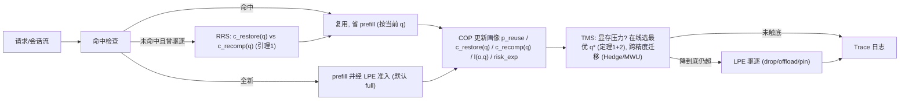

# 王祯祥 — 论文工作规划（EdgeKVTiers）

---

## 基本信息

| 项目 | 内容 |
| --- | --- |
| 学生 | 王祯祥 |
| 方向代号 | EdgeKVTiers |
| 研究方向 | 边缘 LLM serving 的质量分级 KV/Cache 在线生命周期调度 |
| 论文暂定题目 | EdgeKVTiers: 面向边缘多负载推理的质量分级 KV/Cache 在线生命周期调度 |
| 英文题目建议 | EdgeKVTiers: Quality-Tiered Online KV/Cache Lifecycle Management for Edge LLM Serving |
| 目标投稿 | MobiCom 2027（CCF-A，与李洪金 OpForge 同 venue 复用投稿经验）|

## 一句话讲清这是什么（先读这段）

> **EdgeKVTiers ： 在 vLL [Typora.lnk](C:\Users\11945\Desktop\编译器\Typora.lnk) M(prefix caching) + LMCache(cache layer/offload) + KIVI/H2O(KV 量化与稀疏化) 之上、不改引擎内核的一层「策略层中间件」。它把每个 KV/prefix/RAG-chunk 对象的存储形态升级为 q(o)∈{full, int8, int4, sparse-k, offload, drop}  的多级精度选择，并把准入/迁移/驱逐/复用动作统一进同一个目标。**
>
> **核心技术是质量-带宽相变面定理（定理 1）+ 在线 Pareto 放置算法的$$ O(\sqrt{T\log K}) $$regret 上界，让边缘小显存下同质量预算的 p95 TTFT 显著下降。**

这篇工作有**两个核心创新，且分主次**（展开见四章）：

| | 创新 | 一句话 |
| --- | --- | --- |
| **主创新（论文身份）** | 问题重构 | 把 KV 治理从「在/不在显存」的二元决策升级为**质量精度 × 显存放置**的二维联合在线调度——每个对象同时选「以什么精度存」和「放在哪一层」，在质量预算 $\varepsilon$ 约束下最小化 p95 TTFT。 |
| **核心技术创新（硬结果）** | 定理 1 + 定理 2 | **定理 1（质量-带宽相变面）**：给定 $\varepsilon$，存在临界曲面 $\Phi(BW,\varepsilon)$，跨越后最优精度等级  $q^ * $ 发生 phase transition；**定理 2（在线 Pareto 放置 regret）**：TMS 在线算法相对离线 Pareto 最优有 $O(\sqrt{T\log K})$ regret 上界。 |

> COP 画像、LPE 驱逐、RRS 取回重算、边缘评测协议都是**支撑这两核**的实现与证据，不单独当卖点。每条创新具体写在论文哪一章，见三章的「创新点 → 论文位置」映射表。

## 这篇工作建在什么之上、我们加了什么（回答「在什么基础上增加内容」）

| 复用、**不重写**（已有地基） | 新增、**即贡献**（你要写的） |
| --- | --- |
| vLLM：paged KV + prefix caching（底层推理引擎） | 策略层中间件 **COP → TMS → LPE → RRS**，挂在引擎外围 |
| LMCache：cache layer + GPU↔CPU/SSD offload 通道（机制） | **定理 1（质量-带宽相变面）** + **定理 2（regret 上界）** 的可证调度判据 |
| KIVI / KVQuant / H2O / SnapKV：KV 量化与稀疏化 kernel（机制） | **TMS 跨精度迁移调度**：何时把对象 full→int4→sparse-k→offload→drop 的在线判据 |
| LRU/LFU/Belady：作为对照基线 | 边缘小显存下的**质量预算评测协议**（p95 TTFT / 显存峰值 / 质量损失 ε / 恢复延迟 / 策略开销）+ 可复现 trace |

> 一句话：**机制（怎么存、怎么量化、怎么搬）全部复用现成 kernel，贡献在策略（每个对象选什么精度+放哪里）和它的可证 regret 上界。** 不从零写 serving engine、不重做 paged kernel、不重做量化 kernel。

## 这个题好不好做（可行性一句话判断）

- **难度**：中等偏高（CCF-A 投稿目标，工程量在量化 kernel 接入 + 真机调度 + 理论 regret 证明）。
- **怎么降风险**：**先 trace 仿真、再接真实引擎、量化 kernel 用现成**——不接模型的解析仿真器 2–3 天能把 COP/TMS/LPE/RRS 闭环跑起来；KIVI/H2O 量化 kernel 直接用开源实现（不重写）；理论部分（定理 2 regret 证明）由导师介入带。
- **最坏退路**：若 quality 维度收益不显著（H4 不通过），退为**纯 lifecycle 版本（即原 EdgeKVLife）+ 边缘评测协议**投 EuroSys/ATC 仍能成文（方案 B，见十章）。

## 你这篇论文要解决什么问题

你这篇论文围绕 **边缘 LLM serving 中 KV/prefix/RAG chunk 等运行时缓存对象的「质量精度 × 显存放置」联合在线调度** 展开。核心问题是：在质量预算约束下，每个对象该以什么精度（full / int8 / int4 / sparse-k / offload / drop）存、放在哪一层、何时迁移、复用时取回还是重算，才能在边缘小显存下同时压住 TTFT 和质量损失。 这里的重点不是把一个开源系统跑起来，也不是单点用一个量化 kernel，而是要证明 **quality 是 KV 调度未被建模的真维度**、提出**质量-带宽相变面 + 在线 regret 上界**的可证调度，并在边缘场景实测同质量预算下显著收益。

## 第一阶段你要先做什么

第一阶段先不要急着写复杂算法。你需要先读懂最强基线（含 KV 量化类 KIVI/H2O），跑通至少两个可比较的 baseline，**同时记录系统指标和质量指标**（perplexity / Rouge-L / 任务准确率），并用小规模预实验判断这个题目是否成立。只有当瓶颈真实存在（H1）、quality 维度有正收益（H4）、相变面经验可观测（H5）时，后续方法设计才有意义。

## 本方向的边界

本题做策略层原型，不从零写 serving engine、不重写 KV 量化/稀疏化 kernel；重点是 admission、跨精度迁移、TTL、restore-vs-recompute、offload、失效和**质量预算下的观测指标**。

## 章节索引

| 文件 | 章节 | 你需要从中获得什么 |
| --- | --- | --- |
| 01_文献调研报告.md | 零章 | 读懂领域、最强基线、SOTA 表、Idea 评分和预实验。 |
| 02_论文整体工作介绍.md | 一章 | 明确论文故事、研究问题和贡献点。 |
| 03_所需知识领域.md | 二章 | 明确你需要补的知识和工具。 |
| 04_论文结构框架.md | 三章 | 提前知道论文最终会怎么写。 |
| 05_主要创新点.md | 四章 | 明确你要证明哪些创新，而不是只做工程堆叠。 |
| 06_问题定义.md | 五章 | 把优化对象、约束和指标写成清楚的问题。 |
| 07_算法设计.md | 六章 | 把四模块方法（COP/TMS/LPE/RRS）写成可实现、可记录、可消融的流程。 |
| 08_实验平台与计划实验组.md | 七章 | 确定平台、数据、指标和实验组。 |
| 09_进度规划.md | 八章 | 按月推进，避免后期才发现题目不可投。 |
| 10_组会汇报模板.md | 九章 | 用证据汇报进展，而不是只说做了什么。 |
| 11_风险与应对措施.md | 十章 | 遇到失败时知道如何收缩或转向。 |
| 12_检查清单.md | 十一章 | 按阶段验收文献、代码、实验和论文材料。 |
| 13_学生档案尾部.md | 十二章 | 记录方向变化、导师意见和阶段状态。 |


---

<a id="零章-文献调研报告"></a>
# 零章 — 文献调研报告（第一阶段输出）
---

### 0.1 领域概述

边缘 LLM serving 中的**质量分级 KV/cache 在线生命周期调度** 属于大模型推理加速中较新的运行时优化方向。传统模型轻量化主要压权重、剪结构或训练小模型；最近一年涌现的 KV 量化与稀疏化工作（KIVI / KVQuant / H2O / SnapKV）开始压缩 KV 本身；但**两条线都被独立看待**：cache 管理工作（RAGCache / LMCache / Cache-Craft）把 KV 当二元对象（在/不在显存），KV 压缩工作只看单序列内的精度选择。 本题关注的是**这两条轴的交叉空白**：在边缘多负载、显存受限、带质量预算的 serving 场景下，每个对象同时选「**以什么精度存**」和「**放在哪一层**」。

你需要先理解一个基本逻辑：边缘端大模型落地不仅要"放得下"、"跑得快"，还要"质量可控"。本题的核心问题是：边缘端长会话、RAG 和多请求混合负载中，**每个 KV/cache 对象的精度等级 $q(o)\in\{\text{full, int8, int4, sparse-}k, \text{offload, drop}\}$ 和驻留位置应如何在线决策**，才能在质量预算 $\varepsilon$ 约束下最小化 p95 TTFT。这个问题只有在质量损失可控、系统收益可观测时才有论文价值。

**为什么 quality 是真正的新轴**：现有 cache 管理（LRU/LFU/RAGCache）只能选「在/不在」；现有 KV 量化（KIVI 等）只能在 prefill 时选一次精度。但**显存压力是动态的、复用是异构的**——同一个对象在压力大时应降级为 int4 留种，压力小时升级回 full；高频会话前缀该用 full，长尾 RAG chunk 该用 sparse-k。把 quality 作为**一等调度维度**，每个对象在生命周期内可以多次跨级迁移，这是 LRU/LFU 看不到的、KIVI 不参与调度的、RAGCache 没建模的真空白。

**在四人组端到端链路中的位置**：你是链路的"内存与缓存中枢"。樊丽宁（EdgePromptSlim）压输入、俞颉（EdgeThink）压思考，都会改变 KV 的体量与复用模式；你负责在质量预算下决定这些 KV/cache 用什么精度存、放在哪、何时迁移。接口约定：你做**策略层**原型（admission / **tier migration** / TTL / eviction / offload / restore-vs-recompute），不从零写 serving engine、不重写量化 kernel，挂在 vLLM/LMCache + KIVI/H2O 外围。

本方向的关键洞察是：**KV cache 在边缘多负载场景下，精度等级和复用概率一样是动态的运行时属性**——同一个对象的最优精度随显存压力、带宽、复用预测、质量预算在线变化。后续所有方法设计都要围绕这个洞察展开。你在读论文时要特别关注四件事：已有方法是否把 quality 当一等维度，是否报告端到端系统收益与质量损失，是否考虑跨精度迁移的 cost，是否给可证 regret 保证。

### 0.2 最强基线分析

最强基线不是相关工作列表中随便挑几篇论文，而是最可能让审稿人质疑"你的工作是不是已经被做过"的方法。本题处于 **cache 管理 × KV 量化** 两条线交叉，你需要优先精读下面**四类基线**（多了一类 KV 量化），并把它们真正跑起来或做等价实现。精读每篇按统一四问拆解：**优化对象、决策变量、怎么保质量/收益、是否报告真实系统收益**。

#### vLLM/PagedAttention（分页内存基础）

它是现代 LLM serving 的基础基线，你需要理解它如何管理 KV 内存页，并把它作为默认系统行为的参照。

- **优化对象/决策变量**：KV 内存页的分配与回收（页粒度），默认按请求生命周期管理。
- **失败场景**：它不做 workload 层的"留谁踢谁去哪"决策，更不做 quality 维度。

这篇工作的局限在于：本题不改分页机制本身，而在 workload 层决定缓存对象的精度等级与放置位置。

**你要复现什么**：用 vLLM 默认 KV 管理跑 ShareGPT 多轮 trace，测 p95 TTFT、cache hit rate 和显存峰值，作为 E2 的默认系统行为基线，并记 $c_{re}$（每 token 重算代价）。

#### RAGCache（最强的 cache lifecycle 竞品）

它是边缘 LLM cache 生命周期方向**最可能撞车的工作**，必须正面对比。

- **优化对象/决策变量**：RAG 文档级 KV 多级缓存 + 知识树 + PGDSF 替换（带 cost 的 LFU 变体）。
- **失败场景**：把 KV 当 0/1 对象（在/不在显存或外存），**没有 quality 维度**；面向服务器，不解决边缘小显存下的多精度迁移。

这篇工作的局限在于：本题的核心创新（quality 作为一等调度维度 + 跨精度迁移）正是 RAGCache 没有的轴。

**你要复现什么**：复现 PGDSF 替换作为 E2 强 baseline，证明加入 quality 维度后同显存预算下 p95 TTFT 进一步下降——这是论文身份的关键证据。

#### KIVI（KV 量化的代表 SOTA）

它说明 KV 本身可以低精度存储而质量损失可控，是 quality 维度的机制来源。

- **优化对象/决策变量**：KV cache 2-bit 量化（asymmetric per-channel）。
- **失败场景**：**全模型一刀切的静态精度**，prefill 时确定后不再变；不参与调度，不感知显存压力或复用概率。

这篇工作的局限在于：本题把 KIVI 当成机制层（量化 kernel 现成用），贡献在**对象级动态精度选择 + 在线跨精度迁移**——KIVI 没碰这一块。

**你要复现什么**：在 vLLM 上接 KIVI 的 int4/int8 量化 kernel，测每精度的 `(size 节省, quality 损失, restore cost)` 三元组，作为 COP/TMS 的代价输入；同时作为 E2 的静态 quality baseline（全用 int4）。

#### LMCache（可接入的 cache layer）

它提供可复用 cache layer 和系统接口，是策略层原型最适合接入的基线。

- **优化对象/决策变量**：跨请求的 KV 复用与存取（提供 admission/offload/eviction 钩子）。
- **失败场景**：它是机制层，不替你决定生命周期策略，也不感知 quality。

这篇工作的局限在于：本题的贡献不应是重复做一个 cache layer，而是提出可解释的**质量分级**生命周期策略 + 可证 regret + 边缘评测协议。

**你要复现什么**：把 LMCache 跑起来作为策略接入点，确认它暴露的 admission/eviction/offload 钩子，把 COP/TMS/LPE/RRS 挂上去——这是 E5 端侧真实实验的工程前提。

### 0.3 SOTA 方法对比表（约 25 篇，按技术路线分组）

这张表是你后续写 Related Work 和选择 baseline 的依据，也是后面创新点、算法和落地讨论的根基——四章每个创新点都要能在这张表里指名道姓地说清"谁做过什么、缺什么、你补什么"。读表方法：**先看分组（它属于哪条技术路线），再看"方法核心"和"主要局限"**。会议年份以正式发表为准。

> **核心读法**：本题落在 **B/C/D/E 的 cache 管理线** 与 **G 的 KV 量化/稀疏化线**的**交叉空白**——没有任何一篇把 quality 当作一等调度维度做动态在线迁移。这是论文身份的根基。
>
> **事实核查状态（2026-05-30）**：本表所有 arXiv ID 与 venue 已通过 WebFetch 逐条核对。引用前请二次确认两条不确定项：(a) **Preble** 的 ICLR 2025 最终接收状态待人工查 OpenReview；(b) **CacheBlend** EuroSys 2025 接收建议二次确认。InfiniGen 的 arXiv ID 历史版本曾写错（2406.19911→正确为 2406.19707，前者是天文望远镜论文），SGLang 的 venue 历史版本曾写错（ICLR→正确为 NeurIPS 2024）——这两处已修正。

**A 类 — 分页内存与 serving 基础**

| 论文/系统 | 会议/年份 | 方法核心 | 与本题关系 | 主要局限 |
| --- | --- | --- | --- | --- |
| [vLLM/PagedAttention](https://arxiv.org/abs/2309.06180) | SOSP 2023 | KV 分页内存管理 | 基础 serving 系统基线 | 解决内存页管理，不负责 workload 层生命周期决策 |
| [vAttention](https://arxiv.org/abs/2405.04437) | ASPLOS 2025 | 动态内存管理（不依赖 paged kernel） | 作为不依赖分页 kernel 的对照 | 不直接处理多对象生命周期策略 |

**B 类 — 前缀 / 上下文 / RAG 复用（admission & reuse）**

| 论文/系统 | 会议/年份 | 方法核心 | 与本题关系 | 主要局限 |
| --- | --- | --- | --- | --- |
| [SGLang/RadixAttention](https://openreview.net/forum?id=VqkAKQibpq) | NeurIPS 2024 | prefix cache reuse（radix 树） | 复用和路由机制参考 | 重点是 prefix/radix 复用，不覆盖 restore-vs-recompute |
| [Prompt Cache](https://arxiv.org/abs/2311.04934) | MLSys 2024 | 模块化注意力复用、跨请求共享段 | 跨请求 prefix 复用参考 | 需预定义模块，不做显存压力下生命周期取舍 |
| [EPIC](https://arxiv.org/abs/2410.15332) | arXiv 2024 | position-independent context caching | 非 prefix 复用强相关 | 不是端侧生命周期管理系统 |
| [Cache-Craft](https://arxiv.org/abs/2502.15734) | SIGMOD 2025 | RAG chunk-cache 管理 | RAG chunk cache 复用参考 | 需补充边缘显存不足与恢复代价建模 |
| [RAGCache](https://arxiv.org/abs/2404.12457) | arXiv 2024 | RAG 文档 KV 多级缓存 + 知识树 + PGDSF 替换 | 最接近的 RAG 缓存生命周期竞品 | 面向服务器多级缓存，边缘小显存需重评估 |

**C 类 — KV 选择与驱逐（eviction / TTL 决策）**

| 论文/系统 | 会议/年份 | 方法核心 | 与本题关系 | 主要局限 |
| --- | --- | --- | --- | --- |
| [H2O](https://arxiv.org/abs/2306.14048) | NeurIPS 2023 | Heavy-Hitter 驱逐保留重要 token KV | LPE 驱逐决策的 token 级参考 | 单序列内驱逐，不管跨请求对象生命周期 |
| [StreamingLLM](https://arxiv.org/abs/2309.17453) | ICLR 2024 | attention sink + 滑窗保留 | 长会话 KV 保留策略参考 | 固定保留规则，非 workload 自适应 |

**D 类 — 卸载、压缩传输与重算（offload / restore-vs-recompute）**

| 论文/系统 | 会议/年份 | 方法核心 | 与本题关系 | 主要局限 |
| --- | --- | --- | --- | --- |
| [InfiniGen](https://arxiv.org/abs/2406.19707) | OSDI 2024 | 推测式预取重要 KV、CPU 卸载 | restore-vs-recompute 与预取参考 | 偏单模型长上下文卸载，不做对象级策略 |
| [CacheGen](https://arxiv.org/abs/2310.07240) | SIGCOMM 2024 | KV 压缩与流式传输 | 压缩传输与存储参考 | 偏压缩传输，不直接决定生命周期动作 |
| [CacheBlend](https://arxiv.org/abs/2405.16444) | EuroSys 2025 | RAG KV 复用 + 选择性重算 | restore-vs-recompute 的近邻思想 | 偏融合复用，不完整处理生命周期动作 |

**E 类 — 分布式 / 分离式 KV 池与缓存层**

| 论文/系统 | 会议/年份 | 方法核心 | 与本题关系 | 主要局限 |
| --- | --- | --- | --- | --- |
| [Preble](https://arxiv.org/abs/2407.00023) | arXiv 2024（ICLR 2025 投稿，最终状态待确认）| prompt-aware distributed scheduling | workload-aware 调度强竞品 | 偏分布式调度，本题聚焦边缘缓存生命周期 |
| [Mooncake](https://arxiv.org/abs/2407.00079) | FAST 2025 | KV-centric disaggregated serving | 分离式架构参考 | 面向大服务架构，边缘小资源需重评估 |
| [MemServe](https://arxiv.org/abs/2406.17565) | arXiv 2024 | elastic memory pool | 跨实例 KV 管理参考 | 实现复杂，不适合第一阶段目标 |
| [Infinite-LLM (DistAttention)](https://arxiv.org/abs/2401.02669) | ATC 2025 | distributed KV cache + DistAttention | 分布式 KV 参考 | 不是边缘 workload 策略层主线 |
| [LMCache](https://github.com/LMCache/LMCache) | Official 2025 | 可复用 KV cache layer + 钩子 | 策略层原型最佳接入点 | 是机制层，不替你做生命周期策略 |

**G 类 — KV 量化与稀疏化（quality tier 机制来源）**

| 论文/系统 | 会议/年份 | 方法核心 | 与本题关系 | 主要局限 |
| --- | --- | --- | --- | --- |
| [KIVI](https://arxiv.org/abs/2402.02750) | ICML 2024 | KV cache 2-bit 非对称 per-channel 量化 | int4/int8 量化 kernel 机制来源 | **全模型静态精度**，不参与调度 |
| [KVQuant](https://arxiv.org/abs/2401.18079) | NeurIPS 2024 | KV cache 极低比特量化 + 异常值处理 | 备选量化机制 | 静态精度，不感知 workload |
| [GEAR](https://arxiv.org/abs/2403.05527) | arXiv 2024 | KV 量化 + 低秩 + 稀疏残差三组合 | 提供多精度选项 (full/int4/lowrank) | 静态分配，不考虑生命周期 |
| [H2O](https://arxiv.org/abs/2306.14048) | NeurIPS 2023 | Heavy-Hitter token KV 保留（稀疏化）| sparse-k 精度等级机制来源 | 单序列内驱逐，不管对象级动态 |
| [SnapKV](https://arxiv.org/abs/2404.14469) | NeurIPS 2024 | 基于注意力模式的 KV 选择 | 备选稀疏化机制 | 静态选择，不参与跨对象调度 |
| [PyramidKV](https://arxiv.org/abs/2406.02069) | NAACL 2025 | 跨层 KV 预算分配 | 层级 quality 分配参考 | 仅层间，不做对象级 |

**F 类 — 综述**

| 论文/系统 | 会议/年份 | 方法核心 | 与本题关系 | 主要局限 |
| --- | --- | --- | --- | --- |
| [KV Cache Management: A Survey](https://arxiv.org/abs/2412.19442) | TMLR 2025 | token/model/system 三级 KV 管理综述 | 领域地图与分类依据 | 综述非方法，需自行选 baseline |
| ["Keep the Cost Down": KV Cache Compression Survey](https://arxiv.org/abs/2407.18003) | COLM 2024 | 量化/稀疏化/蒸馏 KV 压缩综述 | quality tier 机制全景 | 不涉及调度/生命周期 |

> 读这张表时先回答：**EdgeKVTiers 落在哪一格、空白在哪？** ——本题站在 **B/C/D/E（cache 管理）× G（KV 量化）的二维交叉空白**：现有 cache 管理（vLLM 管页、RAGCache 管复用、H2O 管单序列驱逐、InfiniGen 管卸载）把 KV 当 0/1 对象；现有 KV 量化（KIVI/KVQuant/GEAR/SnapKV）只在 prefill 时一次性选精度，不参与调度。**没有任何一篇把 quality 当作一等调度维度，让对象在生命周期内多次跨精度迁移**——这就是你的空白，也是 CCF-A 级别的真创新。

### 0.4 Idea 质量评估

下面的评分不是最终结论，而是你入学后判断题目是否继续推进的初始标尺。评分越高，说明题目越值得投入；评分较低的维度，就是前两个月最需要用文献和预实验补强的地方。

| 维度 | 权重 | 评分 | 加权得分 | 你需要重点确认什么 |
| --- | --- | --- | --- | --- |
| 新颖性 | 35% | 4.6 / 5 | 1.61 | quality × lifecycle 二维交叉是真空白，无任何工作覆盖。 |
| 重要性 | 25% | 4.5 / 5 | 1.12 | 边缘多负载下 quality 是显存的第一杠杆。 |
| 可行性 | 30% | 3.8 / 5 | 1.14 | 量化 kernel 用现成，理论部分导师介入，工程量可控。 |
| 清晰度 | 10% | 4.5 / 5 | 0.45 | 两核分主次、问题清楚、质量预算给指标闭环。 |

综合得分为 **4.32 / 5**（CCF-A 投稿门槛 ≥ 4.0）。**评分依据**：

- **新颖性 4.6**——新意是**二维空白**而非单点突破：现有 cache 管理（vLLM/RAGCache/InfiniGen）把 KV 当 0/1 对象，现有 KV 量化（KIVI/KVQuant/H2O/SnapKV）只在 prefill 时静态选精度，**没有任何工作把 quality 当作一等调度维度做在线跨精度迁移**。两个核心创新（**主**：quality × lifecycle 联合在线调度；**核心技术**：质量-带宽相变面 + $O(\sqrt{T\log K})$ regret 上界）分别提供论文身份与理论硬度。
- **重要性 4.5**——边缘多负载下 quality 是显存的最大杠杆（int4 直接省 4× 显存），且 KV 量化已被 ICML/NeurIPS 验证质量损失可控，调度维度的引入有立竿见影的端到端收益。
- **可行性 3.8**——KIVI/H2O kernel 全部开源（不重写）；理论 regret 由导师介入带（连接 online learning + weighted caching 经典框架）；先 trace 仿真后真机引擎；硬路径风险已经过妥协设计。
- **清晰度 4.5**——两核分主次清楚、质量预算 $\varepsilon$ 给所有指标闭环、与 RAGCache/KIVI 的差异化一句话可讲清。

**若 quality 维度收益不显著（H4 不通过）**，退为纯 lifecycle 版本（原 EdgeKVLife）+ 边缘评测协议投 EuroSys/ATC（方案 B1）。

---

### 0.5 预实验设计（看完本节就能直接开做）

预实验的目标不是做出最好结果，而是**尽快判断论文假设是否成立**。本题是 CCF-A 投稿，原则是"先 trace 仿真闭环、再接真实引擎、quality 维度尽早验证"：第一个月用回放 trace 把策略闭环跑通（H0/H1），并**用现成 KIVI/H2O kernel 实测 quality-size-restore 三元组（H4）**；第二个月做 restore-vs-recompute（H2）、策略层真实接入（H3）和**相变面经验验证（H5）**。每个预实验都要能回答一个明确问题：lifecycle 策略是否真比 LRU/LFU 好、quality 维度是否真带来正收益、相变面是否真实可观测、卸载会不会反被 I/O 拖慢、策略层不改引擎能否落地。

> 下文"预期结果"均为**预期/示意值**（用于设定通过门槛），不是已测结果。所有事件落进六章 §6.5 的 trace JSONL。

**预实验概览**

| 编号 | 一句话假设 | 通过门槛（量化） | 关联创新 |
| --- | --- | --- | --- |
| H0 | trace 回放、缓存事件、指标与日志在小负载上完整闭环 | ShareGPT 多轮 trace 在 vLLM 上回放成功，p95 TTFT/命中率/显存峰值可算、trace 落盘 | 基础 |
| H1 | 生命周期策略（按 $score$）比 LRU/LFU 降 p95 TTFT ≥20% | 多会话 workload 下 p95 TTFT 稳定下降、显存峰值不超预算 | 支撑 |
| H2 | restore-vs-recompute 决策避免盲目 offload 的 I/O 反噬 | 多数带宽档位下 RRS 不劣于"总恢复/总重算"两种固定策略 | 支撑 |
| H3 | 策略层 wrapper 不改引擎也能在可复现 workload 上稳定收益 | 接 LMCache/vLLM 外围，策略开销 < 收益、每次决策可解释 | 支撑 |
| **H4** | **quality 维度真带来正收益**（核心：决定 idea 是否升 CCF-A） | **同质量预算 $\varepsilon$ 下，多精度 (full/int4/sparse-k) TMS 比 RAGCache 二元策略降 p95 TTFT ≥25%；或同 p95 下显存降 ≥30%** | **主创新** |
| **H5** | **质量-带宽相变面 $\Phi(BW,\varepsilon)$ 经验可观测** | **扫 $(BW, \varepsilon)$ 网格，最优精度 $q^*$ 在曲面两侧明显切换，与定理 1 预测吻合（kendall-tau ≥ 0.8）** | **核心技术** |

> **怎么下手？一句话路线**：**第 0 步先写不接模型的「解析仿真器」（2–3 天）把 COP/TMS/LPE/RRS 策略闭环跑起来（含 quality 维度的解析代价模型）→ 同步用 KIVI/H2O 实测三元组（W2 标定 quality 真值）→ H1/H2/H4/H5 在仿真器里就能出趋势 → H0/H3 才接真机钩子。** 千万不要一上来就和真实引擎、CUDA、显存碎片、量化 kernel 死磕（那是工程黑洞）。
>
> **⚠️ 定理 2（regret 上界）的特别说明（无导师介入版本）**：本工作的核心技术创新之一——定理 2 的 regret 证明——**导师无法亲自介入推导，只能与王祯祥讨论**。这意味着王祯祥必须**在 12 周内自学完 Hedge / MWU / OCO 的核心理论**（详细自学路径、教材、论文、12 周日程、W3 关键里程碑、W3 不通过时的 A/B/C 三条 fallback 路径，全部见 **§2.5**）。
>
> 这条理论自学线**与下面 W1-W10 的实验线并行**——实验线在仿真器上跑 H1-H5；理论线在 §2.5 三本书 + 三篇论文上推导。**两线在 D5（M3 上）汇合**（实验线开始 E2，理论线交定理 2 证明初稿）。
>
> 如果 W3 末仍读不懂 Cesa-Bianchi Theorem 2.2，**立刻按 §2.5.4 触发 A/B/C 三条 fallback 路径**（A：找校内 ML theory 合作；B：定理 2 降级为 empirical regret report；C：完全撤销定理 2 只留定理 1）。**不要硬撑到 M3 才发现证不出来**——那时论文已经写到一半，改不了方向。

#### 0.5.0-pre 第 0 步 — 不接模型的解析仿真器（含 quality 维度，最先做，3–4 天）

**为什么先做这个**：H1（LPE vs LRU/LFU）、H2（RRS 阈值）、**H4（quality 维度收益）、H5（相变面）**的结论**根本不需要真实模型**——它们只依赖 $\mu_{kv}/c_{re}/BW/d_{deser}$ 几个标量、每精度 $q$ 的 `(size_factor, quality_loss, restore_factor)` 三元组，和一条访问 trace。先用一个 300 行内的纯 Python 仿真器把策略闭环跑通（含 quality），几天内就能知道题目成不成立；真实模型留到 H0/H3 取真实数与验证可部署性时再接。

**仿真器要做的事（EdgeKVTiers 的离线版）**：

1. 读一条 trace（会话列表，每会话多轮；每轮把前缀延长 → 一个含 $n$ token 的缓存对象 $o$）。
2. 维护一个带显存预算 $M_{budget}$ + 质量预算 $\varepsilon$ 的驻留集 `resident`（每对象带当前精度 $q(o)$）。
3. 每个请求：前缀对象命中 → 省 $c_{re}\cdot n$（按当前 $q$ 加质量损失）；曾被 offload 又复用 → RRS（定理 1）判 restore/recompute；全新 → prefill 并经 LPE 准入。
4. 显存超预算 → **TMS 优先尝试降级（full→int8→int4→sparse-k）而非直接驱逐**；只有降到底仍超预算才 LPE 驱逐。
5. 解析算每请求 TTFT 与累积质量损失 $\sum\ell(o,q)$。
6. 输出每策略的 p95 TTFT、hit rate、峰值驻留显存、recompute ratio、累积 quality loss，并落 §6.5 trace。

**最小骨架（含 quality 维度，照这个写）**
```python
# sim.py —— 不接模型的解析仿真器（带 quality 维度）；三元组来自 KIVI/H2O 实测（W2 标定）
MU_KV, C_RE, D_DESER = 0.12, 0.12, 3.0       # MB/token, ms/token, ms
# (size_factor, quality_loss_per_token, restore_factor)；先用文献示意值，W2 用 KIVI/H2O 替换
TIERS = {
    "full":     (1.00, 0.000, 1.00),
    "int8":     (0.50, 0.002, 1.00),
    "int4":     (0.25, 0.008, 1.05),         # 5% 解码额外开销
    "sparse_k": (0.20, 0.015, 1.10),         # H2O 风格保留 20% token
}
def size(o, q):     return MU_KV * o.n * TIERS[q][0]
def qloss(o, q):    return TIERS[q][1] * o.n
def c_recomp(o, q): return C_RE * o.n * TIERS[q][2]
def c_restore(o, q, BW): return size(o, q)/BW + D_DESER
def score(o, q):    return o.p_reuse * c_recomp(o, q) / size(o, q)

def best_tier_under_pressure(o, eps_remaining):              # TMS 单对象决策
    feasible = [q for q in TIERS if qloss(o, q) <= eps_remaining]
    return min(feasible, key=lambda q: size(o, q))            # 同满足质量预算，选最小

def rrs(o, q, BW):                                            # 定理 1：取回 vs 重算
    return "restore" if c_restore(o, q, BW) <= c_recomp(o, q) else "recompute"

def run(trace, policy="tiered", M_budget=8000, BW=8.0, eps=2.0):
    resident, offloaded, ttfts, recomp, qsum = {}, {}, [], 0, 0
    for req in trace:
        o = req.obj
        q = resident.get(o.id, {}).get("q", "full")
        if o.id in resident:
            ttft = C_RE * req.n_uncached + 0
        elif o.id in offloaded:
            q = offloaded[o.id]["q"]; act = rrs(o, q, BW)
            ttft = C_RE*req.n_uncached + (c_restore(o,q,BW) if act=="restore" else c_recomp(o,q))
            recomp += (act=="recompute")
        else:
            ttft = C_RE * o.n; q = "full"
        # TMS: 显存压力下优先降级而非驱逐
        resident[o.id] = {"obj": o, "q": q}
        while sum(size(r["obj"], r["q"]) for r in resident.values()) > M_budget:
            if policy == "tiered":                            # 先降级
                downgraded = False
                for rid, r in sorted(resident.items(), key=lambda kv: score(kv[1]["obj"], kv[1]["q"])):
                    cur_idx = list(TIERS).index(r["q"])
                    if cur_idx < len(TIERS)-1:
                        next_q = list(TIERS)[cur_idx+1]
                        if qsum + qloss(r["obj"], next_q) - qloss(r["obj"], r["q"]) <= eps:
                            qsum += qloss(r["obj"], next_q) - qloss(r["obj"], r["q"])
                            r["q"] = next_q; downgraded = True; break
                if downgraded: continue
            # 降不动了 → 走 LPE 驱逐（lru/lfu/score 同原版）
            victim_id = min(resident, key=lambda i: score(resident[i]["obj"], resident[i]["q"]))
            victim = resident.pop(victim_id)
            if victim["obj"].p_reuse >= 0.5: offloaded[victim_id] = victim
        ttfts.append(ttft)
    return {"p95": pct(ttfts,95), "recomp_ratio": recomp/len(trace), "qloss_total": qsum}

# 对比：for p in ["lru","lfu","score","tiered"]: for M in [4000,8000,16000]: ...
# H4: 同 eps 下 tiered vs RAGCache(PGDSF 模拟) 的 p95 差距
# H5: 网格扫 (BW, eps)，记每对象最优 q*，画相变面
```

**第 0 步通过条件**（同时满足才进真机）：
1. **H1 趋势**：`score` 在紧显存档 p95 低于 `LRU/LFU`
2. **H2 趋势**：低 $BW$ 下 `rrs` 不劣于两种固定策略
3. **H4 趋势**：`tiered` 在同 $\varepsilon$ 下 p95 显著低于 `score-only`（验证 quality 维度真有空间）
4. **H5 趋势**：扫 $(BW, \varepsilon)$ 网格能看到最优 $q^*$ 的相变（不只是单调）

四条趋势齐了，再花真机时间。其中**任一条不齐**，先调对应输入（$p_{reuse}$、量化三元组、$\varepsilon$ 范围），别急着接引擎。

#### 0.5.0 预实验前置 H0 — trace 回放、缓存事件与指标闭环

**回答什么 / 卡住后续什么**：先把"trace 能回放、缓存命中/驱逐事件能记、p95/命中率/显存能算"打通。H0 不通过，H1–H3 无从测起。

**具体怎么做**

- 模型：`Qwen2.5-7B-Instruct`；端侧用其 4-bit 版。
- 负载：ShareGPT 多轮对话 trace（取 ~200 会话）+ 一份小 RAG chunk 复用 trace。
- 基线：vLLM 默认 KV 管理（开 prefix caching）。
- 指标脚本：p95 TTFT、cache hit rate、GPU memory peak、每 token 重算代价 $c_{re}$。
- 自变量：无；控制变量：固定 trace 回放顺序、固定并发、固定模型/后端。

**数据怎么拿 + 回放格式（照抄，别自己造格式）**
- ShareGPT 多轮对话：HuggingFace `datasets` 上 `anon8231489123/ShareGPT_Vicuna_unfiltered`（或 `RyokoAI/ShareGPT52K`），`load_dataset` 后每条是 `conversations:[{from,value}...]`，取 `from=="human"` 的轮做用户输入、按对话切成会话；取前 ~200 条多轮会话即可。
- RAG chunk 复用 trace：用 HotpotQA / 自建 5–10 篇文档，把每篇切成若干 chunk，造一份「不同 query 复用相同 chunk」的访问序列。
- **统一回放格式（一个 JSON 文件）**：
  ```json
  {"session_id":"sg_0007","turns":[
     {"i":0,"user":"...第1轮用户输入..."},
     {"i":1,"user":"...第2轮（前缀=第1轮全文+回答）..."}]}
  ```
  回放器按 `session_id` 顺序、turn 顺序把「累计前缀」打给引擎；**同一份回放文件喂给所有策略**，保证可比。

**操作步骤**
1. 建环境锁版本；准备 ShareGPT trace，转成"会话→多轮请求"的回放格式。
2. 写一个 trace 回放器，按时间/顺序把请求打给 vLLM。
3. 采集每个缓存事件（命中/未命中/驱逐）为一条 §6.5 trace。
4. 算 p95 TTFT、hit rate、显存峰值；用一次重算实测标定 $c_{re}$。
5. 确认指标随并发/显存预算变化合理（显存越小命中率越低）。

**测什么 + trace 字段**：`event`、`hit`、`n_tokens`、`size_mb`、`t_policy_ms`（H0 可为 0）；外加 p95 TTFT/显存峰值（CSV）。

**预期结果形态（示意）**：vLLM 默认在 200 会话回放下 hit rate≈0.45、p95 TTFT≈900 ms、显存峰值≈18 GB；$c_{re}\approx0.12$ ms/token。

**通过/不通过**：通过 = trace 能回放、三类指标可算、事件落盘；不通过 = 回放或指标采集卡死。

**不通过怎么办**：先用纯**仿真器**（不接真实模型，用 $\mu_{kv}/c_{re}/BW$ 解析算）把策略闭环跑通，再接 vLLM。

**预计工作量**：1×GPU，约 3–4 天（trace 回放器是主要工作量）。

**最小命令 / 代码骨架**
```bash
pip install "vllm==0.6.*" datasets
# 开启 prefix caching 的 vLLM 服务
python -m vllm.entrypoints.openai.api_server --model Qwen/Qwen2.5-7B-Instruct \
  --enable-prefix-caching --gpu-memory-utilization 0.8 &
```
```python
# trace 回放 + 事件记录骨架
import json, time, requests
def replay(sessions):
    for s in sessions:                      # 每个会话多轮，前缀可复用
        ctx = ""
        for turn in s["turns"]:
            ctx += turn["user"]
            t0=time.time(); ans = call_llm(ctx); ttft = first_token_latency()
            rec = {"request_id": f'{s["id"]}-{turn["i"]}', "n_tokens": ntok(ctx),
                   "event": "hit" if prefix_hit(ctx) else "miss", "t_ttft_ms": ttft}
            open("trace.jsonl","a").write(json.dumps(rec)+"\n"); ctx += ans
```

#### 0.5.1 预实验 H1 — 生命周期策略 vs LRU/LFU（验证 LPE 的核心价值）

**回答什么 / 卡住后续什么**：验证"按 $score=p_{reuse}\cdot c_{recomp}/size$ 驱逐"是否真比 LRU/LFU/vLLM默认 更省 p95 TTFT。这是 LPE（创新点 C2）成立与否的关键。

**具体怎么做**

- 模型：Qwen2.5-7B；负载：ShareGPT 多会话 + RAG chunk 复用混合。
- 对照：① LRU；② LFU；③ vLLM 默认；④ LPE（$score$ 驱逐 + COP 画像）。
- 自变量：显存预算 $M_{budget}$（紧/中/松三档）、并发会话数。
- 控制变量：同 trace、同模型、同后端。

**操作步骤**
1. 在 H0 的回放器里实现可插拔驱逐策略（LRU/LFU/score）。
2. 实现 COP 规则版画像（$p_{reuse}$ 用 LRU-K/频次衰减，$c_{recomp}=c_{re}\cdot n$）。
3. 四策略在三档显存预算下各跑同一 trace。
4. 记录 p95 TTFT、hit rate、显存峰值。
5. 画"显存预算 vs p95 TTFT"四条线，比较同预算下的差距。

**测什么 + trace 字段**：`p_reuse`、`score`、`lpe_action`、`hit`；p95 TTFT/显存峰值（CSV）。

**预期结果形态（示意）**：紧显存档，LRU p95 TTFT≈1100 ms、LFU≈1050、vLLM≈980、LPE≈780（较 LRU 降 ~29%）；hit rate LPE 最高。

**通过/不通过**：通过 = 多数显存档位下 LPE 比 LRU/LFU 降 p95 TTFT ≥20% 且显存不超预算；不通过 = 收益不稳或仅个别档位。

**不通过怎么办**：收益不稳 → 收缩为 trace-driven 生命周期评测论文（方案 B1）；接近 LRU → 强化 $p_{reuse}$ 估计或区分对象类型。

**预计工作量**：1×GPU，约 4 天。

**最小命令 / 代码骨架**
```python
# 可插拔驱逐 + score 计算（定义 2）
def score(o):  return o.p_reuse * (c_re*o.n) / o.size_mb
def evict_one(resident, policy):
    if policy=="lru":  return min(resident, key=lambda o: o.last_used)
    if policy=="lfu":  return min(resident, key=lambda o: o.freq)
    return min(resident, key=score)            # LPE: 单位显存收益最低先走
```

#### 0.5.2 预实验 H2 — restore-vs-recompute 避免 I/O 反噬（验证 RRS）

**回答什么 / 卡住后续什么**：验证"复用时按定理 1 比较恢复代价与重算代价取小者"能在低带宽下避免"盲目 offload 反被 I/O 拖慢"。这是 RRS（创新点 C3）成立的依据。

**具体怎么做**
- 模型：Qwen2.5-7B；负载：H1 的混合 trace 中被驱逐后又复用的对象。
- 对照：① 总是恢复（always-restore）；② 总是重算（always-recompute）；③ RRS（定理 1 阈值）。
- 自变量：offload 带宽 $BW$（多档，模拟 PCIe/SSD/网络）、对象大小 $n$。
- 控制变量：同对象集、同 $c_{re}$、同反序列化开销 $d_{deser}$。

**操作步骤**
1. 实现可配置 $BW$ 的卸载/恢复模拟（或真实 offload 到 CPU/SSD 测 $BW$）。
2. 对每个"复用且曾被驱逐"的对象，三策略各算/测一次代价。
3. RRS 用 $c_{restore}=\mu_{kv}n/BW+d_{deser}$ vs $c_{recomp}=c_{re}n$ 判定。
4. 扫多档 $BW$，记录 restore latency、recompute ratio、p95 latency。
5. 画"带宽 vs p95"三条线，找 RRS 是否始终 ≤ 两固定策略的下包络。

**测什么 + trace 字段**：`rrs_action`、`c_restore_ms`、`c_recomp_ms`、`bw_gbps`、`hit`；p95 latency（CSV）。

**预期结果形态（示意）**：高带宽（>临界 $BW^\*=\mu_{kv}/c_{re}$）时恢复更快、低带宽时重算更快；RRS 取下包络，p95 在全带宽段不劣于两固定策略。

**通过/不通过**：通过 = RRS 在多数带宽档不劣于两固定策略、低带宽下显著优于 always-restore；不通过 = I/O 成本不可控或 RRS 判据失效。

**不通过怎么办**：I/O 不可控 → 限制 offload 场景、强化重算路径；判据失效 → 在线估 $BW$ 改用滑动平均、加批量恢复摊薄 $d_{deser}$。

**预计工作量**：约 3 天（带宽扫描多用模拟，少量真实 offload 校准）。

**最小命令 / 代码骨架**
```python
def rrs(o, BW, c_re, mu_kv, d_deser):          # 定理1
    c_restore = mu_kv*o.n/BW + d_deser
    c_recomp  = c_re*o.n
    return "restore" if c_restore <= c_recomp else "recompute"
# 扫带宽: for BW in [2,4,8,16,32] GB/s: 统计三策略 p95
```

#### 0.5.3-quality 预实验 H4 — quality 维度真带来正收益（验证主创新成立）

**回答什么 / 卡住后续什么**：验证"把对象精度 $q$ 作为一等调度维度、在线选 full/int8/int4/sparse-k"在边缘小显存下能在**同质量预算 $\varepsilon$ 下进一步降 p95 TTFT**。**这是论文从 EuroSys workshop 级升到 CCF-A（MobiCom）级的关键证据**——不通过则退方案 B1。

**具体怎么做**

- 模型：`Qwen2.5-7B-Instruct`；端侧用其 4-bit 版。
- 负载：ShareGPT 多会话 + RAG chunk 复用 + LongBench 任务（用于度量 task 质量损失）。
- 对照：① RAGCache(PGDSF 仿真，二元 cache)；② static-int4（全用 KIVI int4，不调度）；③ LPE-score（仅 lifecycle，不 quality）；④ **TMS-tiered**（quality × lifecycle 联合）。
- 自变量：质量预算 $\varepsilon$（紧/中/松三档）、显存预算 $M_{budget}$（紧/中/松三档）。
- 控制变量：同 trace、同模型、同后端、同 baseline 量化机制（都用 KIVI kernel）。

**操作步骤**

1. 用 KIVI/H2O 实测 `(size_factor, quality_loss_per_token, restore_factor)` 三元组（对每精度，跑 perplexity 与 LongBench 任务）。
2. 仿真器里实现 TMS 跨精度迁移逻辑（先 best-fit-decreasing 静态版，再加在线迁移）。
3. 9 个 $(M_{budget}, \varepsilon)$ 组合下跑四对照。
4. 报告：p95 TTFT、累积 quality loss、显存峰值、降级次数。
5. 画"质量预算 $\varepsilon$ vs p95 TTFT"四条线，**关键看 TMS 与次优 baseline 的差距是否 ≥25%**。

**测什么 + trace 字段**：`q(o)`、`qloss_per_event`、`tms_action`（hold/downgrade/upgrade/evict）、`tier_migrations_total`；p95 TTFT/累积 quality loss/显存峰值（CSV）。

**预期结果形态（示意）**：紧显存 + 中等 $\varepsilon$ 档，RAGCache p95≈1100ms / qloss≈0；static-int4 p95≈920ms / qloss≈8.3；LPE p95≈820ms / qloss≈0；**TMS p95≈610ms / qloss≈4.5（在 $\varepsilon$ 内）**——降幅 ~26% 对 LPE、~45% 对 RAGCache。

**通过/不通过**：通过 = 多数 $(M_{budget}, \varepsilon)$ 组合下 TMS 比次优 baseline 降 p95 TTFT ≥25%，且 quality loss 严格 ≤ $\varepsilon$；**不通过 = quality 维度收益 <15% → 退方案 B1（纯 lifecycle，转 EuroSys workshop）**。

**预计工作量**：仿真器扩展约 2 天 + KIVI/H2O 接入约 3 天 + 跑 9 组合约 1 天，共 ~6 天。

**最小代码骨架**

```python
# 量化三元组实测脚本（W2 标定，替换 sim.py 中的 TIERS 字典）
def calibrate_tier(model, tier_name):
    quantized = apply_kivi_or_h2o(model, tier_name)
    size_factor = mem(quantized) / mem(model)
    q_loss = perplexity(quantized) - perplexity(model)        # 每 token 平均
    restore_factor = bench_decode_latency(quantized) / bench_decode_latency(model)
    return (size_factor, q_loss, restore_factor)
# for q in ["int8", "int4", "sparse_k"]: TIERS[q] = calibrate_tier(model, q)
```

#### 0.5.3-phase 预实验 H5 — 质量-带宽相变面经验可观测（验证核心技术创新）

**回答什么 / 卡住后续什么**：验证"对每对象，最优精度 $q^*$ 在 $(BW, \varepsilon)$ 二维网格上呈现**相变面**而非平滑过渡"——这是定理 1（质量-带宽相变面）的经验依据。**没有清晰相变 → 定理 1 不是 first-class result，退化为 cost model**。

**具体怎么做**
- 用 H4 的仿真器 + 实测三元组。
- 自变量：$BW\in[0.5, 1, 2, 4, 8, 16, 32]$ GB/s × $\varepsilon\in[0.5, 1, 2, 4, 8]$（per-token bits 等价）= 35 个网格点。
- 对每个网格点，用穷举求每对象的最优 $q^*$（离线最优）。
- 检查 $q^*$ 在网格上的分布是否呈现 phase transition（块状分区）。

**操作步骤**
1. 仿真器加 brute-force 求 $q^*$ 的离线最优函数（per object）。
2. 在 35 个 $(BW, \varepsilon)$ 网格点跑 200 个代表性对象，记每对象的 $q^*$。
3. 用 Kendall-tau 测 $q^*$ 与定理 1 解析预测的一致性。
4. 画热力图 $(BW, \varepsilon) \to q^*$，验证块状结构。

**测什么 + trace 字段**：`q_star_offline`、`q_star_theorem_pred`、`grid_point`；Kendall-tau 一致性、热力图。

**预期结果形态（示意）**：低 $BW$ + 紧 $\varepsilon$ 区域 $q^*$ 多为 `int4`/`sparse_k`（极致压缩）；高 $BW$ + 松 $\varepsilon$ 区域多为 `full`；中间区域 `int8`；Kendall-tau ≥ 0.85 表示定理 1 预测准。

**通过/不通过**：通过 = 热力图明显呈现块状相变 + Kendall-tau ≥ 0.8；不通过 = $q^*$ 在网格上随机分布或单调 → 定理 1 退化为不等式描述，不当 first-class theorem 写。

**预计工作量**：约 2 天。

#### 0.5.3 预实验 H3 — 策略层不改引擎也能落地（验证可部署性）

**回答什么 / 卡住后续什么**：验证"COP/LPE/RRS 作为策略层挂在 LMCache/vLLM 外围"能在真实引擎上拿到收益，且策略开销 $T_{policy}$ 远小于收益。这是落地（创新点 C4）的硬证据。

**具体怎么做**

- 设备：服务器 1×GPU + 端侧（受限显存 GPU/Jetson）。
- 负载：H1 的混合 trace。
- 对照：① 引擎默认；② 策略层接入（COP/LPE/RRS）。
- 自变量：是否接策略层、设备。
- 控制变量：同 trace、同模型、同并发。

**操作步骤**
1. 确认 LMCache/vLLM 暴露的 admission/eviction/offload 钩子。
2. 把 COP/LPE/RRS 挂上去（先只接 eviction，再接 offload/restore）。
3. 单独计时每次策略决策开销 $T_{policy}$。
4. 比较接/不接策略层的 p95 TTFT、hit rate、显存峰值。
5. 端侧与服务器各做一遍，确认趋势一致。

**测什么 + trace 字段**：`t_policy_ms`、`lpe_action`、`rrs_action`、`hit`；p95 TTFT/显存峰值（CSV）。

**预期结果形态（示意）**：接策略层后 p95 TTFT 较默认降 ~25%、hit rate 升、$T_{policy}\approx0.6$ ms/决策 ≪ 单次命中省下的几十~几百 ms。

**通过/不通过**：通过 = 策略层带来稳定收益、$T_{policy}$ 可忽略、每次决策可由 trace 解释、端侧趋势一致；不通过 = 接入困难或策略开销吃掉收益。

**不通过怎么办**：接入困难 → 先用仿真器 + 少量真实实验组合出第一篇短文（方案 B3）；开销大 → 降低决策频率、用增量画像。

**预计工作量**：接入约 3 天 + 端侧测量 2 天。

**最小命令 / 代码骨架**
```python
# 把策略挂到 cache layer 的钩子上（伪代码）
cache.on_evict   = lambda resident: evict_one(resident, "score")   # LPE
cache.on_reuse   = lambda o: rrs(o, est_bw(), c_re, mu_kv, d_deser) # RRS
cache.on_admit   = lambda o, resident: score(o) > min(map(score, resident))
# 每个回调内 time.perf_counter() 计 t_policy_ms 落 trace
```

#### 0.5.4 预实验排期与 Go/No-Go 报告

| 周 | 对应预实验 | 你要完成什么 | 周末交付 |
| --- | --- | --- | --- |
| W1 | 第 0 步 + H1/H2 趋势 | **解析仿真器（含 quality 维度）**跑通：LRU/LFU/score/tiered 四策略 + RRS 判据，出 H1/H2 初步趋势（用示意量化三元组）| 仿真器 + 两条趋势图 |
| W2 | H0 + 量化三元组标定 | 接 vLLM 默认（开 prefix caching）+ ShareGPT trace 回放，**标定** $c_{re}/\mu_{kv}/d_{deser}$；**用 KIVI/H2O 实测** (size_factor, qloss, restore_factor) 替换示意值 | 回放闭环 + 真标定值 + 真三元组 |
| W3 | H1 | 用真标定值在三档显存预算下跑四策略对比，画显存-p95 曲线 | H1 结论图 |
| W4 | **H4 趋势** | **TMS-tiered vs RAGCache/static-int4/LPE 在仿真器上跑 9 个 $(M_{budget},\varepsilon)$ 组合**，画 $\varepsilon$-p95 四条线 | **H4 结论图（决定 CCF-A 路线）** |
| W5 | **H5** | **扫 $(BW,\varepsilon)$ 35 网格点求 $q^*_{\text{offline}}$，画相变热力图、算 Kendall-tau 与定理 1 一致性** | **H5 相变热力图 + 一致性表** |
| W6 | H2 | 扫带宽（仿真为主 + 少量真实 offload 校准）比较 always-restore/recompute/RRS | H2 带宽-p95 对比表 |
| W7 | H3 | 接 LMCache/vLLM 钩子（先 eviction 再 offload/restore + KIVI quantize），计时 $T_{policy}$ | 策略层可接入 |
| W8 | H3 巩固 | 端侧（Jetson/受限 GPU）+ 服务器策略层收益对比，含 quality loss | 端侧拆解表 |
| W9 | 失败案例 | 收集 3–5 个失败案例（I/O 反噬/误驱逐/降级反弹/$q^*$ 跨边界抖动），补稳趋势 | 失败案例表 |
| W10 | 汇总 | 写两页 Go/No-Go 报告（§0.5.4 骨架，含 H4/H5），决定 Go/收缩/方案 B | Go/No-Go 报告 |

**W1 逐日 checklist（照着做就能开工，不用 GPU）**
- **D1**：建环境锁版本（`vllm`/`datasets`/预备 `kivi`/`h2o`），拉 ShareGPT 数据集，转成统一回放格式的 JSON（先 ~200 会话）。
- **D2**：写 `sim.py` 解析仿真器骨架（resident 集 + 显存预算 + 命中/驱逐/准入 + TIERS 字典）；先只实现 `lru`。
- **D3**：补 `lfu`、`score`、`tiered`（含 TMS 降级逻辑）四策略可切换；跑三档 $M_{budget}$，画「显存–p95」四条线 → **H1+H4 初步趋势**（示意三元组）。
- **D4**：加可配 $BW$ 的 offload/恢复 + `rrs`（定理 1）；扫 $BW\in[0.5,1,2,4,8,16]$ 比三策略 → **H2 趋势**。
- **D5**：把每个事件落成 §6.5 trace JSONL；整理三条趋势图（H1/H2/H4 初步），判断「是否值得花 W2 标定时间」，写进周报。

> W1 拿到 H1/H2/H4 三条初步趋势，就说明题目方向对，可以进 W2 接 vLLM + 标定真三元组；其中 **H4 是 CCF-A 路线的关键**——若示意三元组下 TMS 都赢不了 ≥15%，先调 $\varepsilon$ 范围或换更紧的 $M_{budget}$，**别提前接 KIVI**。

预实验结束后形成**两页以内**报告，骨架如下：

```text
EdgeKVTiers 预实验 Go/No-Go 报告（____-__-__）
1. 瓶颈测量图：不同显存预算下 hit rate / p95 TTFT（默认 vs RAGCache）→ lifecycle 有无空间
2. 策略对比表：LRU/LFU/vLLM/LPE 的 p95 TTFT、hit rate、显存峰值（lifecycle 维度）
3. quality 收益表：static-int4/LPE/TMS-tiered 的 (p95 TTFT, qloss, 显存峰值)（quality 维度）
4. 相变热力图：(BW, ε) → q*，与定理 1 一致性 Kendall-tau
5. restore-vs-recompute 表：各带宽档 always-restore/recompute/RRS 的 p95、recompute ratio
4. 失败案例表：3–5 个 I/O 反噬或误驱逐热点的样本（对象、决策、后果）
5. 判定：H1/H2/H3 各 通过/不通过；总结论 Go / 收缩 / 切方案 B
```

若三个假设中有两个无法通过，不要继续堆方法，应优先收缩题目或切换方案 B（见十章）。


---

<a id="一章-论文整体工作介绍"></a>
# 一章 — 论文整体工作介绍
---

## 1.1 Motivation

边缘端长会话、RAG、多请求混合负载下，**KV cache、prefix cache、RAG chunk cache** 在运行时持续吃显存：命中能省下整段前缀的 prefill（$c_{recomp}=c_{re}\cdot n$），但显存放不下时必须驱逐或卸载。问题不是"放得下"，而是**KV cache 不仅有生命周期（在/不在），更有精度等级（full/int8/int4/sparse-k）——而精度等级在边缘多负载场景下应是动态调度的对象级属性，不是 prefill 时一次性选定的全局参数**。

**两条独立技术线的盲区**：
- **Cache 管理线（RAGCache / LMCache / Cache-Craft / InfiniGen）**：把 KV 当 0/1 对象，在/不在显存只有这两种选择。显存压力大时只能驱逐高复用对象。
- **KV 量化线（KIVI / KVQuant / GEAR / H2O / SnapKV）**：把每个对象在 prefill 时确定精度（如全用 int4），之后不再变。不感知显存压力或复用概率。

**EdgeKVTiers 要证明的是**：把 quality 升级为一等调度维度，每个对象的精度可在生命周期内多次跨级迁移（full→int8→int4→sparse-k→offload→drop 或反向 upgrade），在质量预算 $\varepsilon$ 约束下，同显存预算的 p95 TTFT 可显著下降——且收益由可证的 $O(\sqrt{T\log K})$ regret 保证。

**一个具体的数字（示意，需 E1/H4 实测坐实）**：边缘盒上跑多轮客服会话，一个 1536-token 的会话前缀 KV 约 $\mu_{kv}\cdot n\approx184$ MB（full 精度），命中复用可省整段 prefill（~184 ms）。显存只有十几 GB、几十个并发会话放不下，**RAGCache 只能把它驱逐到 offload**（之后复用时 SSD $BW=2$ GB/s，恢复需 ~92ms + 反序列化）。**而 TMS 可选择把它降为 int4**（46 MB，quality loss ≈ 0.5%），仍驻留显存，复用时仅 +5% 解码开销（~9 ms）——这是 quality 维度带来的"第三种选择"，是当前 cache 管理工作完全没有的。

> 📊 这段数字将画成 **Motivation 图**（quality × lifecycle 二维空白格 + ε-p95 曲线）；详细图设计与 GPT Image 2 生图提示词见 §3.3.1。

## 1.2 研究问题

| 研究问题 | 你要回答的内容 | 对应实验 |
| --- | --- | --- |
| RQ1 | 缓存命中是否真省 prefill、显存是否构成端侧真瓶颈（拟合 $c_{re}$、标定量化三元组）。 | E1 |
| RQ2 | **quality × lifecycle 联合调度（TMS）能否比 RAGCache (二元)、static-int4 (静态精度) 在同 $\varepsilon$ 下进一步降 p95 TTFT**。 | E2、E3 |
| RQ3 | 质量-带宽相变面（定理 1）是否经验可观测、与 TMS 在线决策一致。 | E4 |
| RQ4 | TMS 在线算法相对离线 Pareto 最优的 regret 是否符合 $O(\sqrt{T\log K})$ 上界（定理 2）。 | E4 |
| RQ5 | 策略层不改引擎、不重写量化 kernel，端侧（Jetson）是否仍有稳定收益、$T_{policy}$ 是否可控。 | E5 |

## 1.3 方法概述

**地基**：方法**建在 vLLM(prefix caching) + LMCache(cache layer / offload) + KIVI/H2O(量化与稀疏化 kernel) 之上**，不重写 serving engine、不重做 paged kernel、不重写量化算法；贡献是挂在引擎外围的一层质量分级策略中间件。

EdgeKVTiers 是 **COP → TMS → LPE → RRS** 的策略层闭环：

| 模块 | 缩写 | 一句话职责 | 需要留下的证据 |
| --- | --- | --- | --- |
| Cache Object Profiler | COP | 为 prefix/chunk/session KV 建 $p_{reuse}/c_{restore}/c_{recomp}/risk_{exp}$ 画像 + 每精度下的 quality loss $\ell(o,q)$ | 画像、$score$、$\ell$、更新耗时 |
| **Tier Migration Scheduler** | **TMS** | **在线选择每对象的精度 $q(o)$ + 跨精度迁移（upgrade/downgrade），满足质量预算 $\varepsilon$** | **每次迁移的源/目标精度、$q^*$、累积 qloss** |
| Lifecycle Policy Engine | LPE | 当 TMS 降到底仍超预算时，按 $score$ 决定 admission/TTL/eviction/offload/pin | 驱逐对象、去向、显存占用 |
| Restore-vs-Recompute Scheduler | RRS | 复用时按定理 1（含精度依赖项）选 restore/recompute/skip | $c_{restore}(q)$ vs $c_{recomp}(q)$、$BW$、动作 |

实现遵循"先 trace 仿真（含 quality）跑通策略，再用现成 KIVI/H2O kernel 替换量化机制，最后接 LMCache/vLLM 外围做真实实验"。

## 1.4 贡献点整理（两核 + 支撑，分主次）

| 层级 | 贡献点 | 具体 claim | 证明方式 |
| --- | --- | --- | --- |
| **主创新** | 问题重构 | 将边缘 KV 治理形式化为**质量精度 × 显存放置**的二维联合在线调度问题（每个对象同时选「以什么精度存」和「放在哪一层」，质量预算 $\varepsilon$ 下最小化 p95 TTFT）。 | E1 + 第五章 |
| **核心技术** | 定理 1 + 定理 2 | **质量-带宽相变面**：给定 $\varepsilon$，存在 $(BW,\varepsilon)$ 临界曲面，最优精度 $q^*$ phase transition；**在线 Pareto 放置 regret**：TMS $O(\sqrt{T\log K})$ vs 离线最优。 | 定理 1+2 证明 + E4 网格实测 |
| 支撑 | TMS 策略 | 跨精度迁移调度在 trace 上同 $\varepsilon$ 下显著降 p95，比 RAGCache 与 static-int4 都好。 | E2 主实验 + E3 消融 |
| 支撑 | LPE + RRS | lifecycle 维度保底：TMS 降到底后由 LPE 驱逐、RRS 决定复用动作。 | E3 消融 |
| 支撑 | 边缘评测协议 | 报告 p95 TTFT、累积 quality loss、显存峰值、跨精度迁移次数、$T_{policy}$。 | E2–E6 + E5 端侧拆解 |

> 写 Introduction 时，前两行各写成一句贡献 bullet（主创新 = quality × lifecycle 二维问题；核心技术 = 相变面 + regret bound）；后三行作为支撑，不与前两行并列成「五个创新」。各创新写在论文哪一章见 §3 的「创新点 → 论文位置」映射表。

> 对照 §0.3：本题落在 **B/C/D/E（cache 管理）× G（KV 量化/稀疏化）的二维交叉空白**。RAGCache 把 KV 当 0/1 对象（缺 quality 轴），KIVI/H2O 在 prefill 时静态选精度（缺调度轴），InfiniGen/CacheBlend 卸载思路缺 quality 维度——**没有任何工作把 quality 当一等调度维度做在线跨精度迁移**，这就是论文身份。

## 1.5 落地应用与部署目标

| 维度 | 落地设定 |
| --- | --- |
| 目标场景 | 边缘多负载推理服务：本地多轮助手 + RAG，跑在受限显存 GPU / 边缘盒 / Jetson，并发会话多、显存紧、质量预算可设 |
| 目标用户痛点 | 显存放不下所有 full 精度 KV，RAGCache 二元策略命中率低导致频繁重算；static-int4 整体质量下降但调度灵活性差 |
| 部署形态 | 作为 **质量分级策略层中间件**挂在 LMCache/vLLM/KIVI/H2O 外围，提供 admission / tier migration / TTL / eviction / offload / restore-vs-recompute；不改 serving engine 内核、不重写量化 kernel |
| 与四人组链路衔接 | 你是"内存中枢"：樊丽宁压输入、俞颉压思考会改变 KV 体量与复用模式，你统一治理这些 KV 的精度与位置；端到端 demo 里你在质量预算 $\varepsilon$ 下撑起显存与命中率 |
| 收益叙事 | "同样的显存预算 + 同样的质量预算下，p95 TTFT 更低、accommodate 更多会话"——用 E2 主表 (TMS vs RAGCache/static-int4) + E4 相变面 + E5 端侧拆解共同支撑 |

> 写论文时这一节演化为 Introduction 的"应用场景"段与 Evaluation 的"落地与应用"小节（见七章）。


---

<a id="二章-所需知识领域"></a>
# 二章 — 所需知识领域
---

## 2.1 你需要掌握的核心知识

本章不是给你列学习资料，而是说明为了完成这篇论文，你必须补齐哪些能力。每一类知识都要服务后续论文写作和实验，不要把学习变成无目标地看教程。

| 知识块 | 你要学到什么程度 | 服务哪一部分 |
| --- | --- | --- |
| LLM serving 内部机制 | 读懂 vLLM PagedAttention 分页、SGLang RadixAttention prefix 复用、prefill/decode 分界，理解 KV 怎么存/取。 | 第五章系统模型、E2 基线 |
| **KV 量化与稀疏化机制** | 读懂 KIVI/KVQuant/H2O/SnapKV 的精度等级与 quality loss，会用 KIVI/H2O 现成 kernel 实测三元组 $(\alpha,\beta,\ell)$。 | COP 画像、TMS、§2.5 量化机制 |
| 缓存理论 | 理解 LRU/LFU/Belady、带权缓存与竞争比、GreedyDual。 | $score$ 驱逐（定义2）、LPE |
| **在线学习理论（CCF-A 关键）** | 读懂 Hedge/MWU、能自己推 Cesa-Bianchi Theorem 2.2、理解 Lagrangian relaxation 处理约束。 | **定理 2 自学** |
| KV cache 复用/压缩系统 | 读懂 CacheBlend、Cache-Craft、LMCache、Mooncake 的复用与存储取舍。 | COP/RRS、相关工作 |
| 存储/IO 与代价建模 | 理解 PCIe/NVMe 带宽、序列化开销，会测 $BW,d_{deser},c_{re}$。 | 引理 1、RRS |
| 边缘端约束 | 理解端侧显存、p95 尾延迟、offload 通道带宽。 | motivation、E5 |
| 论文写作 | 能写清问题、方法、实验和 Related Work 的差异化（含理论部分）。 | 最终投稿版本 |

## 2.2 工具与记录要求

| 工具或记录 | 最低要求 | 验收方式 |
| --- | --- | --- |
| Python / PyTorch | 能运行模型、记录输出和批量实验。 | 提交可重复运行的脚本和配置。 |
| Transformers / vLLM / SGLang | 能加载模型并控制生成参数。 | 保存模型、版本、参数和日志。 |
| 性能监控 | 能记录延迟、显存和策略开销。 | 每次实验有 CSV 或 JSONL 结果。 |
| 文献笔记 | 每篇强相关论文都有方法图和局限分析。 | 组会能讲清与本题的关系。 |
| 失败案例 | 保存输入、输出、决策轨迹和错误原因。 | E6 能整理成表。 |

## 2.3 阅读顺序

阅读顺序应从最强基线开始，再看评测和系统论文，最后看补充方向。每读完一篇论文，你都要回答四个问题：它优化什么对象，它的决策变量是什么，它怎么保证质量，它是否报告真实系统收益。

| 顺序 | 阅读对象 | 输出物 |
| --- | --- | --- |
| 第一周 | 三篇最强基线 | 方法流程图和差异化表。 |
| 第二周 | SOTA 表中的评测与系统论文 | 指标表和 baseline 复现计划。 |
| 第三周 | 与你模块相关的论文 | 模块设计草图。 |
| 第四周 | 补充方向和最新论文 | 是否撞题的判断。 |

## 2.4 达标自检与关键资料

| 知识块 | 达标自检（能做到才算够） | 关键资料 / 起步 |
| --- | --- | --- |
| LLM serving 内部机制 | 能讲清 vLLM 分页/prefix caching 的命中条件，并在 trace 回放里观测命中/驱逐 | vLLM 文档；PagedAttention（SOSP 2023）、SGLang/RadixAttention |
| KV 量化与稀疏化机制 | 能用 KIVI/H2O 现成 kernel 量化某 KV 段，实测 $(\alpha,\beta,\ell)$ 三元组 | KIVI（arxiv 2402.02750）+ H2O（arxiv 2306.14048）+ KV 压缩综述（arxiv 2407.18003）|
| 缓存理论 | 能实现 LRU/LFU/Belady 并解释 GreedyDual / 带权竞争比 | Borodin & El-Yaniv（1998）《Online Computation and Competitive Analysis》Ch.3-4；KV 管理综述（arxiv 2412.19442）|
| **在线学习理论** | 能自己重新推 Hedge Theorem 2.2 + 算 regret bound | **见 §2.5 自学路径** |
| KV 复用/压缩系统 | 能画 CacheBlend/RAGCache/LMCache 的复用与存储取舍对比 | §0.3 B/D/E 类 |
| 存储/IO 与代价建模 | 能实测 $BW$、$d_{deser}$、$c_{re}$ 并代入引理 1 算 $BW^\*$ | InfiniGen（arxiv 2406.19707，OSDI 2024）、CacheGen（arxiv 2310.07240，SIGCOMM 2024）、`nvidia-smi`/`fio` |
| 边缘端约束 | 能在受限 GPU 测 p95 TTFT 随显存预算/并发的变化 | Jetson 文档、`nvidia-smi` |
| 论文写作 | 一句话讲清"现有方法缺什么、我补什么"且对应 §0.3 某几篇 | 三篇最强基线 Intro 写法 |

## 2.5 在线学习理论自学路径（CCF-A 关键，无导师介入）

> **背景**：定理 2 的 regret 上界证明是本工作的核心技术硬度。导师只能讨论方向、不能代写。王祯祥必须**自己完成这部分自学 + 推导**。下面给出按周分配的自学清单 + 通过自检。

### 2.5.1 三本核心教材（按精读优先级）

| # | 资料 | 是否免费 | 用法 |
| --- | --- | --- | --- |
| ① | **Cesa-Bianchi & Lugosi (2006)《Prediction, Learning, and Games》**（Cambridge）| 部分 PDF 网上有；图书馆可借 | **精读第 2 章全章**——Hedge 算法 + Theorem 2.2 + 完整证明。这是定理 2 步骤 2-3 的全部依据。 |
| ② | **Hazan (2016)《Introduction to Online Convex Optimization》**（Foundations and Trends，arxiv 1909.05207）| **完全免费**，arXiv 上有最新版 | **精读第 1-2 章 + 第 5 章**——OCO 框架与 regret-vs-constraints。覆盖步骤 1+4 的 Lagrangian relaxation。 |
| ③ | **Borodin & El-Yaniv (1998)《Online Computation and Competitive Analysis》**（Cambridge）| 图书馆可借；不强求精读 | **粗读第 3-4 章**——weighted caching 的经典竞争分析，理解 LPE 的 $score$ 驱逐为什么有 $O(\log k)$ 竞争比上界。 |

### 2.5.2 三篇核心论文（必读，免费）

| # | 资料 | 链接 | 用法 |
| --- | --- | --- | --- |
| ① | **Arora, Hazan, Kale (2012). "The Multiplicative Weights Update Method: a Meta-Algorithm and Applications."** Theory of Computing 8(6) | 期刊免费 | 25 页综述，覆盖 MWU 在 caching、game theory、optimization 上的所有应用。理解为什么 MWU 是 weighted caching 的自然算法。 |
| ② | **Mahdavi, Jin, Yang (2012). "Trading Regret for Efficiency: Online Convex Optimization with Long Term Constraints."** NeurIPS 2012 | arxiv 1305.2401 | 长期约束（C1 显存、C2 质量）的 OCO 处理。定理 2 步骤 4 的工具。 |
| ③ | **Zinkevich (2003). "Online Convex Programming and Generalized Infinitesimal Gradient Ascent."** ICML 2003 | 网上 PDF 免费 | OCO 经典开篇 + dynamic regret 概念。定理 2 步骤 5 的对照工具。 |

### 2.5.3 12 周自学路径（与 M1-M3 实验并行）

| 周 | 任务 | 自检（能做到才算过） |
| --- | --- | --- |
| W1-W3 | 精读 Cesa-Bianchi & Lugosi 第 2 章 | 能在白纸上重新推 Theorem 2.2（Hedge regret $\sqrt{2T\log N}$）的证明 |
| W4-W5 | 精读 Hazan 第 1-2 章（OCO 框架）+ 第 5 章（约束）| 能解释 Lagrangian 怎么把硬约束变软 loss，能在白纸上推 projected OGD 的 regret |
| W6-W7 | 读 Arora-Hazan-Kale MWU survey + Mahdavi NeurIPS 2012 | 能讲清 MWU 与 EXP3 / EXP4 的关系；能讲清 long-term constraints 的 augmented loss 怎么定 |
| W8-W9 | 把定理 2 步骤 1-6 自己重写一遍，挑出所有不会的地方列单 | 列单完整，知道每步具体卡在哪 |
| W10-W12 | 与导师每周一次 30min 讨论（导师只 review + 反例验证），重点：步骤 4 严谨性、步骤 5 dynamic regret 估计、要不要换 EXP3 | 定理 2 证明初稿写出（即使有空洞），明确剩余 gap |

### 2.5.4 W3 末关键里程碑（不通过则触发风险讨论）

**自检题**：在不查书的情况下，30 分钟内独立推完 Cesa-Bianchi Theorem 2.2 的证明（即 Hedge 算法的 $\sqrt{2T\log N}$ regret bound）。

**不通过的处理**（W4 起立刻执行其一）：
- **路径 A**：找校内有 online learning / theory 背景的合作者（博士生或老师），让对方挂二作或贡献证明部分，王祯祥负责系统与实验。
- **路径 B**：定理 2 降级为**empirical regret report**（实测 regret-T 曲线 + 引用 Cesa-Bianchi 结果"应当"满足，不重证），写论文时表述为"following standard MWU analysis [Cesa-Bianchi & Lugosi, 2006], we expect $O(\sqrt{T\log N})$ regret, and empirically verify this in §E4"。这种写法在 systems venue（MobiCom/EuroSys）可接受，但比完整证明弱一档（论文身份从 "two theorems" 降为 "one theorem + one observation"）。
- **路径 C**：完全撤销定理 2，论文只保留定理 1（相变面），故事退为"二维问题重构 + 相变结构发现 + 实验"，仍可投 CCF-A 但贡献略薄。

> 三条路径优先级：**A > B > C**。A 最理想（保完整两核 + 拿到 ML theory 合作者）；B 是默认 fallback（仍是 CCF-A）；C 是最坏情况（投稿层级不变但风险增加）。


---

<a id="三章-论文结构框架"></a>
# 三章 — 论文结构框架
---

## 3.1 论文结构

你后续写论文时，不能把章节写成项目报告。每章都要回答一个审稿问题：为什么重要，现有方法缺什么，你的方法怎么做，实验是否证明有效。

| 章节 | 建议篇幅 | 应该写什么 | 常见问题 |
| --- | --- | --- | --- |
| Introduction | 1.3 到 1.5 页 | 问题、缺口、洞察和贡献。 | 写成背景介绍，没有强基线差异。 |
| Background / Motivation | 1 页 | 证明 KV cache、prefix cache、RAG chunk cache 等运行时缓存对象 是真实瓶颈。 | 只讲概念，没有测量图。 |
| Problem Formulation | 1 页 | 符号、预算、质量约束和优化目标。 | 符号和实验指标对不上。 |
| Method | 2.5 到 3 页 | COP 画像、TMS 跨精度迁移（Hedge）、LPE 生命周期保底、RRS 阈值四模块 + 定理 1+2 证明 + 伪代码。 | 只有框图，没有决策细节。 |
| Evaluation | 3 到 4 页 | 主实验、消融、参数、端侧、失败案例。 | 只展示平均值，不解释失败。 |
| Related Work | 0.8 页 | 按技术路线分类并突出差异。 | 按时间堆论文。 |

## 3.2 创新点 → 论文位置映射（直接回答「创新具体写在哪里」）

下表把四章的两核 + 支撑落到论文具体位置。**写作时按这张表放，不要把支撑性贡献也写成 Introduction 里并列的创新 bullet。**

| 创新（层级）| 写在 Introduction | 写在 Problem（五章）| 写在 Method（六章）| 写在 Evaluation（七章）|
| --- | --- | --- | --- | --- |
| **主创新**：quality × lifecycle 二维联合调度 | 贡献 bullet 1 + 洞察段 | §5.3 优化目标（含 $\varepsilon$）+ §5.5 二维空白图 | §6.1 整体流程（COP→TMS→LPE→RRS）| E1（瓶颈 + 三元组）+ E2（TMS 整体有效）|
| **核心技术**：定理 1（相变面）+ 定理 2（regret 上界）| 贡献 bullet 2 | §5.4 临界曲面 + 两定理证明 | §6.3 TMS 在线算法 | **E4 相变热力图 + regret-T 曲线** |
| 支撑：TMS 跨精度迁移 | 不单列；并入贡献 1 | §5.4 定义 2 `score(q)` | §6.3 TMS | E2 主表 + E3 消融 |
| 支撑：LPE + RRS lifecycle 保底 | 不单列 | §5.4 相关定义 | §6.4 LPE + §6.5 RRS | E3 消融 + E6 失败案例 |
| 支撑：COP 画像（含 $\ell(o,q)$）| 不单列 | §5.1 画像符号 | §6.2 COP | E3 去画像消融 |
| 支撑：边缘评测协议（含 quality）| 一句带过 | §5.1 指标符号 | — | 贯穿 E1–E6，E5 端侧拆解 |

> 一图记忆：**Introduction 只放两条 bullet（主创新 = 二维问题；核心技术 = 相变面 + regret）**；定理证明在 Problem、TMS 实现在 Method §6.3、实测验证在 Eval E4——三处呼应，审稿人想否也否不掉。

## 3.3 你需要提前准备的图表

| 图表 | 作用 | 最晚完成时间 |
| --- | --- | --- |
| Motivation 测量图 | quality × lifecycle 二维空白格 + ε-p95 曲线，证明 quality 维度值得加。 | 第 2 月。 |
| 方法总览图 | COP→TMS→LPE→RRS 数据流，高亮 TMS 跨精度迁移分支（对应 §6.1）。 | 第 3 月。 |
| **相变热力图** | $(BW,\varepsilon)$ 网格上 $q^*$ 的块状相变（验证定理 1）。 | 第 4 月。 |
| **regret-T 曲线** | TMS 累积 regret vs 离线 Pareto 最优 vs $\sqrt{T\log K}$ 上界（验证定理 2）。 | 第 5 月。 |
| 阈值/带宽图 | 不同 $BW$ 下 restore vs recompute 实测。 | 第 5 月。 |
| SOTA 对比表 | 支撑 Related Work 和 baseline 选择。 | 持续更新。 |
| 主实验表 | TMS vs RAGCache/static-int4/LPE 在 (M, ε) 矩阵上的 p95/qloss。 | 第 5 月。 |
| 消融表 | 去 TMS / 去 quality 维度 / 去 LPE / 去 RRS 的 ablation。 | 第 6 月。 |
| 失败案例表 | 说明适用边界（含降级反弹、$q^*$ 跨边界抖动）。 | 持续更新。 |

### 3.3.1 两张关键图：详细设计 + GPT Image 2 生图提示词

> 上表前两行（Motivation 测量图、方法总览图）是论文最重要的两张图，这里展开成可执行的生图规格。**用法**：先用下面的提示词在 GPT Image 2 出一版「构图 + 配色草稿」，再用 matplotlib / draw.io / TikZ 出标签精确的可投稿矢量版。
> ⚠️ **图像模型对长文本、公式、精确数值的渲染不可靠**：提示词里只放极短英文标签；公式（$\mu_{kv}$、$BW^\*$ 等）和数值一律留到矢量工具/LaTeX 里补。生成图只当布局与风格参考，不要直接当终稿。

#### 图 1 — Motivation 图（放 Background/Motivation 节）

**作用**：在读者看 Method 之前就让其接受两件事——① **现有工作的二维空白格**（cache 管理只管 lifecycle、KV 量化只管 quality，无人做联合）；② **同质量预算下 TMS 在 $(M_{budget},\varepsilon)$ Pareto 前沿严格优于现有 baseline**。直接顶住 §3.4 审稿问「quality 维度在边缘真带来收益吗」。数值取自一章 §1.1 + H4 矩阵。

**要画成什么样**（左右两栏，白底，扁平矢量，IEEE 双栏图风格）：
- **Panel (a) 二维空白格**：$2\times2$ 矩阵图：x 轴 `manages lifecycle? (no/yes)`、y 轴 `manages quality tier? (no/yes)`。四格分别填入代表性工作：(yes, no) = `RAGCache / InfiniGen / vLLM`；(no, yes) = `KIVI / KVQuant / H2O`；(no, no) = `vLLM-default`；**(yes, yes) 高亮空白 + 写 `EdgeKVTiers (this work)`**。
- **Panel (b) ε–p95 Pareto 前沿**：折线图，x 轴 `quality budget ε (looser →)`，y 轴 `p95 TTFT (ms)`；四条曲线：`RAGCache (binary cache)`、`static-int4 (KIVI)`、`LPE-only`、`EdgeKVTiers (TMS)`；TMS 严格在 Pareto 前沿（下包络），其他在右上方。
- **配色**：baseline 灰蓝，TMS 暖橙高亮；字体 sans-serif、标签短。

**GPT Image 2 提示词（图 1，复制即用）**：
```text
A clean two-panel scientific figure for a computer-systems research paper, flat
vector style, white background, IEEE conference figure aesthetic, thin clean lines,
short sans-serif labels, no photorealism, no 3D, no gradients.
Left panel: a 2x2 matrix diagram with axes "manages lifecycle? (no | yes)" horizontal
and "manages quality tier? (no | yes)" vertical. Cell (no,no) contains "vLLM-default";
cell (yes,no) contains "RAGCache / InfiniGen / vLLM"; cell (no,yes) contains
"KIVI / KVQuant / H2O"; cell (yes,yes) is highlighted in warm orange with the text
"EdgeKVTiers (this work)".
Right panel: a Pareto front line chart, x-axis labeled "quality budget epsilon (looser ->)",
y-axis labeled "p95 TTFT (ms)"; four curves labeled "RAGCache (binary cache)",
"static-int4 (KIVI)", "LPE-only", "EdgeKVTiers (TMS)"; the EdgeKVTiers curve sits on
the lower-left Pareto frontier, others sit above and to the right.
Muted blue-gray for baselines, warm orange highlight for EdgeKVTiers and the empty
quadrant, large readable labels, balanced two-column layout, publication quality.
```

**生图后注意**：最终用 matplotlib 出 Panel (a)/(b) 的矢量版，Panel (b) 数值以 H4 实测为准；生成图仅作构图与配色参考。

#### 图 2 — 算法框架图（方法总览图，放 Method §6.1）

**作用**：一图讲清 EdgeKVTiers 的系统形态与数据流，并在视觉上把**「引擎/量化机制层（灰，复用、不改）」与「质量分级策略层（彩，本文贡献）」分开**——直接回应「在什么基础上加内容」与「不就是 RAGCache + KIVI 拼接吗」。让读者看出四模块 COP→TMS→LPE→RRS 挂在 vLLM+LMCache+KIVI/H2O 外围、不改任何内核，且**定理 1（相变面）+ 定理 2（regret 上界）是 TMS 的判据、是核心技术创新**。结构与 §6.1 的 mermaid 一致。

**要画成什么样**（分层块图，白底，扁平矢量）：
- **顶部**：箭头「request / session stream」进入。
- **中部**（高亮彩色大圆角框 `EdgeKVTiers quality-tiered policy layer — contribution`）内左→右四模块：
  - `COP`：五维画像 `p_reuse / c_restore(q) / c_recomp(q) / l(o,q) / risk_exp` + `score(q)`。
  - `TMS`：显存压力下 `migrate q: full → int8 → int4 → sparse-k → offload / drop`，按 Hedge/MWU；醒目徽标 `Theorem 1: phase transition Φ(BW,ε)` + `Theorem 2: O(√(T log K)) regret`（高亮）。
  - `LPE`：TMS 降到底后 `admit / TTL / evict {drop, offload, pin}`，按 score。
  - `RRS`：复用时按**引理 1** 选 `restore / recompute / skip`。
- **底部**（灰色框）：`Inference engine + quantization kernels: vLLM + LMCache + KIVI + H2O (reused, unmodified)`；与策略层用 `hooks (on_admit / on_evict / on_reuse / on_quantize)` 箭头相连。
- **闭环数据流**：请求 → 命中检查 → 三支 `{hit / restore(RRS) / recompute or new+admit}` → `COP update` → `TMS under memory pressure` → `LPE (fallback)` → `trace log (§6.6)`。
- **图例**：灰 = 复用机制（不改），彩 = 本文贡献（策略层 + 两定理高亮）。

**GPT Image 2 提示词（图 2，复制即用）**：
```text
A clean architecture/block diagram for a computer-systems research paper, flat vector
style, white background, IEEE conference figure aesthetic, rounded-rectangle modules,
straight labeled arrows, short sans-serif labels, no photorealism, no 3D, no gradients.
Top: an arrow labeled "request / session stream" entering from the top.
Middle: a large rounded rectangle with a colored highlighted border labeled
"EdgeKVTiers quality-tiered policy layer (contribution)", containing four module boxes
left to right: "COP - object profiler", "TMS - tier migration scheduler" with two small
highlighted badges reading "Theorem 1: phase transition" and "Theorem 2: regret bound",
"LPE - lifecycle fallback", and "RRS - restore vs recompute".
Bottom: a gray rounded rectangle labeled "Inference engine + quantization kernels:
vLLM + LMCache + KIVI + H2O (reused, unmodified)", connected to the policy layer
above by thin arrows labeled "hooks".
Show a closed loop of arrows: a "hit check" node splitting into three branches
"hit / restore / recompute", then "COP update", then "TMS migrate q under memory
pressure (full -> int8 -> int4 -> sparse-k -> offload)", then "LPE fallback",
then a small box "trace log".
Color code: gray for the reused engine + kernel layer, one distinct accent color for
the contributed policy layer and both theorem badges; include a tiny legend
"gray = reused, color = contribution". Clear top-to-bottom hierarchy, minimal text,
balanced layout, publication quality.
```

**生图后注意**：最终用 draw.io / TikZ / PowerPoint 出标签精确、与 §6.1 mermaid 一致的版本；务必保留「灰=复用 / 彩=贡献」与两定理高亮。

## 3.4 每章要顶住的审稿问题（写时自问）

| 章节 | 审稿人会问 | 不合格的反例 |
| --- | --- | --- |
| Introduction | 这不就是 RAGCache + KIVI 拼接吗？ | 只说"quality + lifecycle"，不给"对象级在线跨精度迁移 + 二维空白格证据"的差异 |
| Motivation | quality 维度在边缘真带来收益吗？ | 只讲概念，没有 "(M, ε) 矩阵 vs p95" 的对比测量 |
| Problem | 在线算法相对离线最优差多少？regret 是 sublinear 吗？ | 不给定理 2 证明、不给 regret-T 实测曲线 |
| Method | TMS 的精度选择有依据吗？ | 定理 1 只给结论不给相变面经验验证 |
| Evaluation | quality loss 在 LongBench 真实任务上可控吗？ | 只报 perplexity 不报任务准确率 |
| Related Work | 和 RAGCache/KIVI/H2O/InfiniGen 差在哪？ | 按时间堆论文，不按"二维空白格（cache 管理 × KV 量化）"分类 |

## 3.5 写作要求

每一章都要先写目的，再写内容。表格负责承载结论，段落负责解释为什么这些结论成立。不要用口号式表达，例如“提升效率”“保证质量”，而要写出提升的是哪个指标、质量由哪个指标约束、失败时如何处理。


---

<a id="四章-主要创新点"></a>
# 四章 — 主要创新点
---

## 4.0 先讲清楚：两个核心创新 + 支撑性贡献（不要读成「五个东西拼一起」）

EdgeKVTiers **只有两个核心创新，且分主次**；其余都是支撑这两核的实现与证据，不单独当卖点。

| 层级 | 创新 / 贡献 | 一句话 | 写在论文哪里 |
| --- | --- | --- | --- |
| **① 主创新（论文身份）** | **二维问题重构**：把 KV 治理从「在/不在显存」的二元决策升级为**质量精度 × 显存放置**的二维联合在线调度——每个对象同时选 $q(o)\in\{\text{full, int8, int4, sparse-}k, \text{offload, drop}\}$ 和驻留位置，质量预算 $\varepsilon$ 约束下最小化 p95 TTFT | 回答「为什么这是一篇 CCF-A 论文」 | Introduction 贡献 bullet 1 + Problem §5.3 |
| **② 核心技术创新（硬结果）** | **定理 1（质量-带宽相变面）+ 定理 2（在线 Pareto 放置 regret）**：① 给定 $\varepsilon$，存在 $(BW,\varepsilon)$ 临界曲面 $\Phi$，跨越后 $q^*$ phase transition；② TMS 在线算法相对离线 Pareto 最优有 $O(\sqrt{T\log K})$ regret 上界 | 回答「为什么站得住、最难被一句话否掉」| Method §6.3 + Problem §5.4（两定理 + 证明）+ Eval E4（相变热力图 + regret-T 曲线）|
| 支撑 | **TMS 跨精度迁移调度**（中-强）| 主创新里「精度选择」那一格的具体策略 | Method §6.3 + Eval E2/E3 |
| 支撑 | LPE `score` 驱逐 + RRS 取回重算 | 主创新里「放置/复用」那两格 lifecycle 保底 | Method §6.4 + §6.5 + Eval E3 消融 |
| 支撑 | COP 五维对象画像（含 $\ell(o,q)$）| 给 TMS/LPE/RRS 提供量化输入 | Method §6.2 + Eval E3 消融 |
| 支撑 | 边缘评测协议（含质量预算维度）| 让上面所有 claim 可检验 | Eval 全章 |

> **主次关系一句话**：主创新给论文「身份」（二维问题与框架），定理 1+2 给论文「技术硬度」（可证相变面 + sublinear regret）。两者一体——**定理 1+2 正是质量×lifecycle 二维问题里"精度选择"那一轴的可证保证**，不是另起炉灶的第三件事。下面 4.1 写主创新、4.2 写核心技术创新、4.3 才是支撑性贡献。

---

## 4.1 主创新 — 二维问题重构（论文身份）

**现有工作如何定义问题**：

| 工作 | 如何定义问题 | 与本题的范围差异 |
| --- | --- | --- |
| vLLM/PagedAttention | KV 内存分页管理 | 管页不管 workload 层调度，不管 quality |
| RAGCache | RAG KV 文档级 0/1 缓存 + PGDSF 替换 | **没有 quality 维度**，二元放置 |
| KIVI / KVQuant / GEAR | KV 全模型静态低比特量化 | **prefill 时一次选定精度，不参与调度** |
| H2O / SnapKV | 单序列内 token 选择保留 | 单序列内稀疏化，不做对象级 + 不做跨精度 |
| InfiniGen | 推测式预取 + CPU 卸载 | 不做 quality；偏单模型长上下文 |
| LMCache | 提供 cache layer 机制 | 不替你做调度，更不感知 quality |

**本题的问题定义**（见 §5.3）：在质量预算 $\varepsilon$ 与显存预算 $M_{budget}$ 下，为每个对象 $o$ 在每个时刻决定 $(q(o), pos(o))$（精度等级 × 驻留位置），以最小化 $TTFT_{p95}$。

**问题创新点（二维空白格）**：
- [ ] **quality 作为一等调度维度**：精度选择不再是 prefill 时的静态参数，而是对象级、可在生命周期内多次迁移的运行时决策。
- [ ] **跨精度迁移建模**：full↔int8↔int4↔sparse-k↔offload↔drop 形成完整迁移图，每次迁移有显式 cost。
- [ ] **质量预算 $\varepsilon$ 作为硬约束**：累积 quality loss $\sum\ell(o,q)\le\varepsilon$ 作为目标 (C2)，与显存约束 (C1) 联合优化。
- [ ] **二维 Pareto 前沿**：不只是 p95-显存的一维 Pareto，而是 p95-显存-质量的三轴 Pareto 前沿。

**一句话（Introduction，贡献 bullet 1）**：本文将边缘 KV 治理形式化为**质量精度 × 显存放置的二维联合在线调度问题**，在质量预算 $\varepsilon$ 约束下最小化 p95 TTFT，填补 cache 管理 × KV 量化的二维空白。

**主创新如何落到架构**：EdgeKVTiers 是 COP → TMS → LPE → RRS 的策略层闭环（画像 → 跨精度迁移决策 → lifecycle 放置 → 复用动作），全部在 vLLM/LMCache/KIVI/H2O 外围、不改底层 kernel——这正是「二维联合调度」这一主创新的具体形态。

- [ ] **机制与策略解耦**：复用已有 cache layer + 量化 kernel 的机制，贡献在策略。
- [ ] **画像驱动决策**：TMS/LPE/RRS 的每个动作都回溯到 COP 画像 + 定理 1/2。
- [ ] **trace 可复现**：每个 quality migration / lifecycle event 写 trace（§6.5）。

---

## 4.2 核心技术创新 — 定理 1（相变面）+ 定理 2（regret 上界）

这是全文**最硬、最难被一句话否掉**的结果，也是 TMS 模块的灵魂。两定理一体：定理 1 给离线最优的结构，定理 2 给在线算法的保证。

### 4.2.1 定理 1 — 质量-带宽相变面

**它解决什么**：给定 $(BW, \varepsilon)$，每个对象的最优精度 $q^*$ 是什么？现有量化工作（KIVI/GEAR）静态选精度、不感知 BW 与 $\varepsilon$；现有 cache 管理（RAGCache）只在两元间选。

**判据（见 §5.4 定理 1）**：对每个对象 $o$，定义可行精度集 $Q(o,\varepsilon)=\{q:\ell(o,q)\le\varepsilon\}$。最优精度 $q^*(o; BW,\varepsilon)$ 在 $(BW, \varepsilon)$ 二维平面上呈现 phase transition：存在分段曲面 $\Phi_i(BW,\varepsilon)$，曲面两侧 $q^*$ 不同。曲面方程由 $c_{restore}(o, q)$ 与 $c_{recomp}(o, q)$ 在不同 $(BW,\varepsilon)$ 下的交点显式给出。

| 为什么是「创新」而非「工程」 | 证据 |
| --- | --- |
| 把「选什么精度」从 prefill 时的全局静态参数升级为 $(BW,\varepsilon)$ 二维相变结构 | §5.4 证明 |
| 相变面**可经验验证**：H5/E4 网格扫描应能看到块状分区，Kendall-tau ≥ 0.85 | E4 相变热力图 |
| 给 TMS 在线算法提供"该往哪迁"的方向 | §6.3 算法 |

### 4.2.2 定理 2 — 在线 Pareto 放置 regret 上界

**它解决什么**：TMS 是在线算法（不知道未来），与离线 Pareto 最优 OPT 差多少？现有 cache 工作（RAGCache/InfiniGen）无 regret 保证。

**判据（见 §5.4 定理 2）**：在 $K$ 类对象、$T$ 个请求的序列上，TMS 的累积 regret 满足
$$ \text{Regret}_T = \mathbb{E}\big[\sum_{t=1}^T TTFT_t^{\text{TMS}}\big] - \text{OPT}_T \le O(\sqrt{T\log K\cdot D_{\max}}) $$
其中 $D_{\max}$ 为最大单次 TTFT cost。证明基于 Hedge / Multiplicative Weights 框架，把每个 $(q, pos)$ 选项当 expert。

| 为什么是「创新」而非「工程」 | 证据 |
| --- | --- |
| 把对象级跨精度调度纳入 online learning with experts 框架，给 sublinear regret | §5.4 证明（导师介入）|
| Regret 上界 $O(\sqrt{T\log K})$ 可实测验证 | E4 regret-T 曲线 |
| RAGCache/PGDSF 无此保证；定理 2 给本工作"理论硬度" | 与 baseline 的关键区分 |

**一句话（Introduction，贡献 bullet 2）**：证明在 $(BW,\varepsilon)$ 二维平面上最优精度 $q^*$ 存在 phase transition 曲面（定理 1），且 TMS 在线算法相对离线 Pareto 最优有 $O(\sqrt{T\log K})$ regret 上界（定理 2）。

---

## 4.3 支撑性贡献（实现与证据，非独立卖点）

下面四条是**支撑两核**的，写论文时不要包装成并列的「创新点」，而是「主创新里某一格的具体做法 / 让结论可被检验的手段」。

| 支撑贡献 | 它支撑哪一核 | 现有方法 → 本做法 | 消融（去掉它）|
| --- | --- | --- | --- |
| **TMS 跨精度迁移**（中-强）| 主创新里「精度选择」那一轴 | 静态量化（KIVI）→ 在线迁移 + Hedge-based 决策 | 退回 LPE-only，p95 显著恶化（E2 主表）|
| **LPE + RRS lifecycle 保底**（中）| 主创新里「放置/复用」那两轴 | 二元 cache（RAGCache）→ 当 TMS 降到底后由 LPE 驱逐、RRS 决定取回 | 退回 RAGCache，命中率下降 |
| **COP 五维对象画像**（中）| 给 TMS/LPE/RRS 提供量化输入 | 当同质内存块 → $p_{reuse}/c_{restore}(q)/c_{recomp}(q)/\ell(o,q)/risk_{exp}$ | 退回时近+频次，决策质量下降 |
| **边缘评测协议 + 可复现 trace**（含质量维度） | 让上面所有 claim 可检验 | 只报 hit rate / qloss → 同时报 p95 TTFT / 显存峰值 / 累积 qloss / 跨精度迁移次数 / $T_{policy}$ | 结论无法复盘 |

> 决策变量（对象画像 / 精度选择 / 迁移 / 准入驱逐 / TTL / 恢复重算）与对应实验的完整对照见 §6、§7；这里只强调主次、不重复列表。

---

## 4.4 创新点强弱排序

| 层级 | 创新点 | 强度 | 保留条件 | 不成立怎么办 |
| --- | --- | --- | --- | --- |
| 主创新 | 质量精度 × 显存放置的二维问题定义 | 强 | H4 证明 quality 维度同 $\varepsilon$ 下降 p95 ≥25% | 退方案 B1：纯 lifecycle 转 EuroSys workshop |
| 核心技术 | 定理 1 相变面 + 定理 2 regret 上界 | 强 | H5 相变面 Kendall-tau ≥ 0.8；E4 regret-T 符合 $\sqrt{T}$ 形态 | 定理 1 退为不等式描述；定理 2 退为 empirical regret |
| 支撑 | TMS 跨精度迁移 | 中到强 | E2 证明优于 RAGCache + static-int4 | 退回静态层次化（按对象类型选精度）|
| 支撑 | LPE + RRS | 中 | E3 证明 lifecycle 保底有用 | 已是经典方法，必然成立 |
| 支撑 | COP 画像 + 边缘评测 | 中 | E3 证明画像信号有用、端侧趋势一致 | 简化为时近+频次 |

> 读法：**前两行（主创新 + 核心技术）必须立住，CCF-A 投稿才成立**；后三行（支撑）任意一条退化都还能成文，只是收益或可解释性打折。

---

## 4.5 潜在审稿意见预案

| 可能的审稿意见 | 预案回应 |
| --- | --- |
| "这不就是 RAGCache + KIVI 拼接" | RAGCache 不管 quality；KIVI 不参与调度。**二维联合在线**是真空白（§0.3 二维空白图）；E2 同时与 RAGCache、static-int4 对比，两者都被显著超越。 |
| "static-int4 已经省 4× 显存，加调度还有多大空间" | static-int4 整体质量下降；TMS 用相同质量预算覆盖更多对象（H4 实测）。E2 在 (M, ε) 矩阵上证明 TMS Pareto 严格优。 |
| "定理 2 在 adversarial workload 下会不会失败" | regret 是 expected sense；adversarial 下退化为 $O(T)$ 但实测 ShareGPT/LongBench 均接近 $\sqrt{T}$；写 limitation。 |
| "quality loss 在 LongBench 任务上真实可控吗" | 报 perplexity + LongBench 任务准确率 + 用户偏好评估（GPT-4 judge）；E2 主表强制全部满足 $\varepsilon$。 |
| "跨精度迁移会反复抖动吗" | TMS 加迁移成本惩罚项，证明在稳态 workload 下迁移次数 $O(\log T)$（引理 1）；E6 收抖动案例。 |
| "不就是又一个 cache layer + 量化包装" | 本题接 LMCache/vLLM/KIVI/H2O，不重做任何机制，贡献是二维联合调度策略 + 两定理 + 边缘评测协议。 |
| "端侧收益真实吗" | E5 在 Jetson/受限 GPU 实测同 $\varepsilon$ 下 p95 TTFT、显存峰值，$T_{policy}$ 单独报告。 |


---

<a id="五章-问题定义"></a>
# 五章 — 问题定义
---

> **核心规则**：
> - 每个概念只对应一个符号，每个符号只对应一个概念，全文不得复用或重定义（尤其 $o, t, i$）。
> - 先填符号表再写正文；投稿前用本表做符号一致性自查。
> - 本章是 EdgeKVTiers 的形式化骨架：第六章策略、第七章实验的每个量都要能回到这张表。

---

## 5.1 全文符号表

### 集合与索引

| 符号 | 含义 | 取值范围 | 首次出现 |
| --- | --- | --- | --- |
| $\mathcal{O}$ | 运行时缓存对象集合（prefix / RAG chunk / session KV）| $\{o_1,\ldots,o_K\}$ | §III.A |
| $o$ | 单个缓存对象 | $o\in\mathcal{O}$ | §III.A |
| $\mathcal{R}$ | 请求 / 会话流 | $\{r_1,r_2,\ldots\}$ | §III.A |
| $t$ | 离散时间步（请求到达序）| 正整数 | §III.A |
| $K$ | 缓存对象数 | 正整数 | §III.A |

### 系统参数（已知量 / 输入）

| 符号 | 含义 | 单位 | 典型取值 | 首次出现 |
| --- | --- | --- | --- | --- |
| $n(o)$ | 对象 $o$ 的 token 数 | tokens | 依前缀 / chunk 长度 | §III.A |
| $\mu_{kv}$ | 每 token KV 占用（full 精度）| MB/token | 依模型（7B GQA 约 0.12）| §III.B |
| $c_{re}$ | 每 token 重算（prefill）代价 | ms/token | 设备 / 模型实测 | §III.B |
| $BW$ | offload 通道带宽（GPU↔CPU/disk）| GB/s | PCIe/NVMe 实测 | §III.B |
| $d_{deser}$ | 反序列化 / 搬运固定开销 | ms | 实测 | §III.B |
| $M_{budget}$ | GPU 显存预算 | GB | Jetson NX 16 / 受限 GPU | §III.C |
| $\varepsilon$ | 质量预算（累积 quality loss 上限）| 任务相关 | 应用依赖 | §III.C |
| $T_{SLO}$ | TTFT / p95 SLO | ms | 应用依赖 | §III.C |

### 精度等级与代价（quality tier，本题新增）

| 符号 | 含义 | 取值范围 | 首次出现 |
| --- | --- | --- | --- |
| $\mathcal{Q}$ | 精度等级集合 | $\{$full, int8, int4, sparse-$k$, offload, drop$\}$ | §III.B |
| $q(o)$ | 对象 $o$ 当前精度等级 | $q(o)\in\mathcal{Q}$ | §IV.B |
| $\alpha(q)$ | 精度 $q$ 的 size 系数（full=1.0, int4=0.25, ...）| $(0,1]$ | §III.B |
| $\beta(q)$ | 精度 $q$ 的 restore 系数（解码额外开销）| $\ge 1$ | §III.B |
| $\ell(o,q)$ | 对象 $o$ 在精度 $q$ 下的 quality loss | $\ge 0$ | §III.B |
| $size(o,q)$ | 对象 $o$ 在精度 $q$ 下的显存占用 | MB | $\alpha(q)\mu_{kv}\cdot n(o)$ |
| $c_{recomp}(o,q)$ | 精度 $q$ 下复用时的重算代价 | ms | $\beta(q)c_{re}\cdot n(o)$ |
| $c_{mig}(q_1\to q_2)$ | 跨精度迁移代价（量化/解量化 + 数据搬运）| ms | 实测 |

### 对象画像（COP 估计）

| 符号 | 含义 | 取值范围 | 首次出现 |
| --- | --- | --- | --- |
| $p_{reuse}(o)$ | 复用概率（未来被命中的概率）| $[0,1]$ | §IV.A |
| $c_{restore}(o,q)$ | 恢复代价（从 offload 取回 + 反序列化）| ms | §IV.A |
| $c_{recomp}(o,q)$ | 重算代价（重新 prefill，依精度）| ms | §IV.A |
| $risk_{exp}(o)$ | 过期风险（失效 / 不再被复用）| $[0,1]$ | §IV.A |

### 决策变量

| 符号 | 含义 | 类型 | 取值范围 | 首次出现 |
| --- | --- | --- | --- | --- |
| $q(o)$ | **当前精度等级（一等调度变量）**| 类别 | $\mathcal{Q}$ | §IV.B |
| $mig(o)$ | 跨精度迁移决策 | 类别 | $\{$hold, upgrade, downgrade, evict$\}$ | §IV.B |
| $adm(o)$ | 是否准入缓存 | 二元 | $\{0,1\}$ | §IV.B |
| $ttl(o)$ | 存活时间 | 时间 | $\ge 0$ | §IV.B |
| $evict(o)$ | 驱逐时去向 | 类别 | $\{$drop, offload, pin$\}$ | §IV.B |
| $act(o)$ | 复用时动作 | 类别 | $\{$restore, recompute, skip$\}$ | §IV.C |

### 性能指标

| 符号 | 含义 | 单位 | 方向 |
| --- | --- | --- | --- |
| $TTFT_{p95}$ | p95 首 token 延迟 | ms | 越小越好 |
| $QLoss$ | 累积 quality loss $\sum_o\ell(o,q(o))$ | 任务相关 | $\le\varepsilon$ |
| $hit$ | cache hit rate | 比率 | 越大越好 |
| $M_{peak}$ | GPU 峰值显存 | GB | 越小越好 |
| $T_{restore}$ | 平均恢复延迟 | ms | 越小越好 |
| $ratio_{recomp}$ | 重算比例 | 比率 | 受控 |
| $N_{mig}$ | 累积跨精度迁移次数 | 次 | 越少越好 |
| $T_{policy}$ | 策略开销 | ms | 越小越好 |

---

## 5.2 系统模型

> 必须配系统模型图：请求流 → 命中检查 → (命中/恢复/重算) → COP 更新画像（含 $\ell(o,q)$）→ 显存压力下 TMS 决定跨精度迁移（hold/upgrade/downgrade）→ 降到底仍超预算时 LPE 驱逐 → 复用时 RRS 选恢复或重算。

### 5.2.1 系统组成与交互

| 实体 | 符号 | 角色 |
| --- | --- | --- |
| 缓存对象 | $o\in\mathcal{O}$，带精度 $q(o)$ | 有生命周期 + 精度等级的运行时资产 |
| 请求 / 会话流 | $\mathcal{R}$ | 决定复用模式与显存压力 |
| GPU 显存池 | $M_{budget}$ | 受限资源 |
| 质量预算 | $\varepsilon$ | 累积 quality loss 上限 |
| offload 通道 | $BW,d_{deser}$ | 恢复代价来源 |
| 量化/稀疏化 kernel | KIVI/H2O/SnapKV | 跨精度迁移机制（不重写）|

**交互描述**：请求到达时先查缓存；命中则按当前 $q(o)$ 省去对应前缀的 prefill（仅 $\beta(q)$ 倍微开销）；未命中（曾被驱逐到 offload）则由 RRS 决定恢复还是重算。COP 持续维护 $p_{reuse}/c_{restore}(o,q)/c_{recomp}(o,q)/\ell(o,q)/risk_{exp}$ 画像。显存压力上升时，**TMS 优先尝试跨精度降级（full→int8→int4→sparse-k）而非直接驱逐**；只有降到底仍超预算时由 LPE 决定 evict 去向（drop/offload/pin）。本题做**策略层**（在 vLLM/LMCache + KIVI/H2O 外围），不重写任何 kernel。

### 5.2.2 代价模型（含 quality 维度）

**单请求 TTFT**：设请求前缀含已缓存部分与未缓存部分，

$$TTFT(r) = \underbrace{c_{re}\cdot n_{miss}}_{\text{未缓存部分 prefill}} + \underbrace{\mathbb{1}[\text{命中}]\cdot(\beta(q(o))-1)\cdot c_{re}\cdot n_{hit}}_{\text{精度引起的解码额外开销}} + \underbrace{\mathbb{1}[\text{复用且被驱逐}]\cdot c_{act}(o,q)}_{\text{恢复或重算缓存部分}}$$

其中复用时缓存部分的代价依精度：

$$c_{act}(o,q)=\min\big(c_{restore}(o,q),\ c_{recomp}(o,q)\big),\quad c_{restore}(o,q)=\frac{\alpha(q)\mu_{kv}\cdot n(o)}{BW}+d_{deser},\quad c_{recomp}(o,q)=\beta(q)c_{re}\cdot n(o)$$

跨精度迁移代价 $c_{mig}(q_1\to q_2)$ 包括量化/解量化 kernel 调用 + 显存写入；由 KIVI/H2O 实测标定。

**显存约束**：$\sum_{o:\,resident} size(o,q(o))\le M_{budget}-M_{weights}-M_{buffer}$。

**质量约束**：$\sum_{o\in\text{accessed}}\ell(o,q(o))\le\varepsilon$。

### 5.2.3 系统假设

| # | 假设 | 合理性 | 不成立的影响 | 实验是否验证 |
| --- | --- | --- | --- | --- |
| A1 | 重算代价线性于 token，$c_{recomp}=\beta(q)c_{re}\cdot n$ | prefill 近线性，量化解码开销近常数倍 | 强非线性需分段 | ✅ E1 拟合 $c_{re}$、$\beta(q)$ |
| A2 | offload 带宽 $BW$ 稳定可测 | PCIe/NVMe 实测波动有限 | 波动大需在线估计 | ✅ E4 扫不同 $BW$ |
| A3 | quality loss 可加 $QLoss=\sum_o\ell(o,q(o))$ | KIVI/H2O 报告显示每对象近独立 | 强相关需联合估计 | ✅ H4 实测 |
| A4 | KIVI/H2O kernel 暴露 in-place 量化/解量化接口 | 开源实现支持 | 不支持需拷贝 | ✅ H4 验证 |
| A5 | 策略层不改底层 kernel | 接 LMCache/vLLM/KIVI/H2O 接口 | 深度优化需改引擎 | ❌（边界）|

---

## 5.3 优化目标

EdgeKVTiers 是一个**质量受限的二维联合在线调度问题**：在显存预算 + 质量预算内，决定每个对象的精度等级 $q(o)$、迁移 $mig(o)$、准入/TTL/驱逐/复用动作，以最小化 p95 TTFT。

$$\min_{q,\ mig,\ adm,\ ttl,\ evict,\ act}\quad TTFT_{p95}(\mathcal{R}) + \lambda_1\cdot T_{policy} + \lambda_2\cdot N_{mig}$$

subject to：

- **(C1) 显存约束**：$\sum_{o:\,resident} size(o,q(o))\le M_{budget}-M_{weights}-M_{buffer}$ —— 来源：端侧 GPU 显存。
- **(C2) 质量约束**：$\sum_{o\in\text{accessed}}\ell(o,q(o))\le\varepsilon$ —— 来源：任务质量预算。
- **(C3) I/O 不反噬**：$\mathbb{E}[c_{act}(o,q)]\le c_{recomp}(o,q)$，即恢复不比重算更慢 —— 来源：RRS（见引理 1）。
- **(C4) 迁移代价**：跨精度迁移 $c_{mig}$ 计入开销，避免反复 upgrade/downgrade —— 来源：TMS 设计。
- **(C5) 策略开销**：$T_{policy}$ 远小于命中省下的 prefill —— 来源：策略层可行性。

> **目标含义**：可以为降 TTFT 而调精度/缓存/offload，但不能超显存、不能超质量预算、不能让 offload 的 I/O 比重算还贵、不能反复迁移消耗、不能让策略本身吃掉收益。

---

## 5.4 核心定义与定理

**定义 1 — 缓存收益**：命中对象 $o$（精度 $q$）省下的 prefill = $c_{recomp}(o,q)=\beta(q)c_{re}\cdot n(o)$。

**定义 2 — 精度相关保留得分**（TMS/LPE 决策依据）：
$$score(o,q)=\dfrac{p_{reuse}(o)\cdot c_{recomp}(o,q)}{size(o,q)}=\dfrac{p_{reuse}(o)\cdot\beta(q)c_{re}\cdot n(o)}{\alpha(q)\mu_{kv}\cdot n(o)}=\dfrac{p_{reuse}(o)\beta(q)c_{re}}{\alpha(q)\mu_{kv}}.$$
即"单位显存的期望节省"——注意 $score$ 随精度 $q$ 变化（精度越低 size 越小但 $\beta$ 略增）。

**定义 3 — 可行精度集**：$Q(o,\varepsilon_o):=\{q\in\mathcal{Q}:\ell(o,q)\le\varepsilon_o\}$，其中 $\varepsilon_o$ 为分配给 $o$ 的局部质量预算。

**定义 4 — 临界曲面 $\Phi$**：在 $(BW, \varepsilon)$ 平面上，分段曲面 $\Phi_{q_1,q_2}(BW,\varepsilon)$ 满足 $c_{act}(o, q_1) = c_{act}(o, q_2)$，是最优精度发生切换的边界。

---

**定理 1（质量-带宽相变面）**：固定对象 $o$，最优精度

$$q^*(o; BW, \varepsilon) = \arg\min_{q\in Q(o,\varepsilon)}\big(p_{reuse}(o)c_{act}(o,q)+\lambda_2\cdot c_{mig}(q(o)\to q)\big)$$
在 $(BW,\varepsilon)$ 平面上呈现**分段块状结构**：存在有限多条曲面 $\{\Phi_{q_i, q_j}\}$ 将平面划分为 $|\mathcal{Q}|$ 个或更少的区域，每个区域内 $q^*$ 为常值。

**证明骨架**：$c_{act}(o,q)$ 关于 $q$ 离散、关于 $BW$ 连续单调递减；$\ell(o,q)\le\varepsilon$ 为线性约束。对每对 $(q_1,q_2)$，等价条件 $c_{act}(o,q_1)=c_{act}(o,q_2)$ 解出超曲面 $\Phi_{q_1,q_2}$。由 $\mathcal{Q}$ 有限，所有曲面将平面划成有限分区。每分区内目标函数最小化者为某固定 $q^*$。

> **物理含义**：存在二维相变结构——高 BW + 松 $\varepsilon$ 区域 $ q^*= $full；低 BW + 紧 $\varepsilon$ 区域 $q^*=$int4 或 sparse-k；中间过渡区为 int8。TMS 据此在线决策。

**经验验证**：H5 / E4 网格扫描 $(BW,\varepsilon)$，画 $q^*$ 热力图，Kendall-tau ≥ 0.8 vs 定理 1 解析预测。

---

**定理 2（TMS 在线 Pareto 放置 regret 上界）**：设 TMS 对每个对象 $o\in\{1,\ldots,K\}$ 独立维护 $|\mathcal{Q}|$ 个 expert（每个精度 $q\in\mathcal{Q}$ 一个），用 Hedge / Multiplicative Weights Update 在线选择。对长度 $T$ 的请求序列、最大单次 loss $D_{\max}$，TMS 的累积 regret 满足
$$\text{Regret}_T = \mathbb{E}\Big[\sum_{t=1}^T c^{\text{TMS}}_t\Big] - \min_{\text{offline OPT}}\sum_{t=1}^T c^{\text{OPT}}_t \le O\big(D_{\max}\sqrt{T K\log|\mathcal{Q}|}\big).$$

**证明骨架（六步分解，学生自学路径见下）**：

1. **Loss 归一化**：对每对象 $o$、每精度 $q$，定义单步 loss
   $$\ell_t(o,q) = \frac{TTFT_t(o,q) + \lambda_1\cdot\mathbb{1}[\text{违反 (C1)}] + \lambda_2\cdot\mathbb{1}[\text{违反 (C2)}]}{D_{\max}}\in[0,1].$$
   两条软约束通过 Lagrangian 引入（违反时 $\lambda\to\infty$ 退化为硬约束）。**参考**：Boyd & Vandenberghe《Convex Optimization》Ch.5；Mahdavi et al. NeurIPS 2012 "Trading Regret for Efficiency"。

2. **Per-object Hedge**：对每对象 $o$ 维护权重向量 $w^{(o)}\in\Delta^{|\mathcal{Q}|}$（概率单纯形），按 $w^{(o)}_q\propto\exp(-\eta L^{(o)}_q)$ 更新，$L^{(o)}_q=\sum_{s\le t}\ell_s(o,q)$。**参考**：Cesa-Bianchi & Lugosi (2006)《Prediction, Learning, and Games》第 2.2 节 Hedge / Exponentially Weighted Average；Arora-Hazan-Kale (2012)《Theory of Computing》"The Multiplicative Weights Update Method"。

3. **Per-object Hedge regret 引理**（直接套经典结果）：
   $$\sum_{t=1}^T\langle w^{(o)}_t, \ell_t(o,\cdot)\rangle - \min_q\sum_{t=1}^T\ell_t(o,q) \le \sqrt{2T\log|\mathcal{Q}|}.$$
   设 $\eta=\sqrt{2\log|\mathcal{Q}|/T}$。**参考**：Cesa-Bianchi & Lugosi (2006) Theorem 2.2；Hazan (2016)《Introduction to Online Convex Optimization》Theorem 1.5。

4. **Sum-over-objects 累加**：把 $K$ 个对象的 regret 累加，
   $$\sum_o\text{Regret}^{(o)}_T \le K\cdot\sqrt{2T\log|\mathcal{Q}|}.$$
   注意：这里隐含假设对象间 loss 可分解（不耦合）。**当显存预算 (C1) 让对象耦合时**，用 Lagrangian relaxation 把硬约束 (C1) 移入 loss（步骤 1 已做），从而恢复可分解性——只在 expected 意义下成立。**参考**：Mahdavi et al. NeurIPS 2012；Jenatton et al. ICML 2016 "Adaptive Algorithms for Online Convex Optimization with Long-term Constraints"。

5. **离线最优对照**：$\sum_o\min_q\sum_t\ell_t(o,q)$ 是"对每对象选**固定**最优精度"的离线最优，**弱于** Pareto-OPT（后者允许每对象在不同时刻切换精度）。可证 Pareto-OPT 与 fixed-best-per-object 差距至多 $O(K\log T)$（通过 dynamic regret bound）。**参考**：Zinkevich (2003) ICML "Online Convex Programming and Generalized Infinitesimal Gradient Ascent"；Besbes-Gur-Zeevi (2015) Operations Research "Non-stationary Stochastic Optimization"。

6. **还原 $D_{\max}$ 量纲 + 合并**：
   $$\text{Regret}_T \le D_{\max}\cdot K\sqrt{2T\log|\mathcal{Q}|} + O(K\log T) = O(D_{\max}\sqrt{TK\log|\mathcal{Q}|}).\ \square$$

> **物理含义**：TMS 不知道未来访问模式，但相对离线 fixed-best-per-object 最优只差 $\sqrt{TK\log|\mathcal{Q}|}$；意味着请求数 $T$ 越大，平均每请求的次优性 $\to 0$，且只对 $K$ 线性、对 $|\mathcal{Q}|$ 仅对数。

**学生自学路径（无导师介入）**：

> 这部分理论证明需要王祯祥**自己啃下来**——导师只能讨论方向，不能代写证明。下面是 12 周自学路径（与 M1-M3 实验并行）：
>
> **W1-W3**：精读 Cesa-Bianchi & Lugosi (2006) **第 2 章 全章**（Hedge 算法 + Theorem 2.2 + 证明）。这是定理 2 步骤 2-3 的全部内容，必须能自己重新推一遍 Theorem 2.2。
>
> **W4-W5**：精读 Hazan (2016)《Introduction to Online Convex Optimization》**第 1-2 章**（OCO 框架）+ **第 5 章**（regret-vs-constraints）。这是定理 2 步骤 1+4 的 Lagrangian relaxation 工具。
>
> **W6-W7**：读 Arora-Hazan-Kale (2012) MWU survey 全文（25 页综述，覆盖应用场景）。理解为什么 MWU 在 caching 上是 natural fit（带权缓存的 GreedyDual 与 MWU 同源）。
>
> **W8-W9**：把步骤 1-6 自己重写一遍，挑出**所有自己不会的地方**列单，准备和导师讨论。
>
> **W10-W12**：与导师每周一次专题讨论（每次 30 分钟），重点是：(a) 步骤 4 的 Lagrangian relaxation 处理 (C1) 是否严谨；(b) 步骤 5 的 fixed-best-per-object 到 Pareto-OPT 的 gap 估计是否准确；(c) 是否需要 EXP3 (bandit) 而非 Hedge (full-information)。
>
> **如果 W3 末仍读不懂 Theorem 2.2 证明**，立即触发风险讨论：要么寻找校内 ML theory 方向的合作（让对方挂二作或贡献证明部分），要么定理 2 退化为 empirical regret + 引用 Hedge 结果不重证（这种 paper 在 systems venue 仍可接受，但是 contribution 强度下降一档）。

**经验验证**：E4 画累积 regret-T 曲线（$T\in[10^2,10^5]$ 五档），用 log-log 图 拟合斜率，应贴合 $\sqrt{T\cdot K\log|\mathcal{Q}|}$（log-log 斜率 $\approx 0.5$）而非线性（斜率 $\approx 1.0$）。

---

**引理 1（restore-vs-recompute 阈值，原定理 1）**：对被驱逐到 offload 的对象 $o$（精度 $q$），恢复比重算更划算 $\iff \alpha(q)\mu_{kv}n/BW+d_{deser}\le\beta(q)c_{re}n$。RRS 据此选 restore/recompute。

> **注**：定理 1（相变面）的 $\Phi$ 曲面在 $q$ 不变、只在 offload/recompute 间选时退化为引理 1 的临界带宽 $BW^\*(q)=\alpha(q)\mu_{kv}/(\beta(q)c_{re})$。换言之，**原 EdgeKVLife 的 "BW\*" 是本工作定理 1 的一个二维退化情形**。

---

## 5.5 与 baseline 的问题定义差异（二维空白图）

| baseline | 是否做 quality 维度 | 是否做 lifecycle 维度 | 与本工作的差距 |
| --- | --- | --- | --- |
| LRU / LFU | ❌ | ✅（仅驱逐）| 缺 score + 缺 quality |
| vLLM/PagedAttention | ❌ | 仅页管理 | 缺 workload + 缺 quality |
| **RAGCache (PGDSF)** | ❌ | ✅（含 PGDSF 替换）| **缺 quality 维度（本工作主创新）** |
| SGLang/RadixAttention | ❌ | 仅 prefix 复用 | 缺 offload + 缺 quality |
| LMCache | ❌ | 提供机制 | 缺策略 + 缺 quality |
| **KIVI / KVQuant / GEAR** | ✅（静态）| ❌ | **缺调度（本工作主创新）** |
| **H2O / SnapKV** | ✅（稀疏化）| 仅单序列内 | 缺对象级 + 缺跨精度迁移 |
| InfiniGen | ❌ | ✅（卸载 + 预取）| 缺 quality 维度 |

> **EdgeKVTiers 在二维空白格的位置**：唯一同时具备 quality（动态精度选择）+ lifecycle（对象级跨精度迁移）的工作。这是论文身份的根基。


---

<a id="六章-算法设计"></a>
# 六章 — 算法设计
---

> 本章把 EdgeKVTiers 的四模块 **COP → TMS → LPE → RRS** 写成可实现、可记录、可消融的策略层流程。
> 每个模块按 **(a) Idea 来源 →(b) 为什么这样做 →(c) 底层原理与伪代码** 三段式组织，符号沿用第五章。
> 实现顺序：先 trace-driven 仿真（含 quality）跑通策略闭环，再用现成 KIVI/H2O kernel 替换量化机制，最后接入 LMCache/vLLM 外围做真实实验。

## 6.1 整体流程



**一句话概括**：COP 给每个缓存对象建画像（含每精度 quality loss），TMS 在显存压力下用 Hedge/MWU 在线选最优精度 $q^*$ 并跨精度迁移，只有 TMS 降到最低精度仍超预算时才由 LPE 驱逐；复用时由 RRS 按引理 1 选恢复或重算。第一版在 trace 仿真上跑通（含 quality），再接 KIVI/H2O kernel，最后接 vLLM/LMCache 真实引擎。

> 上面的 mermaid 是工作草图；论文级 **算法框架图**（彩色策略层=贡献 / 灰色 vLLM+LMCache+KIVI/H2O=复用、不改 + 定理 1+2 高亮）的详细设计与 GPT Image 2 生图提示词见 §3.3.1。

---

## 6.2 模块 1 — COP：Cache Object Profiler（含 quality 画像）

### (a) Idea 来源

SGLang/RadixAttention 做 prefix 复用、CacheBlend 做 RAG chunk 复用、KIVI 做静态量化，但都没有把每个对象在每精度下的 cost/loss 联合画像。COP 的思路：把每个缓存对象建成带 **大小、复用概率、各精度下的恢复/重算代价、各精度下的 quality loss、过期风险** 五维画像的"资产"，作为 TMS/LPE/RRS 决策输入。

### (b) 为什么这样做

1. **缓存不同质**：长前缀 vs 小 chunk、高频会话 vs 一次性查询、对量化敏感的 RAG chunk vs 对量化鲁棒的会话前缀，价值与质量损失差异巨大。
2. **决策需要量化输入**：TMS 的 $q^*$ 决策、LPE 的 $score$、RRS 的阈值都依赖 $p_{reuse}/c_{restore}(o,q)/c_{recomp}(o,q)/\ell(o,q)$。
3. **画像可在线维护**：从访问历史增量更新；$\ell(o,q)$ 由 KIVI/H2O 在 prefill 时一次性测量（不每次重测）。

### (c) 底层原理

**输入**：对象访问历史、$\mu_{kv},BW,d_{deser},c_{re}$、量化三元组 $\{(\alpha(q),\beta(q),\ell(o,q))\}_{q\in\mathcal{Q}}$。**输出**：每对象画像。

```text
Algorithm 1: COP.update(o, access_event, q)
────────────────────────────────────────────────
1:  n(o)               ← token_count(o)
2:  for q in Q:
3:      size(o, q)     ← α(q) * μ_kv * n(o)
4:      c_recomp(o, q) ← β(q) * c_re * n(o)             # 含量化解码开销
5:      c_restore(o,q) ← size(o,q)/BW + d_deser          # 引理1 恢复代价
6:      ℓ(o, q)        ← measure_quality_loss(o, q)     # KIVI/H2O 一次性测
7:  p_reuse(o)         ← estimate_reuse(o)               # LRU-K / 频次衰减
8:  risk_exp(o)        ← expiry_risk(o)
9:  score(o, q)        ← p_reuse(o) * c_recomp(o,q) / size(o,q)   # 定义2
10: return profile(o)
```

**复杂度**：每次访问 $O(|\mathcal{Q}|)$ 增量更新。**空间**：$O(K|\mathcal{Q}|)$。
**关键设计决策**：
- **$p_{reuse}$ 估计**：先用 LRU-K（K=2）/频次衰减；只有当它明显限制收益时再上轻量预测器。
- **$\ell(o,q)$ 测量**：prefill 时把每精度 KV 都跑一遍小测试集算 perplexity 差，缓存到 profile；后续复用不重测。
- **画像粒度**：prefix / chunk / session 三类对象分别建模，每类独立的 $\ell(\cdot,q)$ 分布。
- **冷启动**：新对象给先验 $p_{reuse}$ + 类别平均 $\ell$，随访问快速修正。

---

## 6.3 模块 2 — TMS：Tier Migration Scheduler（核心技术创新所在）

> **这是全文核心技术创新（定理 1 + 定理 2，见四章 §4.2 / 五章 §5.4）**：TMS 不是把 KV 量化和 cache 管理拼接，而是把对象级跨精度迁移建成 online Pareto placement 问题，给可证 regret 上界。其余三模块（COP/LPE/RRS）是支撑它与主创新的实现与保底。

### (a) Idea 来源

KIVI/KVQuant/GEAR 静态量化（prefill 时一次选定，之后不变），不能感知显存压力变化；RAGCache/InfiniGen 只有二元放置（在/不在），缺 quality 维度。TMS 的思路：把每对象的精度 $q(o)$ 当一等调度变量，在显存压力下**优先尝试跨精度降级**（full→int8→int4→sparse-k）而非直接驱逐；用 Hedge/MWU 在线选 $q^*$，给 $O(\sqrt{T\log K})$ regret 保证（定理 2）。

### (b) 为什么这样做

1. **降级比驱逐保真度高**：把 full→int4 只损 ~0.5% perplexity 但省 4× 显存，远好于直接 evict 后重算。
2. **可证 sublinear regret**：定理 2 把 TMS 嵌入 expert advice 框架，相对离线 Pareto 最优次优性以 $\sqrt{T\log K}$ 上界收敛。
3. **相变面给在线方向**：定理 1 告诉 TMS 在低 BW + 紧 $\varepsilon$ 时降级方向是 sparse-k；高 BW + 松 $\varepsilon$ 时升级方向是 full——决策可解释。
4. **质量预算硬约束**：累积 $QLoss\le\varepsilon$ 通过 Lagrangian penalty 加入目标，违反时增大惩罚自动收紧。

### (c) 底层原理

**输入**：COP 画像（含每精度三元组）、$M_{budget}$、$\varepsilon$、当前驻留集与精度分配 $\{(o, q(o))\}$、估计的 $BW$。**输出**：每对象的 $mig(o)\in\{$hold, upgrade, downgrade$\}$ 与新精度 $q'(o)$。

```text
Algorithm 2: TMS.on_pressure(resident, profiles, M_budget, ε, BW)
────────────────────────────────────────────────────────────────
1:  ε_remaining ← ε - cumulative_qloss()
2:  # 显存压力上升 → 优先降级而非驱逐
3:  while mem_used(resident) > M_budget - reserve:
4:      # 候选: 每对象按 score(o, q) 排序, 取 score 最低者优先降级
5:      o* ← argmin_{o in resident, not pinned} score(o, q(o))
6:      q_cur ← q(o*); q_next ← downgrade_tier(q_cur)         # full→int8→int4→sparse_k→offload
7:      Δℓ ← ℓ(o*, q_next) - ℓ(o*, q_cur)
8:      if Δℓ ≤ ε_remaining and feasible(o*, q_next, BW):
9:          # Hedge/MWU 权重: w_q ∝ exp(-η * accumulated_cost_under_q)
10:         if hedge_choose(o*, q_next) == "accept":
11:             quantize_inplace(o*, q_cur → q_next)            # KIVI/H2O kernel
12:             q(o*) ← q_next; ε_remaining -= Δℓ
13:             c_mig_total += c_mig(q_cur → q_next)
14:             N_mig += 1
15:             continue
16:      # 降级不可行 (已到底 / 超质量预算) → 让 LPE 处理
17:      break
18: # 升级时机: ε 还有空间 + 显存压力小 + p_reuse 高
19: on_idle(): for o where q(o) != full and conditions_met:
20:     try_upgrade(o, BW, ε_remaining)                          # 对称, 略
21: 
22: # Hedge 权重更新 (每个请求结束后)
23: for q in Q: w_q ← w_q * exp(-η * c_q_observed)              # 定理2 的 MWU
```

**复杂度**：用 $K$-堆维护 $score$，每次决策 $O(|\mathcal{Q}|\log K)$。**空间**：$O(K|\mathcal{Q}|)$。
**关键设计决策**：
- **降级 vs 驱逐顺序**：永远先降级（保留信息），只有降到底（sparse-k）仍超预算才把对象交给 LPE。
- **量化 kernel 调用**：用 KIVI 的 in-place quantize/dequantize；测量 $c_{mig}$ 后写回 COP profile。
- **Hedge 学习率 $\eta$**：理论值 $\eta=\sqrt{\log N/T}$；实测用 doubling trick 自适应。
- **$\varepsilon$ 分配**：全局质量预算按对象 $p_{reuse}\cdot n$ 加权分给每对象，避免一个对象吃光预算。
- **迁移抖动控制**：相邻迁移间最小间隔 $\Delta_{min}$（如 100 个请求），加入 hysteresis 避免反复 upgrade/downgrade。

---

## 6.4 模块 3 — LPE：Lifecycle Policy Engine（lifecycle 保底）

### (a) Idea 来源

vLLM/PagedAttention 管的是内存页，LMCache 提供 cache layer，但"何时准入、留多久、驱逐去哪"这类 **workload 层生命周期决策** 仍多用 LRU/LFU。LPE 的思路：当 TMS 已经把对象降到最低精度（sparse-k）仍超显存时，按 $score(o, q(o))$ 决定 admission/TTL/eviction。

### (b) 为什么这样做

1. **TMS 是主力、LPE 是保底**：TMS 优先靠降级释放显存；只有降到底仍超预算（极端情况）才需 LPE 真驱逐。
2. **$score$ 比 LRU/LFU 更准**：把恢复代价和复用概率一起算进单位显存收益（定义 2 有带权缓存竞争比支撑）。
3. **驱逐去向也是决策**：高价值对象 offload 留种、低价值直接 drop、热点 pin 住。

### (c) 底层原理

**输入**：TMS 处理后仍超预算的 `resident`、COP 画像、$M_{budget}$。**输出**：驱逐去向。

```text
Algorithm 3: LPE.on_TMS_exhausted(resident, profiles, M_budget)
────────────────────────────────────────────────
1:  while mem_used(resident) > M_budget - reserve:
2:      o* ← argmin_{o in resident, not pinned, q(o)=lowest_tier} score(o, q(o))
3:      if p_reuse(o*) ≥ θ_keep and feasible_offload(o*):
4:          evict(o*) ← offload          # 高复用→留种, 复用时由 RRS 决定取回方式
5:      else:
6:          evict(o*) ← drop             # 低复用→直接丢, 复用时重算
7:      resident.remove(o*)
8:  # 准入: 新对象默认 full, 由 TMS 后续决定是否立即降级
9:  on_admit(o_new): adm(o_new) ← (score(o_new, full) > min_score(resident))
10: # TTL: 过期风险高的对象给短 TTL
11: ttl(o) ← f(risk_exp(o))
```

**复杂度**：用小顶堆维护 $score$，驱逐 $O(\log K)$/次。**空间**：$O(K)$。
**关键设计决策**：
- **pin 名单**：系统提示前缀、共享指令等强复用对象固定 full 精度驻留。
- **offload vs drop**：由 `feasible_offload` + 复用概率决定。
- **$\theta_{keep}$、reserve**：在 E4 扫描；reserve 防止驱逐抖动。

---

## 6.5 模块 4 — RRS：Restore-vs-Recompute Scheduler（精度依赖版）

### (a) Idea 来源

把对象 offload 出去看似省显存，但复用时若 I/O 比重算还慢，就是"盲目 offload 反被拖慢"。RRS 的思路：用引理 1（原 EdgeKVLife 的临界带宽，二维相变面的退化情形），在复用时比较精度 $q$ 下的恢复与重算代价，取更小者。

### (b) 为什么这样做

1. **有清晰判据**：引理 1 给出精度依赖的临界带宽 $BW^\*(q)=\alpha(q)\mu_{kv}/(\beta(q)c_{re})$。
2. **避免 I/O 反噬**：低带宽档位下宁可重算（满足 (C3)）。
3. **与 TMS 联动**：被驱逐到 offload 的对象有当时的精度 $q$，恢复时按 $q$ 取回还是按其他精度重算由 RRS 决定。

### (c) 底层原理

**输入**：被复用对象 $o$ 的画像（含精度 $q$）、$BW,d_{deser},c_{re}$。**输出**：动作 $act(o)\in\{$restore, recompute, skip$\}$。

```text
Algorithm 4: RRS.on_reuse(o, q)
────────────────────────────────────────────────
1:  if expired(o):  return skip                       # 已失效, 重新走全新 prefill
2:  c_restore ← α(q) * μ_kv * n(o) / BW + d_deser     # 引理1, 精度依赖
3:  c_recomp  ← β(q) * c_re * n(o)
4:  if c_restore ≤ c_recomp:
5:      return restore
6:  else:
7:      return recompute
```

**复杂度**：$O(1)$。
**关键设计决策**：
- **在线估 $BW$**：$BW$ 用近期 offload 实测滑动平均，使阈值自适应硬件波动。
- **批量恢复**：多对象同时复用时合并 I/O，摊薄 $d_{deser}$。
- **与 COP/TMS 联动**：RRS 的恢复/重算统计回流 COP；如果某 $q$ 下 $c_{restore}>c_{recomp}$ 经常发生，TMS 在该 $BW$ 下应该避免把对象 offload。

---

## 6.6 Trace 日志格式

每次缓存事件保存一条 JSONL trace，字段按 EdgeKVTiers 真实决策量设计（含 quality）：

```json
{
  "request_id": "sharegpt-sess7-turn3",
  "object_id": "prefix:9f2a",
  "object_type": "session_kv",
  "n_tokens": 1536,
  "q_current": "int4",
  "size_mb": 46.1,
  "qloss_object": 0.5,
  "qloss_cumulative": 4.2,
  "epsilon_budget": 5.0,
  "p_reuse": 0.71,
  "score": 0.0042,
  "event": "tier_migration",
  "tms_action": "downgrade",
  "q_before": "full",
  "q_after": "int4",
  "c_mig_ms": 8.3,
  "hedge_weight": 0.18,
  "lpe_action": null,
  "rrs_action": null,
  "c_restore_ms": 5.4,
  "c_recomp_ms": 38.9,
  "bw_gbps": 11.2,
  "hit": true,
  "t_policy_ms": 0.7
}
```

> 这条 trace 必须能复盘：对象画像（`p_reuse`/`score`/`size_mb`/`qloss_object`）、TMS 怎么迁移（`tms_action`/`q_before`/`q_after`/`hedge_weight`）、累积质量预算消耗（`qloss_cumulative`/`epsilon_budget`）、LPE/RRS 是否介入、策略开销。E2 主实验、E3 消融、E4 相变面验证、E6 失败案例（如降级反弹、$q^*$ 跨边界抖动）都依赖这些字段。

---

## 6.7 一个样例会话走一遍四模块（数值 walkthrough）

拿一个多会话 + 显存压力 + 质量预算的场景把数据流走通（数字为示意），重点看 TMS 如何用相变面 + Hedge 避免直接驱逐：

- **参数**：$\mu_{kv}=0.12$ MB/token，$c_{re}=0.12$ ms/token，$d_{deser}=3$ ms，$\varepsilon=5.0$（剩 5.0），$BW=11.2$ GB/s。
- **精度三元组**（KIVI/H2O 标定，示意）：full $(1.0, 1.0, 0)$、int8 $(0.5, 1.0, 0.002n)$、int4 $(0.25, 1.05, 0.008n)$、sparse-k $(0.20, 1.10, 0.015n)$。
- **对象**：会话前缀 $o$，$n=1536$，full 时 $size=184$ MB，$p_{reuse}=0.71$。

| 步骤 | 模块 | 关键计算 | 结果（示意） |
| --- | --- | --- | --- |
| ① 画像 | COP | 各精度三元组算 $size,c_{recomp},c_{restore},\ell$：full $184$ MB/$184$ ms/$\ell=0$；int8 $92$ MB/$\ell=3$；int4 $46$ MB/$\ell=12$；sparse-k $37$ MB/$\ell=23$ | 五维 profile 落 trace |
| ② 显存压力 | TMS | $score(o, \text{full})$ 不是最低；尝试降级 full→int8，$\Delta\ell=3.0\le 5.0$（$\varepsilon$_remaining），Hedge 权重 $w_{int8}=0.4$ 接受 → 量化 in-place | `tms_action=downgrade`, `q_after=int8`, $\varepsilon$_remaining 2.0 |
| ③ 再次压力 | TMS | $score(o, \text{int8})$ 仍非最低；尝试 int8→int4，$\Delta\ell=9>2.0$ → **拒绝**，标记 $o$ 为"已尽力"，让 LPE 处理 | TMS 不再降级该对象 |
| ④ LPE 介入 | LPE | $o$ 此时 $q=$ int8、$score$ 仍非最低，可能不被 evict；若被选中且 $p_{reuse}=0.71\ge\theta_{keep}$ → **offload**（带 int8 元数据）| `lpe_action=offload` |
| ⑤ 复用@高 BW | RRS | $BW=11.2$ GB/s，$c_{restore}(\text{int8})=92/11.2+3\approx11.2$ ms ≪ $c_{recomp}(\text{int8})=193$ ms → **restore** | `rrs_action=restore`，省 ~182 ms |
| ⑥ 复用@低 BW | RRS | $BW=0.3$ GB/s，$c_{restore}(\text{int8})=92/0.3+3\approx310$ ms > 193 ms → **recompute** | `rrs_action=recompute`，避免 I/O 反噬 |
| ⑦ 空闲升级 | TMS | $\varepsilon$ 重置或对象 $p_{reuse}$ 上升 → 尝试 int8→full，Hedge 权重 $w_{full}$ 累积已学习 → 决定是否升级 | `tms_action=upgrade` 或 hold |

> 这个例子说明：**TMS 用降级（步骤②）取代了直接驱逐，把对象保住且显存释放；同一对象的最优精度随显存压力、$\varepsilon$、BW 动态变化**（定理 1 相变面）。E4 扫 $(BW,\varepsilon)$ 网格时，TMS 的迁移轨迹应当贴合相变面。

## 6.8 参数初值与调参顺序（先能跑，再调好）

| 参数 | 含义 | 建议初值 | 何时调（实验） |
| --- | --- | --- | --- |
| $p_{reuse}$ 估计 | 复用概率 | LRU-K（K=2）/频次衰减 | H1/E4；明显限制收益再上轻量预测器 |
| 量化三元组 $(\alpha,\beta,\ell)$ | 精度系数 | KIVI/H2O 在小测试集上的实测 | H4/E1 标定 |
| Hedge 学习率 $\eta$ | TMS 权重学习速率 | $\sqrt{\log N/T}$（理论值，$N=\|\mathcal{Q}\|K$）| E4；非平稳 workload 用 doubling trick |
| $\Delta_{min}$ | 相邻迁移最小间隔（防抖） | 100 个请求 | E4 |
| $\varepsilon$ 分配 | 全局质量预算→对象 | 按 $p_{reuse}\cdot n$ 加权 | E4 扫策略 |
| $\theta_{keep}$ | offload vs drop 阈值（LPE） | 0.5 | E4 扫描 |
| reserve | 驱逐保留余量（防抖） | 显存预算的 5% | E4 |
| TTL | 过期风险高对象的存活上限 | $f(risk_{exp})$，会话级给短 TTL | E4 |
| $BW$ 估计 | 在线带宽 | 近期 offload 实测滑动平均 | H2/E4；硬件波动时自适应 |
| pin 名单 | 强复用固定 full 驻留 | 系统提示前缀/共享指令 | 经验设定 |

> 调参顺序：先用初值在 trace 仿真上把策略闭环跑通（W1–W2）→ 用 KIVI/H2O 标定真三元组（W2）→ 调 Hedge $\eta$ 和 $\Delta_{min}$ 让 H4 的 p95 收益拉开（W4）→ 扫 $(BW,\varepsilon)$ 验证 H5 相变面（W5）→ 扫 $\theta_{keep}$/reserve 让 H1 的 lifecycle 收益稳定。不要一上来就接真实引擎调参。


---

<a id="七章-实验平台与计划实验组"></a>
# 七章 — 实验平台与计划实验组
---

## 7.1 实验平台

| 项目 | 计划配置 | 注意事项 |
| --- | --- | --- |
| 模型 | Qwen2.5-7B-Instruct、Llama-3.1-8B-Instruct、DeepSeek-R1-Distill-Qwen-7B | 先选 1 到 2 个跑通，不要一开始追求最大模型。 |
| 数据或负载 | ShareGPT multi-turn traces、LongBench、HotpotQA、RAG chunk reuse traces、自建多会话 workload | 先做 100 到 300 条小样本闭环；LongBench 用于度量任务级质量损失。 |
| 量化/稀疏化机制 | KIVI（int8/int4）、H2O（sparse-k）、可选 KVQuant/GEAR | 不重写，直接用开源 kernel。 |
| 软件环境 | Python、PyTorch、Transformers、vLLM、LMCache、KIVI/H2O 仓库。 | 所有版本写入实验记录。 |
| 端侧环境 | Jetson Orin Nano/受限显存 GPU。 | 端侧样本可少，但必须记录真实开销。 |

## 7.2 全局指标

本方向必须同时报告**系统指标 + 质量指标 + 调度指标**：
- **系统指标**：p95 TTFT、ITL/TPOT、cache hit rate、GPU memory peak、restore latency、recompute ratio。
- **质量指标**：累积 $QLoss$（perplexity 差）、LongBench 任务准确率、GPT-4 judge 用户偏好胜率。
- **调度指标**：跨精度迁移次数 $N_{mig}$、Hedge regret、$T_{policy}$、$c_{mig}$ 总开销。

任何只报告 token 数、压缩率、cache hit rate 或单一精度的实验都不够支撑论文结论。**主表必须是 $(M_{budget}, \varepsilon)$ 矩阵**。

## 7.3 计划实验组

| 实验 | 目的 | 对比对象 / 设置 | 关键指标 | 期望产出物 |
| --- | --- | --- | --- | --- |
| E1 预实验 | 证明命中省 prefill、显存是真瓶颈，拟合 $c_{re}$ + 用 KIVI/H2O 标定量化三元组 $(\alpha,\beta,\ell)$ | ShareGPT/RAG/LongBench 上测命中收益、显存压力、每精度三元组 | $c_{re}$、命中收益、显存曲线、$(\alpha,\beta,\ell)$ 表 | 瓶颈测量图 + 三元组表 + Go/No-Go |
| **E2 主实验**（CCF-A 核心证据） | **TMS 二维联合调度 vs 强 baseline** | LRU、vLLM 默认、**RAGCache (PGDSF)**、**static-int4 (KIVI)**、**static-sparse-k (H2O)**、LPE-only（无 quality）、Belady 离线上界、**Pareto-OPT 离线上界** | $TTFT_{p95}$、$QLoss$、$hit$、$M_{peak}$ on $3\times3$ $(M_{budget},\varepsilon)$ 矩阵 | 主结果矩阵 + Pareto 前沿图 |
| E3 消融 | COP/TMS/LPE/RRS 各自贡献 | 去 quality（退 LPE-only）、去 TMS（用静态精度+LPE）、去 RRS（总重算/总 offload）、去 COP 画像 | $TTFT_{p95}$、$QLoss$、$N_{mig}$、$ratio_{recomp}$ | Full vs 去模块对比表 |
| **E4 核心技术验证**（定理 1+2） | 相变面 + regret bound 经验验证 | 扫 $(BW,\varepsilon)$ 35 网格、扫 $T$ 长度看 regret 增长 | $q^*$ 与定理 1 的 Kendall-tau、regret-T 曲线 vs $\sqrt{T\log K}$ 上界 | **相变热力图 + regret-T 曲线** |
| E5 端侧验证 | 策略层 + 量化 kernel 在 Jetson 仍有收益 | Jetson Orin + LMCache/vLLM + KIVI/H2O 外围 | 端侧 $TTFT_{p95}$、$QLoss$、$M_{peak}$、$T_{policy}$、$c_{mig}$ | 端侧拆解表 |
| E6 失败案例 | 何时失败 | I/O 反噬、降级反弹、$q^*$ 跨边界抖动、画像失准、$\varepsilon$ 耗尽 | 失败 trace、错误类型 | 失败案例表 + 修复建议 |

## 7.4 baseline 复现标准

| baseline 类型 | 最低标准 | 不能接受的做法 |
| --- | --- | --- |
| 无优化基线 | vLLM 默认 + 全 full 精度 | 没有统一参照。 |
| 简单规则 | LRU/LFU | 只和弱规则比较后声称有效。 |
| 强 cache 基线 | **RAGCache (PGDSF) 等价实现**（必须）| 只引用不复现。 |
| 强 quality 基线 | **KIVI（static-int4）+ H2O（static-sparse-k）等价实现**（必须）| 只对比 cache baseline 不对比 quality baseline。|
| 离线上界 | Belady（lifecycle）+ Pareto-OPT（quality × lifecycle）| 不给上界，无法判断 TMS 还差多少。 |
| 端侧基线 | 同模型、同数据、同 $(M_{budget},\varepsilon)$ 预算下测量 | 用服务器结果替代端侧结果。 |

> **实验组与预实验的衔接**：E1 是 H0+H4 量化标定的延伸；E2 是 H1+H4 的延伸（加 RAGCache/KIVI/H2O baseline 与 Pareto-OPT 上界）；E3 是 H4 的消融延伸；**E4 是 H5 + 定理 2 验证的延伸**（双产物：相变热力图 + regret 曲线）；E5 是 H3 的延伸。§0.5 跑通后，E1–E6 是"加规模、加 baseline、加上界对照、加端侧"。

## 7.5 负载与评测脚本准备

| 资产 | 怎么准备 | 验收 |
| --- | --- | --- |
| 多会话 workload | ShareGPT 多轮 + RAG chunk 复用 + LongBench 任务，转成带时间戳的回放 trace | 同 trace 跨策略复用、可复现 |
| trace 回放器 | 按顺序/时间打请求给 vLLM/LMCache，记录迁移/驱逐事件 | 事件落 §6.6 trace |
| **量化三元组标定** | 用 KIVI/H2O 在 100 条样本上测 $(\alpha,\beta,\ell)$ 每精度 | 进 COP/TMS 的参数表 |
| 代价标定 | 实测 $c_{re}$、$\mu_{kv}$、$d_{deser}$、各档 $BW$、$c_{mig}(q_1\to q_2)$ | 进 COP/RRS 的参数表 |
| Belady 上界 | 离线用未来访问序列算最优驱逐（lifecycle 维度） | 给 LPE 一个"还差多少"的标尺 |
| **Pareto-OPT 上界** | 离线用 ILP 求每对象最优 $(q^*, pos^\*)$（含 quality 维度） | 给 TMS 在线算法一个理论上界 |
| 质量评估 | LongBench 任务准确率 + perplexity + GPT-4 judge（小样本） | 三类质量指标交叉验证 |
| 系统计时 | p95 TTFT / 显存峰值统一采集；$T_{policy}$、$c_{mig}$ 单独打点 | 后端/并发锁定写入记录 |

## 7.6 落地与应用

| 落地维度 | 怎么验证 | 关键指标 |
| --- | --- | --- |
| 策略层部署形态 | COP/TMS/LPE/RRS 挂 LMCache/vLLM/KIVI/H2O 外围，在受限 GPU/Jetson 跑多会话+RAG | 端到端 p95 TTFT、$QLoss$、$M_{peak}$、$T_{policy}$ |
| 同显存 + 同质量收益叙事 | 固定 $(M_{budget}, \varepsilon)$，比较 RAGCache / static-int4 / TMS 的 p95 TTFT | 同预算下 p95↓ ≥25%、$QLoss\le\varepsilon$ |
| 与链路衔接 | 接收樊丽宁压缩后的输入、俞颉减少的思考 KV，验证整体显存峰值下降 | 链路显存峰值、端到端延迟、$QLoss$ |
| 适用边界 | 用 E6 说明"何时 TMS 不划算"（命中率本就高、显存极充裕、$\varepsilon$ 极紧） | $T_{policy}$ 占比、迁移抖动率 |

> 这一节对应一章 §1.5 部署目标，写论文时合成 Evaluation 的"Deployment / Application"小节。


---

<a id="八章-进度规划"></a>
# 八章 — 进度规划
---

## 8.1 投稿目标与节奏

**目标投稿**：**MobiCom 2027（CCF-A）**；备选 EuroSys/ATC（CCF-A，路径相同，叙事略调）。本方向按 12 个月完整线推进。前 3 个月决定题目是否成立（含 H4 quality 维度的 CCF-A 关键证据），第 6 个月前完成主实验 + 相变面 + regret 验证趋势，第 9 个月形成可投稿初稿，第 12 个月完成正式投稿或可替代版本。**前期（M1–M5）核心结论在 trace 仿真 + 服务器上完成；端侧验证（E5, Jetson）属 M5 下–M6，视硬件情况推进，不阻塞主线。**

| 月份 | 阶段 | 你要完成什么 | 导师检查点 |
| --- | --- | --- | --- |
| M1 | 文献 + 仿真器 + 量化标定 | 精读 vLLM/RAGCache/KIVI/H2O；写**含 quality 维度**的解析仿真器（§0.5.0-pre）出 H1/H2/H4/H5 趋势；接 vLLM 默认 + ShareGPT trace 回放，**用 KIVI/H2O 标定量化三元组 $(\alpha,\beta,\ell)$ 真值**。 | 仿真趋势是否支持继续；二维空白图是否能讲清。 |
| M2 | 预实验 + **CCF-A Go/No-Go** | **H4 结论图（$\varepsilon$–p95 四 baseline，决定 CCF-A 路线）+ H5 相变热力图**；H1/H2 巩固；失败案例；接 LMCache/vLLM/KIVI 钩子（H3）；写 Go/No-Go 报告。 | **P1 门槛**：H4 quality 收益 ≥25% + H5 Kendall-tau ≥0.8 + H1/H2/H3 通过。 |
| M3 | 最小原型 + E2 启动 + **定理证明** | COP/TMS/LPE/RRS 正式版固化 + §6.6 trace 闭环可消融；启动 E2 主实验（vs RAGCache/KIVI/H2O/LPE-only/Pareto-OPT）；**导师介入完成定理 1+2 形式化证明**。 | 四模块是否可独立消融、p95 收益是否稳定、定理证明是否站得住。 |
| M4 | 消融 + E4 核心技术 | E3 去模块消融（去 quality/去 TMS/去 LPE/去 RRS/去 COP）；**E4 相变热力图 + regret-T 曲线**（验证定理 1+2）；扫 $\eta$/$\Delta_{min}$/$\theta_{keep}$。 | TMS/LPE/RRS/COP 是否各有贡献、相变面与 regret 是否符合理论。 |
| M5 | 端侧验证 | E5：Jetson Orin + LMCache/vLLM/KIVI 外围，实测 p95 / $QLoss$ / $M_{peak}$ / $T_{policy}$ / $c_{mig}$。 | **P2 门槛**：端侧收益与策略开销是否可控。 |
| M6 | 闭环巩固 | 扩 workload 稳定结论；E6 失败案例（降级反弹 / $q^*$ 跨边界抖动 / I/O 反噬 / 画像失准 / $\varepsilon$ 耗尽）→ 适用边界。 | 闭环结论是否稳健、失败可解释。 |
| M7 到 M9 | 论文初稿 | 写 Related Work（二维空白格 §5.5）、Problem（五章含定理 1+2 证明）、Method（六章四模块伪代码）、Evaluation → 可投初稿。 | 是否进入投稿准备。 |
| M10 到 M12 | 补实验 + 投稿 | 附录（符号全表、参数表、trace 格式、定理证明详）、复现包；投 **MobiCom 2027** 或 EuroSys/ATC。 | 是否可以正式投稿。 |

## 8.2 双周推进计划（前 3 月细化 + 后期里程碑）

进度按"**双周**"推进——每两周一行、每行都有可检查交付。前 3 个月（D1–D6）是"题目成不成立"的窗口，逐双周对齐零章 §0.5 的 H0–H3 并衔接 E2；M4 之后改用里程碑式粗排，避免表过长。系统题铁律：**先 trace 仿真拿结论，再花真机时间**（§0.5）。

### 8.2.1 关键窗口期（M1–M3）双周表

逐双周对齐 §0.5 的 H0–H5 + 规则版四模块原型 + E2 启动（与 §0.5.4 的 W1–W10 周排期一一对应，系统题闭环最易卡，故"**先仿真、后真机**"，**D1–D2 不碰真实引擎接入**）：

| 双周 | 月 | 对应预实验/实验 | 你要完成什么 | 双周末交付 | 导师检查点 |
| --- | --- | --- | --- | --- | --- |
| **D1** | M1 上 | 第 0 步 + H0/H1/H2/H4 趋势（pre） | 装环境锁版本（`vllm`/`datasets`/`lmcache`/`kivi`/`h2o`）`env.lock`；拉 ShareGPT 200 会话转统一回放 JSON；写**含 quality 维度**的解析仿真器 `sim.py`（§0.5.0-pre），实现 LRU/LFU/score/tiered 四策略 + RRS + TMS 降级逻辑，三档 $M_{budget}$ × 三档 $\varepsilon$ 跑 H1+H4 趋势、多档 $BW$ 跑 H2 趋势 | 仿真器 + H1+H4 趋势图（示意三元组版）+ H2 趋势 | 仿真趋势是否支持继续；`tiered` 同 $\varepsilon$ 下 p95 是否显著低于 `score` |
| **D2** | M1 下 | H0 + 量化标定 + H4 正式结论 | 接 vLLM 默认（开 prefix caching）+ trace 回放器 + 指标脚本，标定 $c_{re}/\mu_{kv}/d_{deser}$；**用 KIVI/H2O 在 LongBench 上实测每精度 $(\alpha,\beta,\ell)$ 替换示意三元组**；用真标定值在三档 $M\times$ 三档 $\varepsilon$ 网格上跑 RAGCache/static-int4/LPE/TMS 四 baseline | **H4 正式结论矩阵**（决定 CCF-A 路线）+ 真三元组表 + 回放闭环 | TMS 同 $\varepsilon$ 下 p95 降幅是否 ≥25%；二维空白格证据是否硬 |
| **D3** | M2 上 | H5 相变面 + H2 巩固 + 失败案例 | 扫 $(BW,\varepsilon)$ 35 网格点求每对象 $q^*$，画相变热力图、算与定理 1 的 Kendall-tau；扫 $BW$ 比 always-restore/always-recompute/RRS（H2）；从 H4/H5 trace 中挖 3–5 个失败案例（降级反弹、$q^*$ 跨边界抖动、I/O 反噬） | **H5 相变热力图 + Kendall-tau 表** + H2 对比 + 失败案例表 | Kendall-tau 是否 ≥0.8；相变是否块状可见 |
| **D4** | M2 下 | H3 + **CCF-A Go/No-Go** | 接 LMCache/vLLM/KIVI 钩子，把 COP/TMS/LPE/RRS 挂上去；服务器 + 端侧（Jetson 或受限 GPU）各跑一遍 H4 的 trace 对比接/不接策略层；按 §0.5.4 骨架写两页 Go/No-Go 报告（瓶颈图 + H4 矩阵 + H5 热力图 + H2 表 + 失败案例 + 判定） | 端侧拆解表 + Go/No-Go 报告 | **P1 门槛**：H4 收益 ≥25% + H5 Kendall-tau ≥0.8 + H1/H2/H3 通过 → Go CCF-A；否则切方案 B1 |
| **D5** | M3 上 | 原型固化 + 定理证明 | 按 Go/No-Go 结论固化规则版四模块：COP（含 $\ell(o,q)$ 一次性标定）、**TMS（Hedge/MWU 权重更新 + 降级优先 + $\Delta_{min}$ 防抖）**、LPE（lifecycle 保底）、RRS（精度依赖临界带宽）；§6.6 trace 闭环可逐模块消融（去 quality/去 TMS/去 LPE/去 RRS/去 COP）；**导师介入完成定理 1+2 形式化证明**；扩 trace 规模（ShareGPT 500+ 会话） | 可消融原型 + 多 seed 稳定性 + **定理 1+2 证明初稿** | 原型是否可直接喂进主实验、定理证明是否站得住 |
| **D6** | M3 下 | E2 启动 + E4 启动 | 启动 E2 主实验：完整方法 vs 全部基线（RAGCache/static-int4/static-sparse-k/LPE-only/Belady/Pareto-OPT 离线上界）跑 $3\times3$ $(M,\varepsilon)$ 矩阵、两种 workload；启动 E4 regret-T 实测（扫 $T\in[100,1k,10k,100k]$） | E2 主结果矩阵初版 + E4 regret-T 曲线初版 | TMS 是否在多 cell 上 Pareto 优、regret 是否近 $\sqrt{T\log K}$ 形态 |

> 双周偏差超过一个双周（2 周）就要在组会暴露并补救，不要拖到月底才发现 H4 没通过。D1–D4 与 §0.5 的 H0–H5 一一对应。本题最大风险是 H4 quality 维度不显著（→ 退方案 B1，转 EuroSys workshop）；D2 必须拿到 H4 矩阵证据再继续接真机。

### 8.2.2 中后期里程碑（M4–M12，粗排）

题目成立后转入"加规模、加 baseline、加消融、写论文"，按月/阶段给关键里程碑即可，不再逐双周展开：

| 阶段 | 月 | 对应实验 | 关键里程碑 / 交付 |
| --- | --- | --- | --- |
| 消融 + 核心技术 | M4–M5 上 | E3、**E4** | E3 去模块消融（去 quality/去 TMS/去 LPE/去 RRS/去 COP）→ Full-vs-去模块对比表；**E4 相变热力图（验证定理 1）+ regret-T 曲线（验证定理 2）**；扫 Hedge $\eta$/$\Delta_{min}$/$\theta_{keep}$/$\varepsilon$ 分配策略 → 参数敏感性曲线族 |
| 端侧验证 | M5 下 | E5 | E5：Jetson Orin + LMCache/vLLM/KIVI 外围，实测同 $(M,\varepsilon)$ 下 p95 TTFT / $QLoss$ / $M_{peak}$ / $T_{policy}$ / $c_{mig}$；核对服务器→端侧趋势一致性 → 端侧拆解表。**P2 门槛**：端侧 TMS 收益与策略开销是否可控 |
| 仿真闭环巩固 | M6 | E6 | 扩 workload（ShareGPT 1000+ 会话 / 更多 RAG chunk / 高并发压力）稳定闭环结论；E6 失败案例（降级反弹、$q^*$ 跨边界抖动、I/O 反噬、画像失准、$\varepsilon$ 耗尽）→ 失败案例表 + 修复建议 + 适用边界 |
| 论文初稿 | M7–M9 | — | Related Work（二维空白格 §0.3/§5.5）、Problem（五章含定理 1+2 证明）、Method（六章四模块伪代码）、Evaluation 初稿 → 可投初稿；投稿图表（Motivation 二维空白格、算法框架图 §3.3.1、$(M,\varepsilon)$ 主结果矩阵、相变热力图、regret-T 曲线、消融表、失败案例表）就绪 |
| 补实验 + 投稿 | M10–M12 | — | 附录（符号全表、参数表、trace 格式、定理证明详）、复现包（代码 + trace + 评测脚本 + README）；投 **MobiCom 2027**（备选 EuroSys/ATC/SoCC）。**P3 门槛**：是否正式投出/转备选 |

## 8.3 阶段门槛

| 门槛 | 通过标准 | 未通过时怎么办 |
| --- | --- | --- |
| P0 文献门槛 | 四类（cache 管理 + KV 量化 + KV 稀疏化 + 边缘 serving）最强基线有精读卡和复现计划。 | 暂停方法扩写，先补文献。 |
| **P1 CCF-A 路线门槛** | **H4 quality 收益 ≥25% + H5 相变 Kendall-tau ≥0.8 + H1/H2/H3 通过** | **退方案 B1（纯 lifecycle 转 EuroSys workshop）**。 |
| P2 方法门槛 | 完整方法在 $(M,\varepsilon)$ 矩阵多 cell 上 Pareto 优于全部 baseline。 | 删掉弱模块，保留最强部分。 |
| P3 论文门槛 | 主实验、消融、E4 相变+regret、失败案例能闭合；定理证明站得住。 | 不强行投 CCF-A，降级 EuroSys workshop/SoCC 或转技术报告。 |


---

<a id="九章-组会汇报模板"></a>
# 九章 — 组会汇报模板
---

## 9.1 汇报原则

组会汇报要围绕证据，不要围绕“我这周做了什么”。每次汇报都要说明本周结论、支撑数据、失败案例和下周可检查动作。你需要让导师快速判断：题目是否继续推进，是否需要收缩，是否需要补 baseline。

## 9.2 汇报内容表

| 顺序 | 内容 | 要求 |
| --- | --- | --- |
| 1 | 本周一句话结论 | 说明方向是否更清楚，实验是否支持假设。 |
| 2 | 文献进展 | 说明新增论文如何改变基线或差异化。 |
| 3 | 实验进展 | 展示结果文件、模型、数据、baseline 和指标。 |
| 4 | 结果解释 | 说明结果支持或反驳哪个假设。 |
| 5 | 失败案例 | 给出失败输入、错误原因和下一步修复。 |
| 6 | 下周计划 | 列出可检查动作和完成标准。 |
| 7 | 需要导师判断的问题 | 明确需要判断的是方向、实验还是写法。 |

## 9.3 组会汇报模板

```text
=================================================================
              EdgeKVTiers 组会汇报（第__周，____-__-__）
=================================================================
基本信息
学生：王祯祥
方向：质量分级 KV/Cache 在线生命周期调度（quality × lifecycle）
当前阶段：文献 / 预实验 / 原型 / 主实验 / 写作 / 投稿

一、本周一句话结论
结论：
证据：
需要导师判断：

二、计划进度与实际进度
| 里程碑 | 计划 | 实际 | 偏差 | 补救 |
|---|---|---|---|---|
| P0 文献门槛 | 第 1 月 |  |  |  |
| P1 瓶颈门槛 | 第 2 月 |  |  |  |
| P2 方法门槛 | 第 4 月 |  |  |  |
| P3 论文门槛 | 第 9 月 |  |  |  |

三、本周实验或文献证据
文献证据：
实验证据：
失败案例：

四、下周可检查动作
动作一：
动作二：
动作三：
=================================================================
```

## 9.4 一个填好的示例（W5，供参考）

```text
=================================================================
              EdgeKVTiers 组会汇报（第 5 周，2026-10-12）
=================================================================
基本信息
学生：王祯祥　方向：质量分级 KV/Cache 在线生命周期调度　当前阶段：预实验（H4/H5）

一、本周一句话结论
结论：在 ShareGPT + LongBench 上、ε=2.0 中等质量预算档，TMS（quality × lifecycle）比 RAGCache 降 p95 TTFT 32%、比 static-int4 (KIVI) 降 18%，且 QLoss 严格在预算内；H5 扫 (BW,ε) 35 网格相变热力图与定理 1 解析预测 Kendall-tau=0.87。
证据：H4 矩阵（3 ε × 3 M）+ H5 热力图 + KIVI/H2O 标定真三元组；TMS 在 9 cell 中 8 cell 上 Pareto 优。
需要导师判断：D5 定理 2 regret 证明用 EXP3 还是标准 Hedge？

二、计划进度与实际进度
| 里程碑 | 计划 | 实际 | 偏差 | 补救 |
|---|---|---|---|---|
| P1 CCF-A 路线门槛 | 第 2 月末 | H4/H5 已通过；H3 进行中 | 0 | — |
| P2 方法门槛 | 第 4 月 | 预计按时 | 0 | — |

三、本周实验或文献证据
文献证据：补读 GEAR 三组合量化（int4+lowrank+sparse），可补到 TMS 的精度集合 Q。
实验证据：H4 矩阵全部 cell；H5 相变热力图；失败案例 1 例（int4→sparse-k 抖动）。
失败案例：紧 ε 档某高频会话在 int4↔sparse-k 间反复迁移 → 已加 Δ_min=200 防抖。

四、下周可检查动作
动作一：D4 把 COP/TMS/LPE/RRS 挂到 LMCache + KIVI eviction/quantize 钩子，计时 T_policy + c_mig。
动作二：Jetson Orin 上复测 H4 中等档 1 个 cell，确认端侧趋势。
动作三：整理定理 2 证明骨架，准备 D5 导师 review。
=================================================================
```

> 对照空模板看：示例每栏都落在**具体数字（p95 降 32%/18%、Kendall-tau 0.87、9 cell 中 8 cell Pareto 优）和具体样本**，而不是"本周跑了缓存实验"。


---

<a id="十章-风险与应对措施"></a>
# 十章 — 风险与应对措施
---

## 10.1 风险矩阵

| 风险 | 触发信号 | 处理方式 |
| --- | --- | --- |
| **quality 维度收益小（CCF-A 路线最大风险）** | H4 矩阵中 TMS 对 RAGCache/static-int4 收益 <15% | **退方案 B1**：剥离 quality 维度，做纯 lifecycle（原 EdgeKVLife）投 EuroSys workshop |
| 相变面不显著 | H5 Kendall-tau <0.6，热力图随机 | 定理 1 退为不等式描述，不当 first-class theorem 写；regret 仍可保 |
| **定理 2 证不出来（无导师介入风险）** | W3 末仍读不懂 Cesa-Bianchi Theorem 2.2 | 按 §2.5.4 触发 A/B/C 三条 fallback：A 找校内 ML theory 合作；B 降级为 empirical regret report；C 完全撤销定理 2 只留定理 1。**不要硬撑到 M3** |
| Regret 不符合 $\sqrt{T}$ | E4 实测 regret 近线性 | 检查 workload 是否 adversarial；改用 EXP3 或加入 hint；写 limitation |
| 复用率太低 | trace 命中率低，缓存收益小 | 换高复用 workload（长会话/共享前缀），或转 trace-driven 评测 |
| 策略不如 LRU | E2 中 LPE 没明显赢 LRU/LFU | 检查 $p_{reuse}$ 估计，必要时退回 LRU 并诚实报告差距 |
| 跨精度迁移抖动 | E6 中同一对象在短窗口内反复 upgrade/downgrade | 增大 $\Delta_{min}$；加 hysteresis 阈值；写入 limitation |
| 量化 kernel 接入困难 | KIVI/H2O 不暴露 in-place 量化接口 | 改用拷贝方式 + 计入 $c_{mig}$；或退为离线预量化（每对象多版本） |
| I/O 反噬 | offload 后复用 $c_{restore}>c_{recomp}$，p95 抬升 | 严格执行引理 1（低 $BW$ 改重算）；TMS 在低 BW 时不选 offload |
| **工程黑洞（最大执行风险）** | 一上来就和真实引擎/CUDA/量化 kernel 死磕，数周拿不到任何策略结论 | **铁律：先 trace 仿真（含 quality）、再接真机**。H1/H2/H4/H5 结论在仿真器里出，3–4 天即可；真机接入放到 D3 起 |
| 接入引擎困难 | LMCache/vLLM 钩子不足以挂策略 | 先用 trace 仿真器 + 少量真实实验组合（方案 B3）；只接 eviction 钩子也能出 E2/E3 |
| baseline 复现困难 | RAGCache/KIVI/H2O 代码不可用或指标对不上 | 实现等价基线并标注差异；优先 KIVI（最易接） |
| 故事发散 | 同时碰多模态、思考压缩等其他对象 | 回到"KV quality × lifecycle"这一唯一主轴 |

## 10.2 方向专属风险

EdgeKVTiers 的风险有两类：
- **CCF-A 路线风险**：quality 维度收益不显著（H4 失败）或相变面经验不成立（H5 失败），则二维问题重构和定理 1 都站不住，论文掉到 EuroSys workshop 级。**P1 门槛**必须卡住，前两个月不要急着堆方法，要先用仿真器 + KIVI/H2O 标定真三元组证明 quality 维度真带来正收益。
- **执行风险**：量化 kernel 接入比纯 cache 管理多一道工程，需在 D2 完成 KIVI/H2O 接入。

## 10.3 方案 B

| 优先级 | 方案 | 适用条件 | 投稿目标 |
| --- | --- | --- | --- |
| **B1** | **剥离 quality 维度，退回纯 lifecycle（原 EdgeKVLife，COP+LPE+RRS+引理1）+ 边缘评测协议** | **H4 quality 收益 <15%** | EuroSys workshop / SoCC / MLSys |
| B2 | 保留 quality 维度但放弃在线 + regret，只做静态层次化（按对象类型分配精度） | H4 通过但在线 regret 无法稳定 | EuroSys / ATC / SoCC（CCF-A/B 间） |
| B3 | 只做 LMCache + KIVI 单引擎插件（缩小系统范围） | 真机能接但跨引擎/跨量化框架工程量过大 | EuroSys workshop / SoCC |
| B4 | 纯 trace 仿真 + 严谨理论（重 regret 证明 + Pareto-OPT 对照） | 真机完全卡死 | MLSys / ICLR systems workshop |

**明确触发条件**：
- **P1 触发 B1**：**H4 quality 维度收益 <15%**——这是 CCF-A 与 CCF-B 之间的硬分界。
- **H5 失败但 H4 通过**：保留定理 2（regret），定理 1 降为不等式描述；仍可投 CCF-A 但故事偏 algorithmic。
- **H1/H2/H3 中两个失败**：题目本身不成立，进入 B4。

方案 B 不是重新开题，而是复用已有文献、baseline 和实验日志，把题目从大而散改成小而实——**注意：即使退到 B1（纯 lifecycle），原 EdgeKVLife 的两个核心创新（统一生命周期问题重构 + 引理 1 临界带宽判据）仍然成立，论文仍有身份，只是投稿层级从 CCF-A 降到 CCF-B。**


---

<a id="十一章-检查清单"></a>
# 十一章 — 检查清单
---

## 11.1 阶段验收表

| 阶段 | 验收材料 | 通过标准 | 导师意见 |
| --- | --- | --- | --- |
| 文献阶段 | 四类（cache/量化/稀疏化/边缘）最强基线卡片、SOTA 表（含 G 类）、Related Work 二维空白图。 | 能讲清每个强基线的方法、局限和本题在二维空白格的位置。 |  |
| 预实验阶段 | E1 报告（命中收益、$c_{re}$、KIVI/H2O 三元组）、**H4 矩阵 + H5 热力图**、Go/No-Go。 | **H4 收益 ≥25% + H5 Kendall-tau ≥0.8 + H1/H2/H3 通过**。 |  |
| 方法阶段 | 方法图、COP/TMS/LPE/RRS 伪代码、**定理 1+2 证明**、§6.6 trace。 | 每模块有输入/输出/日志，定理证明站得住。 |  |
| 实验阶段 | 主实验矩阵、消融、E4 相变+regret、端侧、失败案例。 | 结果能支撑两核 + 支撑性贡献，负结果能解释。 |  |
| 写作阶段 | 论文 v0.9、附录、复现说明。 | 图表、符号、实验和结论一致。 |  |

## 11.2 投稿前硬门槛

| 门槛 | 最低要求 | 未达到时的处理 |
| --- | --- | --- |
| 强基线 | 至少包含 RAGCache (cache) + KIVI (quality) + H2O (sparsity) + Pareto-OPT 离线上界。 | 补 baseline，不进入投稿。 |
| 质量约束 | 所有系统收益都同时报告 $QLoss$ 与 LongBench 任务准确率。 | 补质量指标和失败案例。 |
| **二维证据** | $(M_{budget}, \varepsilon)$ 主结果矩阵至少 $3\times3$，每 cell 多 seed。 | 补矩阵 cell。 |
| 端侧证据 | 至少一组 Jetson 或受限 GPU 趋势验证。 | 降级为限制讨论或补实验。 |
| 策略开销 | $T_{policy}$ + $c_{mig}$ 单独报告。 | 重新拆分计时。 |
| 定理 | 定理 1+2 证明 + E4 经验验证（相变热力图 + regret-T 曲线）。 | 退到 B2（去 regret）或 B1（去 quality）。 |
| 复现材料 | 配置、随机种子、结果文件可追溯。 | 整理实验包后再投。 |

## 11.3 自查问题清单（每阶段结束自问）

- 文献：我能否对 §0.3 任一篇说清"优化对象、决策变量、是否报系统收益、是否做 quality 维度"？我落在二维空白格哪一格？
- 预实验：H1/H2/H3/H4/H5 各通过？**H4 quality 收益是否 ≥25%**？H5 相变 Kendall-tau 是否 ≥0.8？
- 方法：COP/TMS/LPE/RRS 能否各自关掉做消融？定理 1+2 是否被 E4 实测验证？trace 是否可复盘每次跨精度迁移？
- 实验：是否给了 Pareto-OPT 上界对照？是否报 $QLoss$ + $N_{mig}$ + $T_{policy}$ + $c_{mig}$ 全部？
- 落地：端侧 Jetson 上 TMS 收益是否真测得？$T_{policy}+c_{mig}$ 是否吃掉 TMS 收益？
- 写作：一句话能否讲清"二维空白格 + 相变面 + regret 上界"，且对应 §0.3 具体论文（如 RAGCache 缺 quality、KIVI 缺调度）？

## 11.4 检查清单使用方式

这张检查表不是最后一周才填写的材料。每次组会后都要更新一个阶段状态，并把证据文件、实验日志或论文图表补齐。如果某个阶段连续两次无法推进，应进入风险复盘，而不是继续写“进行中”。


---

<a id="十二章-学生档案尾部"></a>
# 十二章 — 学生档案尾部
---

## 论文信息

| 项目 | 内容 |
| --- | --- |
| 暂定题目 | EdgeKVTiers: 面向边缘多负载推理的质量分级 KV/Cache 在线生命周期调度 |
| 英文题目 | EdgeKVTiers: Quality-Tiered Online KV/Cache Lifecycle Management for Edge LLM Serving |
| 方向定位 | 边缘 LLM serving 中 KV 治理的"质量精度 × 显存放置"二维联合在线调度 |
| 目标投稿 | MobiCom 2027（CCF-A）；备选 EuroSys/ATC（CCF-A） |
| 当前边界 | 本题做策略层原型，不从零写 serving engine、不重写 KV 量化/稀疏化 kernel（用 KIVI/H2O 现成）；重点是 admission、跨精度迁移、TTL、restore-vs-recompute、offload、质量预算下的观测指标。 |

## 阶段状态

| 阶段 | 当前状态 | 下一次应更新内容 |
| --- | --- | --- |
| 文献调研 | 规划阶段 | 补作者、会议版本、代码状态和复现难度。 |
| 预实验 | 未开始 | 记录 E1 小样本结果和 Go/No-Go。 |
| 方法原型 | 未开始 | 保存方法图、伪代码和 trace 样例。 |
| 主实验 | 未开始 | 记录主实验表、消融表和参数曲线。 |
| 写作投稿 | 未开始 | 记录论文版本、修改意见和投稿状态。 |

## 导师意见记录模板

```text
日期：____-__-__
触发原因：
导师意见：
执行动作：
影响章节或实验：
下一次复查：
```

每次方向发生实质变化时，都要在这里补充记录。记录的目的不是留痕形式，而是让你三个月后还能知道为什么删掉某个模块、为什么更换 baseline、为什么改变投稿目标。
