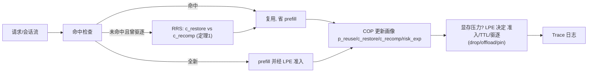

<a id="六章-算法设计"></a>
# 六章 — 算法设计
---

> 本章把 EdgeKVLife 的三模块 COP → LPE → RRS 写成可实现、可记录、可消融的策略层流程。
> 每个模块按 **(a) Idea 来源 →(b) 为什么这样做 →(c) 底层原理与伪代码** 三段式组织，符号沿用第五章。
> 实现顺序：先 trace-driven 仿真跑通策略闭环，再接入 LMCache/vLLM 外围做真实实验。

## 6.1 整体流程



**一句话概括**：COP 给每个缓存对象画像，LPE 在显存压力下决定它的生死与去向，RRS 在复用时按定理 1 选恢复或重算。第一版在 trace 仿真上跑通，再上真实引擎。

> 📊 上面的 mermaid 是工作草图；论文级 **算法框架图**（彩色策略层=贡献 / 灰色 vLLM+LMCache=复用、不改 + 定理 1 高亮）的详细设计与 GPT Image 2 生图提示词见 §3.3.1。

---

## 6.2 模块 1 — COP：Cache Object Profiler

### (a) Idea 来源

SGLang/RadixAttention 做 prefix 复用、CacheBlend 做 RAG chunk 复用，但都把缓存当同质内存块。COP 的思路：把每个缓存对象建成带 **大小、复用概率、恢复代价、过期风险** 四维画像的"资产"，作为 LPE/RRS 决策输入。

### (b) 为什么这样做

1. **缓存不同质**：长前缀 vs 小 chunk、高频会话 vs 一次性查询，价值差异巨大。
2. **决策需要量化输入**：LPE 的 $score$ 和 RRS 的阈值都依赖 $p_{reuse}/c_{restore}/c_{recomp}$。
3. **画像可在线维护**：从访问历史增量更新，开销低。

### (c) 底层原理

**输入**：对象访问历史、$\mu_{kv},BW,d_{deser},c_{re}$。**输出**：每对象画像。

```text
Algorithm 1: COP.update(o, access_event)
────────────────────────────────────────────────
1:  n(o)        ← token_count(o)
2:  size(o)     ← μ_kv * n(o)
3:  p_reuse(o)  ← estimate_reuse(o)        # 规则版: 时近+频次(类 LRU-K); 升级版: 轻量预测
4:  c_recomp(o) ← c_re * n(o)              # 定义1 缓存收益
5:  c_restore(o)← size(o)/BW + d_deser     # 定理1 中的恢复代价
6:  risk_exp(o) ← expiry_risk(o)           # 会话结束/chunk 失效 的概率
7:  score(o)    ← p_reuse(o)*c_recomp(o)/size(o)   # 定义2, 供 LPE 驱逐
8:  return profile(o)
```

**复杂度**：每次访问 $O(1)$ 增量更新。**空间**：$O(K)$。
**关键设计决策**：
- **$p_{reuse}$ 估计**：先用 LRU-K / 频次衰减（无需训练）；只有当它明显限制收益时再上轻量预测器。
- **画像粒度**：prefix / chunk / session 三类对象分别建模，避免一刀切。
- **冷启动**：新对象给先验 $p_{reuse}$，随访问快速修正。

---

## 6.3 模块 2 — LPE：Lifecycle Policy Engine

### (a) Idea 来源

vLLM/PagedAttention 管的是内存页，LMCache 提供 cache layer，但"何时准入、留多久、驱逐去哪"这类 **workload 层生命周期决策** 仍多用 LRU/LFU。LPE 的思路：用 COP 画像做准入、TTL、驱逐（drop/offload/pin）的统一策略，按 $score$ 排序而非单纯时近/频次。

### (b) 为什么这样做

1. **显存压力下必须取舍**：边缘显存小，留谁、踢谁直接决定命中率与 TTFT。
2. **$score$ 比 LRU/LFU 更准**：把恢复代价和复用概率一起算进单位显存收益（定义 2 有带权缓存竞争比支撑）。
3. **驱逐去向也是决策**：高价值对象 offload 留种、低价值直接 drop、热点 pin 住。

### (c) 底层原理

**输入**：COP 画像、$M_{budget}$、当前驻留集。**输出**：准入/TTL/驱逐去向。

```text
Algorithm 2: LPE.on_pressure(resident, profiles, M_budget)
────────────────────────────────────────────────
1:  while mem_used(resident) > M_budget - reserve:
2:      o* ← argmin_{o in resident, not pinned} score(o)   # 单位显存收益最低者先走
3:      if p_reuse(o*) ≥ θ_keep and feasible_offload(o*):
4:          evict(o*) ← offload          # 高复用→留种, 复用时由 RRS 决定取回方式
5:      else:
6:          evict(o*) ← drop             # 低复用→直接丢, 复用时重算
7:      resident.remove(o*)
8:  # 准入: 新对象只有 score 高于当前最低驻留者才入驻
9:  on_admit(o_new): adm(o_new) ← (score(o_new) > min_score(resident))
10: # TTL: 过期风险高的对象给短 TTL
11: ttl(o) ← f(risk_exp(o))
```

**复杂度**：用小顶堆维护 $score$，驱逐 $O(\log K)$/次。**空间**：$O(K)$。
**关键设计决策**：
- **pin 名单**：系统提示前缀、共享指令等强复用对象固定驻留。
- **offload vs drop**：由 `feasible_offload` + 复用概率决定，避免把不会再用的对象搬来搬去。
- **$\theta_{keep}$、reserve**：在 E4 扫描；reserve 防止驱逐抖动。

---

## 6.4 模块 3 — RRS：Restore-vs-Recompute Scheduler

> **这是全文核心技术创新（定理 1，见四章 §4.2 / 五章 §5.4）**：RRS 不是又一个启发式，而是把「取回还是重算」建成可证的临界带宽阈值。其余两模块（COP/LPE）是支撑它与主创新的实现。

### (a) Idea 来源

把对象 offload 出去看似省显存，但复用时若 I/O 比重算还慢，就是"盲目 offload 反被拖慢"。RRS 的思路：直接用定理 1 的阈值，在复用时比较恢复与重算的代价，取更小者。

### (b) 为什么这样做

1. **有清晰判据**：定理 1 给出临界带宽 $BW^\*=\mu_{kv}/c_{re}$，决策可解释、可验证。
2. **避免 I/O 反噬**：低带宽档位下宁可重算（满足 (C3)）。
3. **可跳过**：若对象已失效或收益太低，直接 skip。

### (c) 底层原理

**输入**：被复用对象 $o$ 的画像、$BW,d_{deser},c_{re}$。**输出**：动作 $act(o)$。

```text
Algorithm 3: RRS.on_reuse(o)
────────────────────────────────────────────────
1:  if expired(o):  return skip          # 已失效, 重新走全新 prefill
2:  c_restore ← μ_kv*n(o)/BW + d_deser    # 定理1
3:  c_recomp  ← c_re * n(o)
4:  if c_restore ≤ c_recomp:              # 等价于 BW ≥ μ_kv·n/(c_re·n - d_deser)
5:      return restore
6:  else:
7:      return recompute
```

**复杂度**：$O(1)$。
**关键设计决策**：
- **在线估 $BW$**：$BW$ 用近期 offload 实测滑动平均，使阈值自适应硬件波动。
- **批量恢复**：多对象同时复用时合并 I/O，摊薄 $d_{deser}$。
- **与 LPE 联动**：RRS 的恢复/重算统计回流 COP，修正 $c_{restore}/c_{recomp}$ 估计。

---

## 6.5 Trace 日志格式

每次缓存事件保存一条 JSONL trace，字段按 EdgeKVLife 真实决策量设计：

```json
{
  "request_id": "sharegpt-sess7-turn3",
  "object_id": "prefix:9f2a",
  "object_type": "session_kv",
  "n_tokens": 1536,
  "size_mb": 184.3,
  "p_reuse": 0.71,
  "score": 0.0042,
  "event": "reuse",
  "lpe_action": "offload",
  "rrs_action": "restore",
  "c_restore_ms": 21.4,
  "c_recomp_ms": 38.9,
  "bw_gbps": 11.2,
  "hit": true,
  "t_policy_ms": 0.6
}
```

> 这条 trace 必须能复盘：对象画像（`p_reuse`/`score`/`size_mb`）、LPE 怎么处置（`lpe_action`）、RRS 选了什么以及为什么（`rrs_action`/`c_restore_ms` vs `c_recomp_ms`/`bw_gbps`）、是否命中（`hit`）、策略开销（`t_policy_ms`）。E2 主实验、E3 消融、E6 失败案例（如 I/O 反噬、误驱逐热点）都依赖这些字段。

---

## 6.6 一个样例会话走一遍三模块（数值 walkthrough）

拿一个多会话 + 显存压力的场景把数据流走通（数字为示意），重点看 RRS 如何用临界带宽避免 I/O 反噬：

- **参数**：$\mu_{kv}=0.12$ MB/token，$c_{re}=0.12$ ms/token，$d_{deser}=3$ ms，临界带宽 $BW^\*=\mu_{kv}/c_{re}=1.0$ MB/ms = 1.0 GB/s。
- **对象**：会话前缀 $o$，$n=1536$，$size=184$ MB，$p_{reuse}=0.71$。

| 步骤 | 模块 | 关键计算 | 结果（示意） |
| --- | --- | --- | --- |
| ① 画像 | COP | $size=184$MB，$c_{recomp}=0.12\times1536\approx184$ms，$score=p_{reuse}\cdot c_{recomp}/size\approx0.71\times184/184\approx0.71$/MB... 归一后 0.0042 | 进堆参与 LPE 排序 |
| ② 显存压力 | LPE | 显存超预算，$o$ 的 $score$ 不是最低且 $p_{reuse}=0.71\ge\theta_{keep}$ → 选择 **offload**（留种）而非 drop | `lpe_action=offload` |
| ③ 复用@高带宽 | RRS | 若 $BW=11.2$ GB/s：$c_{restore}=184/11.2+3\approx19.4$ms < $c_{recomp}=184$ms → **restore** | `rrs_action=restore`，省 ~165ms |
| ④ 复用@低带宽 | RRS | 若 $BW=0.5$ GB/s（<$BW^\*$）：$c_{restore}=184/0.5+3\approx371$ms > 184ms → **recompute** | `rrs_action=recompute`，避免 I/O 反噬 |
| ⑤ 失效 | RRS | 若会话已结束（`expired`）→ **skip**，走全新 prefill | `rrs_action=skip` |

> 这个例子说明：LPE 对高复用对象选 offload 留种、RRS 再按当时带宽决定取回还是重算——同一个对象在高/低带宽下的最优动作相反，这正是"盲目 offload"会踩的坑。E4 扫带宽时，always-restore 在 ④ 这种低带宽档会被 I/O 拖慢，而 RRS 取下包络，这就是 RRS 的贡献证据。

## 6.7 参数初值与调参顺序（先能跑，再调好）

| 参数 | 含义 | 建议初值 | 何时调（实验） |
| --- | --- | --- | --- |
| $p_{reuse}$ 估计 | 复用概率 | LRU-K（K=2）/频次衰减 | H1/E4；明显限制收益再上轻量预测器 |
| $\theta_{keep}$ | offload vs drop 阈值 | 0.5 | E4 扫描 |
| reserve | 驱逐保留余量（防抖） | 显存预算的 5% | E4 |
| TTL | 过期风险高对象的存活上限 | $f(risk_{exp})$，会话级给短 TTL | E4 |
| $BW$ 估计 | 在线带宽 | 近期 offload 实测滑动平均 | H2/E4；硬件波动时自适应 |
| pin 名单 | 强复用固定驻留 | 系统提示前缀/共享指令 | 经验设定 |

> 调参顺序：先用初值在 trace 仿真上把策略闭环跑通（W2–W3）→ 调 $\theta_{keep}$/reserve 让 H1 的 p95 收益拉开 → 再扫 $BW$ 验证 H2 的定理 1 阈值（W5）。不要一上来就接真实引擎调参。
